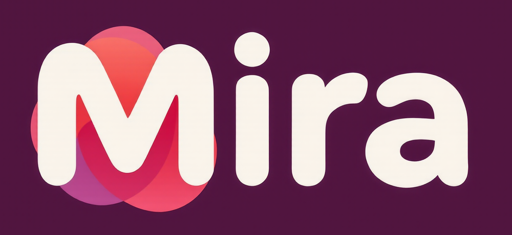
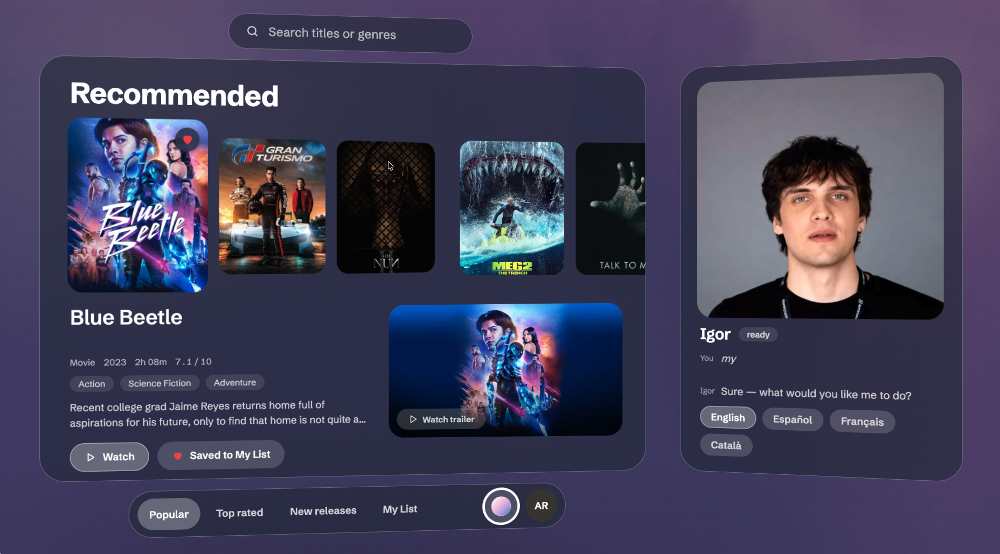
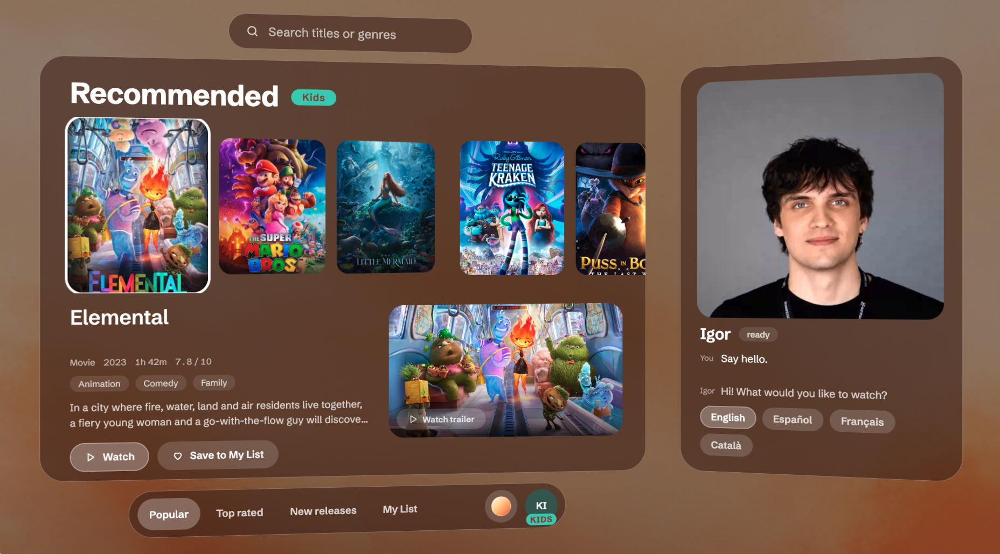
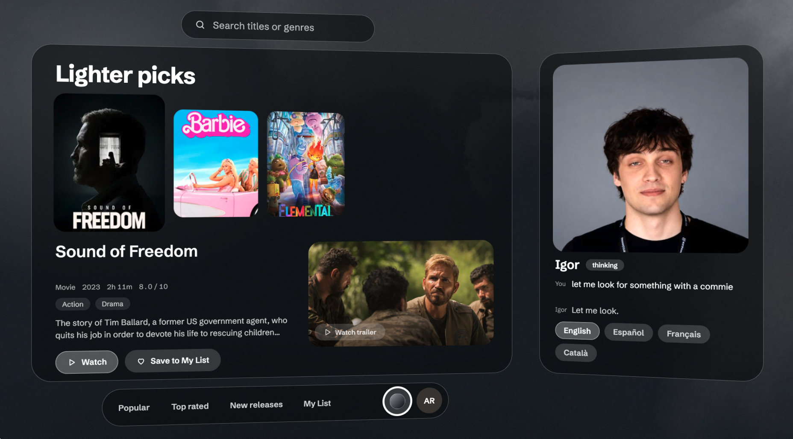

<div align="center">



<br>

**A TV that you talk to.**

<br>

[](pyproject.toml)
[](https://docs.astral.sh/uv/)
[](frontend/)
[](frontend/)
[](https://github.com/pipecat-ai/pipecat)
[](avatars.yaml)
[](https://github.com/arnabdeypolimi/hackbarna_2026)

<br>

Mira is a conversational avatar that lives on top of a streaming UI. Say what you're in the
mood for, and she finds it, talks it through with you, and drives the screen while she
speaks — moving the rail, opening details, pressing play. Interrupt her mid-sentence; she
stops and listens.

<br>



<br>

<video src="https://raw.githubusercontent.com/arnabdeypolimi/hackbarna_2026/main/docs/video/mira-launch.mp4" poster="docs/screenshots/mira-home.png" controls width="900"></video>

</div>

---

## What she does

- **Voice in, face out.** WebRTC microphone audio → speech-to-text → LLM → text-to-speech →
  a lip-synced talking head, streamed back as video. End to end, on a real TV.
- **Drives the UI while talking.** Every turn produces speech *and* a stream of typed
  commands (`focus`, `open_details`, `play`, `show_titles`, …) that the TV executes as the
  words land. No "let me do that for you" pause.
- **Knows the catalogue.** A vector index over TMDB titles and a viewer's own taste profile
  power recommendations; "something lighter" or "the second one" resolve against what is
  actually on screen.
- **Remembers you.** Per-viewer history and a one-paragraph memory rewritten at the end of
  each session, so the next visit starts where the last one left off.
- **Speaks four languages.** English, Spanish, French and Catalan, pinned per session.
- **Kids-safe.** Profiles are adult or kids; a kids profile never sees the adult shelf.

<div align="center">
<table>
<tr>
<td></td>
<td></td>
</tr>
<tr>
<td align="center"><sub>Kids profile — same sofa, different shelf</sub></td>
<td align="center"><sub>"Something lighter" → a live re-ranked rail, dark theme</sub></td>
</tr>
</table>
</div>

---

## How it works

Two independent planes that meet only at the session store and a command bus.

- **Media plane** — one [Pipecat](https://github.com/pipecat-ai/pipecat) pipeline per
  session. Speech reaches TTS sentence by sentence while actions dispatch in parallel.
- **Control plane** — an authenticated WebSocket. The TV pushes its screen state; the agent
  sends commands. A dropped socket does not drop the call.
- **The agent thinks in envelopes.** Each cycle is one constrained-decoded
  `{intent, say, actions[]}`; a tool result (e.g. a catalogue search) buys the next cycle.
  Commands are turn-scoped: barge-in drops anything not yet on the wire.

The vocabulary in `src/tv_avatar/agent/commands.py` is the single source of truth — the
prompt manifest, `contracts/protocol.schema.json` and `contracts/protocol.d.ts` are all
generated from it, so the TV cannot compile a command the backend would reject.

---

## Quickstart

Backend — Python 3.11 and [uv](https://docs.astral.sh/uv/):

```bash
uv sync
cp .env.example .env        # fill in NEBIUS_API_KEY, SLNG_API_KEY, ANAM_API_KEY
uv run uvicorn tv_avatar.app:app --reload --port 8000
```

TV frontend — Node 20.19+:

```bash
cd frontend && npm install && npm run dev
```

Open the frontend, allow the microphone, and Mira greets you first. Without a `.env` the
backend still starts and `/config` reports what is missing; the engineering console at
<http://localhost:8000/demo/> shows live timings, the transcript and every wire message.

```bash
uv run pytest                                  # backend tests, no keys or network
uv run python tools/export_schemas.py          # regenerate contracts/ after a vocabulary change
```

---

## Repository

| Path | What |
|---|---|
| `src/tv_avatar/` | FastAPI backend: sessions, WebRTC signalling, agent loop, recommendations, memory |
| `frontend/` | React TV app — its own toolchain, [`README`](frontend/README.md) and [`design.md`](frontend/design.md) |
| `contracts/` | Generated wire schema (JSON Schema + TypeScript). Never hand-edit |
| `avatars.yaml` | Avatars, voices and languages — adding one is a YAML edit |
| `docs/` | [Design spec](docs/superpowers/specs/2026-09-19-tv-avatar-backend-design.md), plans, observability contract |

Built at HackBarna 2026.
