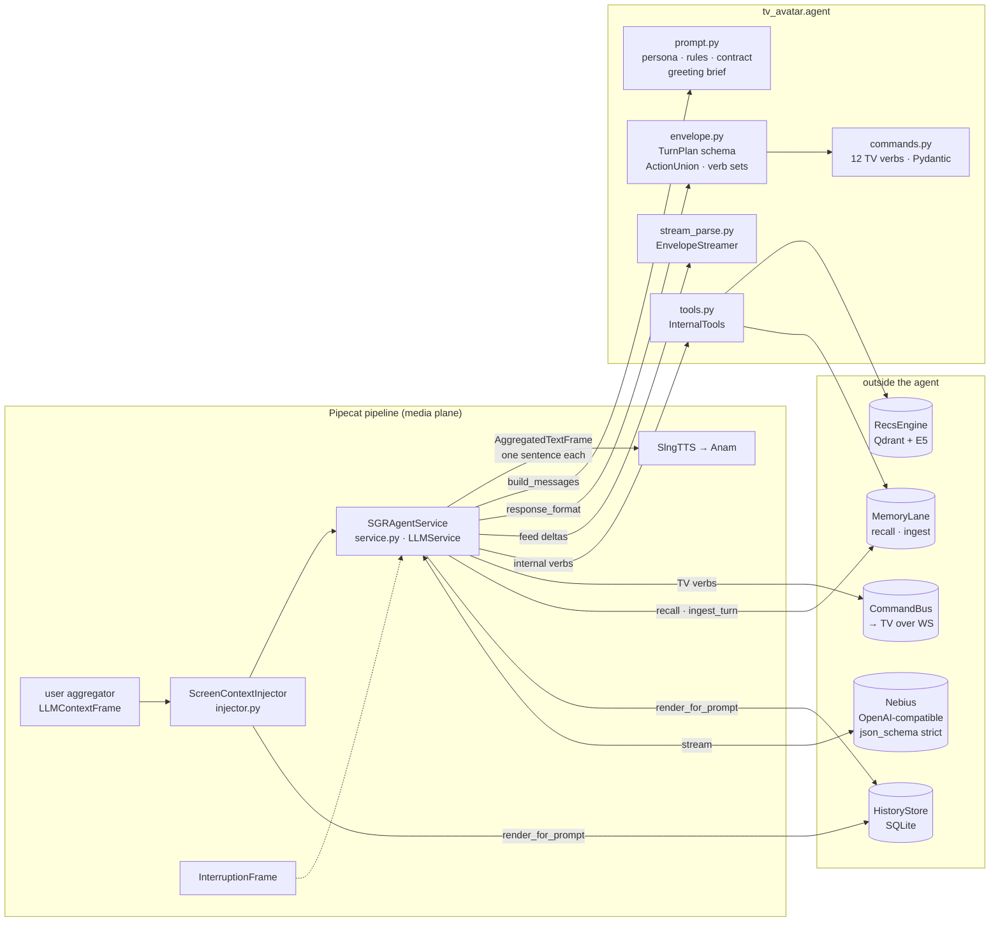
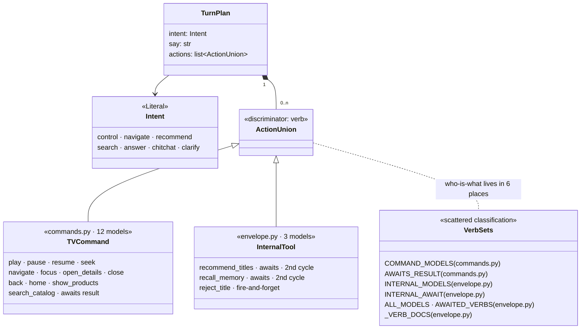
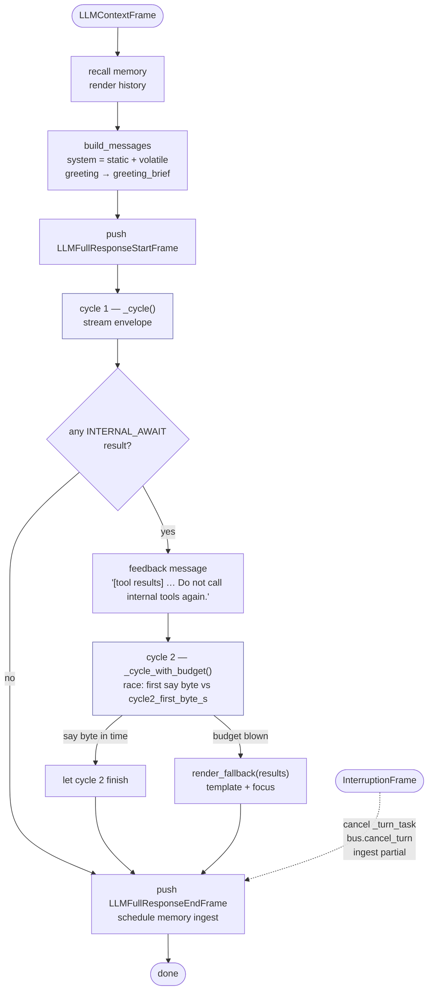
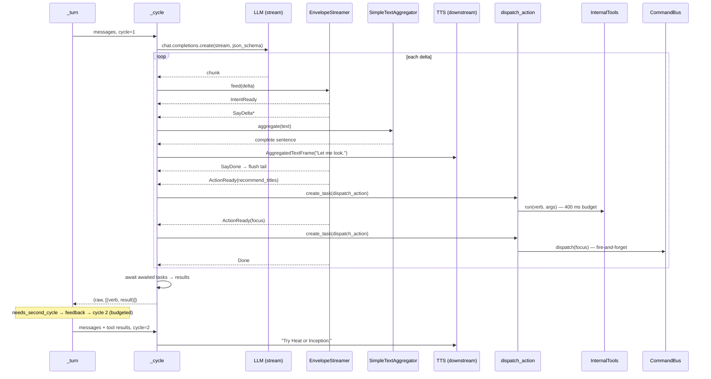
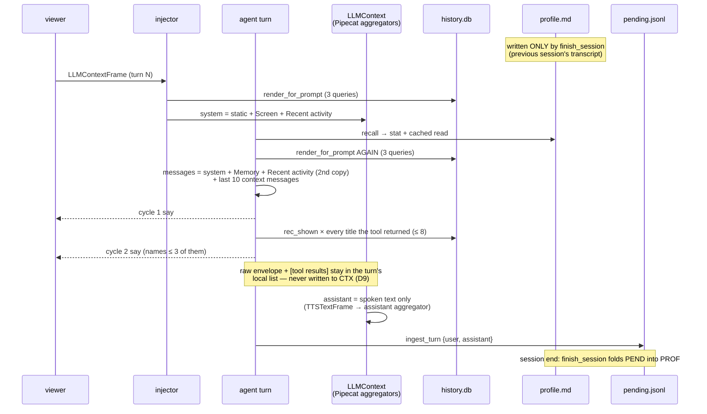
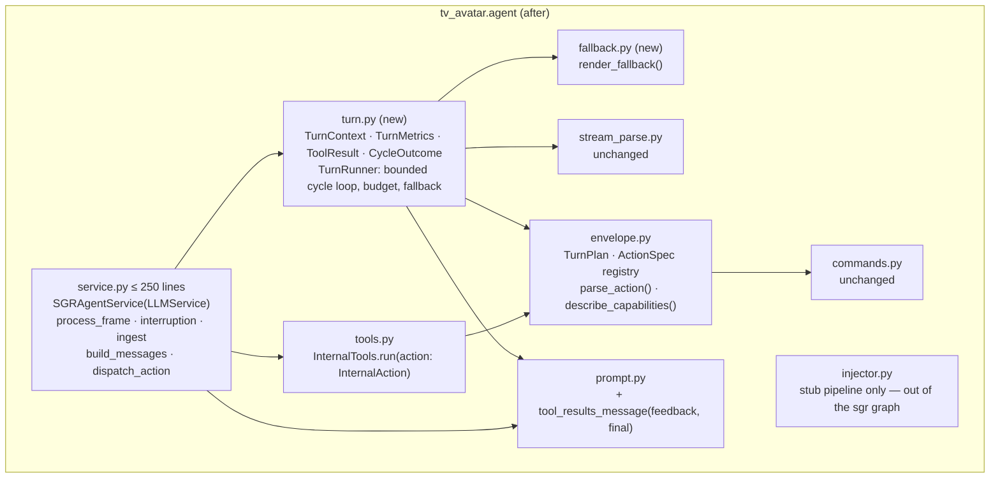
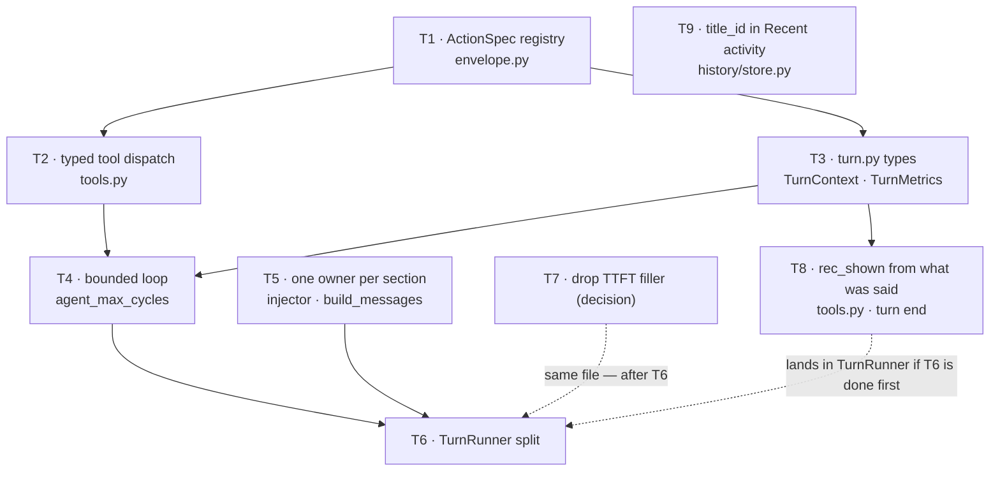

# Agent Cleanup — Make `tv_avatar.agent` a Textbook SGR Loop

> **For agentic workers:** REQUIRED SUB-SKILL: Use superpowers:executing-plans to implement this plan task-by-task. Steps use checkbox (`- [ ]`) syntax for tracking. Write the failing test first, watch it fail, then implement.

**Spec:** `docs/superpowers/specs/2026-09-19-tv-avatar-backend-design.md` (§8)
**Parent plan:** `docs/superpowers/plans/2026-09-19-tv-avatar-backend-phase2.md` (D8, D12)
**Findings:** `docs/findings/2026-09-19-phase2-agent-memory-recs.md`
**Reference:** Schema-Guided Reasoning patterns — https://abdullin.com/schema-guided-reasoning/patterns

**Baseline:** `uv run pytest -q` → **214 passed** on `feat/agentic-layer` at `cd3206d`. Every task below must leave that number equal or higher.

**Status (2026-09-19): executed, single session, order T9 → T1 → T5 → T2 → T7 → T3 → T4 → T8 → T6.** Commits `d13428f..7aa8f13` on `feat/observability`; **239 passed**. Decisions taken: filler removed, `rec_accepted` dead code removed, `recall_memory` left as is. Deviations from the text below: the cycle loop lives in `agent/loop.py` (`TurnRunner` behind one `TurnHost` protocol — speak, dispatch_action, TTFB metrics) rather than in `turn.py`, keeping both files under 300 lines; Task 5 removed the injector from the `sgr` pipeline entirely instead of narrowing it; `.env.example` gained `AGENT_MAX_CYCLES` / `CYCLE_FIRST_BYTE_S`. Findings: `docs/findings/2026-09-19-phase2-agent-memory-recs.md` → "Agent cleanup".

**Goal:** No behaviour change the viewer can hear, except one bug fix (§2.5). The agent already *is* an SGR agent; this plan makes the code say so — typed turn state instead of a `marks` dict, a registry instead of five verb sets, a real bounded loop instead of a hand-unrolled one, one owner per prompt section, and a `service.py` under 300 lines.

---

## 1. The agent as it is today

### 1.1 Structure — what talks to what



Two things stand out already: `HistoryStore.render_for_prompt` is called by **both** the injector and the agent on every turn, and `service.py` reaches into everything.

### 1.2 The envelope — the schema *is* the reasoning



Field order is the SGR **cascade**: `intent` (route) → `say` (speech) → `actions` (typed steps). Constrained decoding (`turn_plan_schema()`, strict, `oneOf→anyOf`) makes an invalid verb unrepresentable. This part is right and stays.

### 1.3 The turn loop — control flow



The loop is written as `for cycle in (1,): … break` with cycle 2 spelled out by hand (`service.py` `_turn`, lines ~216–240). `MAX_CYCLES = 2` is only consulted by the "skip tools on the last cycle" check, so raising it does nothing on its own.

### 1.4 Inside one cycle — streaming, speaking, dispatching



Speech reaches TTS **during** the stream, one sentence at a time, and the tool runs **while** the filler is being spoken — that is the property every change below must preserve (`test_awaited_action_triggers_second_cycle` pins it).

### 1.5 The filler that is not a filler

`SLOW_FILLERS` / `_slow_filler` (`service.py` lines ~410–417) is a TTFT mask, started only in cycle 1, cancelled on the first `say` byte, never active during tool execution. `filler_after_ms` defaults to `0` (off) and the config comment says it "was judged annoying". It is dead in production and costs a task, a race, and a `finally`.

### 1.6 Memory and history — what is read and written, and when



Three consequences are visible from this diagram alone: history is rendered twice, `rec_shown` is written before the model decides what to say, and the ids the model saw in cycle 1 survive only as names in `Recent activity` (no `title_id`) — the next turn cannot act on them.

---

## 2. What is wrong, precisely

| # | Smell | Where | Why it matters |
|---|---|---|---|
| 2.1 | Hand-unrolled loop; `cycle=2` hardcoded in `_cycle_with_budget`; `needs_second_cycle` name; `MAX_CYCLES` half-used | `service.py` `_turn`, `_cycle_with_budget` | Cannot change the depth without rewriting `_turn`; two code paths for what is one concept (a bounded loop). |
| 2.2 | `marks: dict[str, Any]` mutated by three methods; `setdefault` for first-seen timings | `service.py` `_turn`, `_cycle` | Untyped, misspell-a-key-silently; the log line `log.info("turn", **marks)` is the only consumer. |
| 2.3 | `_cycle(messages, turn_id, user_id, memory_text, cycle, marks, t0, first_say)` — 8 positional params; returns `tuple[str, list[tuple[str, dict]]]` | `service.py` | Every helper threads the same 4 values. Results are `(verb, dict)` tuples read positionally. |
| 2.4 | Verb classification in six places (`COMMAND_MODELS`, `AWAITS_RESULT`, `INTERNAL_MODELS`, `INTERNAL_AWAIT`, `ALL_MODELS`/`AWAITED_VERBS`, `_VERB_DOCS`); `InternalTools.run` re-matches on the verb *string* and validates per branch | `envelope.py`, `commands.py`, `tools.py` | Adding a tool means touching 4 constants and a `match`. SGR **routing** wants dispatch on the *typed* union, not on strings. |
| 2.5 | **Bug:** `# Recent activity` is stamped twice in the live prompt — injector adds it, then `build_messages` appends Memory + Recent activity again; history is also fetched twice per turn | `injector.py` `_stamp`, `service.py` `build_messages` | Wasted prompt tokens on the shared endpoint (TTFT grows with context — findings), and two owners of one section. The `"# Screen" in content` heuristic that decides this is brittle. |
| 2.6 | `render_fallback` (pure text) and `_slow_filler` (dead feature) inside the Pipecat service | `service.py` | 458 lines; the Pipecat glue, the loop, the fallback and the filler are one class. |
| 2.7 | Feedback string `"… Do not call internal tools again."` is inline and unconditional | `service.py` `_turn` | Blocks any deeper loop; prompt text living outside `prompt.py`. |
| 2.8 | **Bug:** `rec_shown` is recorded for every title the tool returned (`RecommendTitles.limit` default 8) at cycle 1, before the model speaks; the prompt then names ≤ 3 | `tools.py` `_recommend` lines ~84–87 | `Recently recommended` and the greeting's "want to carry on with X?" can lead with a title the viewer never heard. |
| 2.9 | **Bug:** `Recently watched` / `Recently recommended` render `item.label()` — name, year, genres, **no `title_id`** | `history/store.py` `render_for_prompt` | The rules forbid inventing ids; after the greeting offers "carry on with The Batman?", "yes, play it" only works if that title happens to be on screen. |
| 2.10 | `recall_memory` can never return anything new: `SummaryMemoryLane._search` ignores the query and returns the same profile already in `# Memory` | `tools.py` `_recall`, `summary_lane.py` `_search` | Every call buys a ~1 s second cycle for nothing. The lane's prefetch/prefix/TTL machinery is vestigial for the same reason (harmless). **Decision, not refactor** — see §4b. |
| 2.11 | Within-session memory gap: the profile updates only at `finish_session`; the conversation window is `MAX_HISTORY_MESSAGES = 10` (5 exchanges) | `service.py` `build_messages`, `summary_lane.py` | Something said in turn 1 is gone by turn 7 and 2.10 cannot bring it back. **Decision** — see §4b. |
| 2.12 | `memory_text` is threaded `dispatch_action → InternalTools.run → _recommend` and then discarded (`RecsContext(memory_text=None)`) | `service.py`, `tools.py` | Dead parameter through three signatures. |
| 2.13 | `HistoryRecorder.on_command` (`rec_accepted`, `search_issued`) has no caller | `history/recorder.py` lines 72–77 | The recommender has no accept signal; the code suggests it does. **Decision** — see §4b. |

2.5, 2.8 and 2.9 are the ones a viewer can notice: a slower first word, a greeting that offers a film that was never mentioned, and a "yes, play it" the agent cannot honour. The rest is code quality.

### Why `[tool results]` never enter the conversation history

By design (D9, "stamp, never store"). The turn builds a *local* `messages` list — system + last 10 context messages — and appends the raw cycle-1 envelope and the `[tool results]` user message to **that list only**. `LLMContext` is owned by Pipecat's aggregator pair: the user aggregator writes the transcript, the assistant aggregator writes what TTS actually spoke (`TTSTextFrame`s). The agent never calls `context.add_message`. Reasons this is right: the envelope is JSON and the results are a dict of 8 titles with reasons — several hundred tokens per recommendation turn on an endpoint where 20 messages measured 2.3 s TTFT vs 0.4 s; the results would be stale the moment the screen changes; and on interruption the context would hold recommendations the viewer never heard. Where it goes wrong is 2.9: the *ids* fall out of the loop entirely. The fix belongs in the history render (persistent, cross-session, three tokens per title), not in the conversation.

---

## 3. Target shape

### 3.1 Module layout after the cleanup



### 3.2 SGR pattern → code, after

| SGR pattern | Today | After |
|---|---|---|
| **Cascade** (fixed field order = reasoning order) | `TurnPlan(intent, say, actions)` | unchanged |
| **Routing** (branch on a `Literal`) | `intent` logged only; tools branch on `verb: str` | `InternalTools.run(action)` does `match action: case RecommendTitles(): …` on the parsed union member. `intent` stays a log field — routing *speech* on it is a product change, out of scope. |
| **Cycle** (typed list of steps) | `actions: list[ActionUnion]` | unchanged; each element parsed once via `parse_action()` and carried as a model, not a dict |
| **Bounded agentic loop** | `for cycle in (1,)` + explicit cycle 2 | `TurnRunner.run()`: `for cycle in range(1, max_cycles + 1)`; every cycle after the first is budgeted; the last cycle refuses tools; `max_cycles` comes from `Settings.agent_max_cycles` (default **2**, `ge=1, le=4`) |
| **Observation step** (tool output back into the schema) | inline `"[tool results]…"` user message | `prompt.tool_results_message(feedback, final=cycle == max_cycles)` — tells the model tools are still available on intermediate cycles |
| **No `thoughts` slot** | deliberately absent (TTFT) | unchanged — documented in `envelope.py` |

### 3.3 Types that replace the dict (turn.py)

```python
@dataclass(frozen=True)
class TurnContext:
    turn_id: str
    user_id: str
    memory_text: str | None
    t0: float
    log: Logger            # loguru bound logger

@dataclass(frozen=True)
class ToolResult:
    verb: str
    payload: dict[str, Any]

    @property
    def earns_cycle(self) -> bool:      # replaces needs_second_cycle
        return REGISTRY[self.verb].earns_cycle

@dataclass(frozen=True)
class CycleOutcome:
    raw: str
    results: tuple[ToolResult, ...]
    spoke: bool                         # replaces the first_say Event for the budget race

@dataclass
class TurnMetrics:                      # replaces marks
    cycles: int = 0
    n_actions: int = 0
    intent: str | None = None
    recall_ms: int | None = None
    ttft_ms: int | None = None
    first_action_ms: int | None = None
    fallback: bool = False
    total_ms: int | None = None

    def mark_once(self, field: str, ms: int) -> None: ...   # the setdefault idiom, typed
    def as_log_fields(self) -> dict[str, Any]: ...          # drops Nones
```

### 3.4 The registry (envelope.py)

```python
@dataclass(frozen=True)
class ActionSpec:
    model: type[BaseModel]
    kind: Literal["tv", "internal"]
    awaits_result: bool     # the turn blocks on the reply
    earns_cycle: bool       # a result triggers another LLM cycle
    doc: str

REGISTRY: dict[str, ActionSpec] = {**tv_specs_from(COMMAND_MODELS, AWAITS_RESULT), **internal_specs}
ActionUnion = Annotated[Union[tuple(s.model for s in REGISTRY.values())], Field(discriminator="verb")]
_ACTION_ADAPTER = TypeAdapter(ActionUnion)

def parse_action(raw: dict) -> BaseModel: return _ACTION_ADAPTER.validate_python(raw)
def describe_capabilities() -> str: ...   # from REGISTRY, drop _VERB_DOCS
```

`INTERNAL_MODELS`, `INTERNAL_AWAIT`, `ALL_MODELS`, `AWAITED_VERBS` are **deleted**, not aliased — the point is one place to look. `commands.py` keeps `COMMAND_MODELS`/`AWAITS_RESULT` because `contracts/` export and the TV client depend on the wire vocabulary being separate from internal tools.

---

## 4. Tasks

Each task: files → failing test → implement → full suite green → commit. Line numbers refer to `cd3206d`.

### Task 1: Action registry in `envelope.py`

**Files:** modify `src/tv_avatar/agent/envelope.py`, `tests/test_envelope.py`; update imports in `src/tv_avatar/agent/service.py`, `src/tv_avatar/agent/tools.py`.

- [x] **Step 1: failing tests** in `tests/test_envelope.py`:
  - `test_registry_covers_every_union_member` — `set(REGISTRY) == {m.model_fields["verb"].default for m in union members}`.
  - `test_registry_classification` — `REGISTRY["search_catalog"].awaits_result and not .earns_cycle`; `REGISTRY["recommend_titles"].earns_cycle`; `REGISTRY["reject_title"].kind == "internal" and not .awaits_result`; every TV verb `kind == "tv"`.
  - `test_parse_action_returns_typed_model` — `parse_action({"verb": "recommend_titles", "query": "heist"})` is a `RecommendTitles`; unknown verb raises `ValidationError`.
  - `test_describe_capabilities_from_registry` — every verb appears once with its `[awaits result]` tag matching `awaits_result`.
- [x] **Step 2:** `uv run pytest tests/test_envelope.py -q` → FAIL (ImportError).
- [x] **Step 3:** implement §3.4. Keep `turn_plan_schema()` output byte-identical — add `test_turn_plan_schema_unchanged` that snapshots `json.dumps(turn_plan_schema(), sort_keys=True)` **before** the change into `tests/fixtures/turn_plan_schema.json` and asserts equality after. This is the guard that constrained decoding on Nebius is unaffected.
- [x] **Step 4:** replace `INTERNAL_MODELS` / `INTERNAL_AWAIT` / `AWAITED_VERBS` uses in `service.py` (`dispatch_action`, `_cycle`, `needs_second_cycle`) and `tools.py` with `REGISTRY[...]` lookups. Delete the old names.
- [x] **Step 5:** `uv run pytest -q` → ≥ 214 passed.
- [x] **Commit:** `refactor(agent): one ActionSpec registry replaces five verb sets`

### Task 2: Typed tool dispatch (SGR routing on the union)

**Files:** modify `src/tv_avatar/agent/tools.py`, `tests/test_agent_tools.py`, `src/tv_avatar/agent/service.py` (`dispatch_action`).

- [x] **Step 1: failing test** — `InternalTools.run(RecommendTitles(query="heist"), user_id, memory_text)` accepts a model; passing a `Focus()` raises `TypeError("not an internal action")`; a `RejectTitle` returns synchronously-shaped `{"status": "ok"}` without going through `wait_for`.
- [x] **Step 2:** run → FAIL.
- [x] **Step 3:** `run(self, action: InternalAction, ...)` where `InternalAction = RecommendTitles | RecallMemory | RejectTitle`; body is `match action: case RecommendTitles(): … case RecallMemory(): … case RejectTitle(): … case _: raise TypeError`. Timeout/exception handling stays exactly as today (it is behaviour).
- [x] **Step 4:** `service.dispatch_action(action: BaseModel, ctx)` — parse once in `_cycle` via `parse_action()` (a `ValidationError` there logs `rejected action` and skips, matching today's bus `ValueError` path), then route by `REGISTRY[verb].kind`. The bus still receives `(verb, args)` — `action.model_dump(exclude={"verb"}, exclude_none=True)`.
- [x] **Step 5:** update `FakeTools.run` signature in `tests/test_agent_service.py`; `uv run pytest -q` → green.
- [x] **Commit:** `refactor(agent): internal tools dispatch on the typed action, not the verb string`

### Task 3: `turn.py` — typed turn state

**Files:** create `src/tv_avatar/agent/turn.py`, `tests/test_turn_types.py`; modify `src/tv_avatar/agent/service.py`.

- [x] **Step 1: failing tests** — `TurnMetrics().as_log_fields()` omits `None`s; `mark_once("ttft_ms", 300)` then `mark_once("ttft_ms", 900)` keeps 300; `ToolResult("recommend_titles", {}).earns_cycle is True`, `ToolResult("search_catalog", {}).earns_cycle is False`.
- [x] **Step 2:** run → FAIL.
- [x] **Step 3:** add the §3.3 dataclasses. Thread `TurnContext` through `_cycle`, `_cycle_with_budget`, `_speak_fallback`, `dispatch_action`; replace `marks` with `TurnMetrics`; `_cycle` returns `CycleOutcome`. Drop the dead `memory_text` parameter from `dispatch_action`, `InternalTools.run` and `_recommend` (2.12) — `TurnContext.memory_text` stays only as a log field. **Otherwise pure plumbing — no logic moves.** The `log.info("turn", **metrics.as_log_fields())` line must emit the same keys as today (`cycles, n_actions, intent, recall_ms, ttft_ms, first_action_ms, total_ms`, plus `fallback` only when true) — `tests/test_agent_service.py` gets one test capturing the loguru record and asserting the key set.
- [x] **Step 4:** `uv run pytest -q` → green; `uv run ruff check src tests`.
- [x] **Commit:** `refactor(agent): TurnContext/TurnMetrics/ToolResult replace positional params and the marks dict`

### Task 4: Real bounded loop + `agent_max_cycles`

**Files:** modify `src/tv_avatar/config.py`, `src/tv_avatar/agent/prompt.py`, `src/tv_avatar/agent/service.py`, `tests/test_config.py`, `tests/test_agent_service.py`, `.env.example`.

- [x] **Step 1: failing tests**
  - `test_config.py`: `Settings(...).agent_max_cycles == 2`; `agent_max_cycles=5` raises; `cycle_first_byte_s` still readable from env `CYCLE2_FIRST_BYTE_S` (AliasChoices — do not break existing `.env` files).
  - `test_agent_service.py`: rename `test_cycles_are_capped_at_two` → `test_cycles_are_capped_at_setting`, parametrised over `max_cycles in (1, 2, 3)` with `FakeOpenAI([RECO_1, RECO_1, RECO_1, RECO_2])`: `len(client.calls) == max_cycles`, `len(tools.calls) == max_cycles - 1`.
  - `test_feedback_message_tells_model_when_tools_are_still_allowed`: with `max_cycles=3`, `client.calls[1]` feedback does **not** contain "Do not call internal tools again", `client.calls[2]` does.
  - `test_every_follow_up_cycle_is_budgeted`: `max_cycles=3`, cycle 2 slow → fallback after one budget, **no** cycle 3 attempted (`len(client.calls) == 2`).
  - `test_awaited_action_triggers_second_cycle` unchanged — it is the acceptance test for "nothing audible changed".
- [x] **Step 2:** run → FAIL.
- [x] **Step 3:** `Settings.agent_max_cycles: int = Field(default=2, ge=1, le=4)`; rename `cycle2_first_byte_s` → `cycle_first_byte_s` with `validation_alias=AliasChoices("CYCLE_FIRST_BYTE_S", "CYCLE2_FIRST_BYTE_S")`. Update the config comment: it is the budget for **every** cycle after the first.
- [x] **Step 4:** `prompt.tool_results_message(feedback: str, *, final: bool) -> str` — today's text when `final`, otherwise `"…Now answer the user using these results, or call one more internal tool only if you cannot answer without it."`
- [x] **Step 5:** rewrite `_turn`'s loop:

  ```python
  outcome = await self._cycle(messages, ctx, cycle=1, metrics)
  for cycle in range(2, self._cfg.agent_max_cycles + 1):
      if not any(r.earns_cycle for r in outcome.results):
          break
      messages = messages + [assistant(outcome.raw), user(tool_results_message(feedback(outcome), final=cycle == max_cycles))]
      budgeted = await self._cycle_with_budget(messages, ctx, cycle, metrics)
      if budgeted is None:
          metrics.fallback = True
          await self._speak_fallback(outcome.results, ctx)
          break
      outcome = budgeted
  ```

  `_cycle_with_budget` takes `cycle: int` and returns `CycleOutcome | None`. The "last cycle refuses tools" check becomes `cycle >= self._cfg.agent_max_cycles`. Delete the module constant `MAX_CYCLES` and `needs_second_cycle` (now `ToolResult.earns_cycle`).
- [x] **Step 6:** `uv run pytest -q` → green. Add `AGENT_MAX_CYCLES=2` to `.env.example` with a one-line comment: *each extra cycle is a full LLM round trip the viewer waits through; 2 is the measured sweet spot.*
- [x] **Commit:** `feat(agent): bounded SGR cycle loop; AGENT_MAX_CYCLES setting (default 2, unchanged behaviour)`

### Task 5: The agent is the only owner of the system prompt (fixes the doubled `# Recent activity`)

**Files:** modify `src/tv_avatar/agent/service.py` (`build_messages`), `src/tv_avatar/agent/prompt.py` (`render_screen` moves here from `injector.py`; `volatile_sections`), `src/tv_avatar/agent/injector.py` (imports `render_screen` from `prompt.py`; otherwise unchanged — it keeps serving the `stub` pipeline), `src/tv_avatar/pipeline/builder.py`, `tests/test_agent_service.py`, `tests/test_pipeline_builder.py`, `tests/test_wiring.py`.

**Rule: no inspection of incoming messages.** Today `build_messages` sniffs the system message for `"# Screen"` to guess whether the injector ran, and stamps different things depending on the answer. After this task there is exactly one writer of the SGR system prompt — `SGRAgentService.build_messages` — and it **unconditionally replaces** whatever system message arrives with `static + Screen + Memory + Recent activity`. The injector is removed from the `sgr` pipeline entirely; it stays for `stub`, where there is no agent to do the stamping.

- [x] **Step 1: failing tests**
  - `test_agent_service.py`: `build_messages` with an incoming system message of arbitrary content (`"whatever"`) produces a system prompt that does **not** contain `"whatever"` and contains each of `# Capabilities`, `# Screen`, `# Memory`, `# Recent activity` exactly once, in that order. Same assertion with **no** incoming system message. Same assertion with an injector-style system message already carrying `# Screen` + `# Recent activity` (the today-case) — count still 1.
  - `test_pipeline_builder.py`: with `agent_impl="sgr"` the built pipeline contains **no** `ScreenContextInjector`; with `"stub"` it contains one.
  - `test_wiring.py`: end-to-end `user aggregator → SGRAgentService` with `FakeOpenAI` — the system message the fake receives has the four sections exactly once, and `SessionState.screen` (set via the control channel in the test) is what `# Screen` renders.
- [x] **Step 2:** run → FAIL (today the count is 2 and the builder adds the injector for `sgr`).
- [x] **Step 3:**
  - Move `render_screen(session, catalog)` from `injector.py` to `prompt.py`; `injector.py` imports it (its own tests keep passing untouched).
  - `build_messages(messages, memory, history) -> list[dict]`: `rest = [m for m in messages if m["role"] != "system"][-MAX_HISTORY_MESSAGES:]`; `system = build_system_prompt(language) + "\n\n" + volatile_sections(render_screen(self._session, self._catalog), memory.render_for_prompt(), history)`; return `[{"role": "system", "content": system}, *rest]`. No branches.
  - `pipeline/builder.py`: `if settings.agent_impl == "stub": stages.append(ScreenContextInjector(...))`. The `agent_impl != "chat"` condition and its comment go.
- [x] **Step 4:** `uv run pytest -q` → green. Note in `docs/findings/2026-09-19-phase2-agent-memory-recs.md` under a new "Cleanup" heading: system prompt shrank by one history block per turn and one `HistoryStore` fetch per turn (measure `system_chars` from the `turn prompt` debug log before/after with `tools/smoke_turn.py` if keys are available; otherwise record the character delta from the unit test).
- [x] **Commit:** `fix(agent): agent is the sole writer of the SGR system prompt; injector serves the stub only`

### Task 6: Split `service.py`

**Files:** create `src/tv_avatar/agent/fallback.py`; modify `src/tv_avatar/agent/turn.py`, `src/tv_avatar/agent/service.py`, `tests/test_agent_service.py`.

- [x] **Step 1:** move `render_fallback` → `fallback.py` (test `test_render_fallback_shapes` moves import; no code change).
- [x] **Step 2:** move the loop, `_cycle`, `_cycle_with_budget`, `_speak_fallback` into `TurnRunner` in `turn.py`, constructed per turn with two callbacks typed as Protocols:

  ```python
  class Speaker(Protocol):
      async def speak(self, text: str) -> None: ...
  class Dispatcher(Protocol):
      async def dispatch(self, action: BaseModel, ctx: TurnContext) -> dict: ...
  ```

  `SGRAgentService` implements both (`_speak`, `dispatch_action`) and keeps: `process_frame`, `_cancel_turn`, `_schedule_ingest`, `_run_turn` (metrics start/stop, Start/End frames), `build_messages`. `_turn_said` becomes `TurnRunner.said` read by the service at ingest time.
- [x] **Step 3:** `wc -l src/tv_avatar/agent/service.py` ≤ 250; `uv run pytest -q` → green; `test_interruption_frame_cancels_stream_and_queued_commands` is the guard that cancellation still reaches the inner stream.
- [x] **Commit:** `refactor(agent): TurnRunner owns the cycle loop; service.py is Pipecat glue`

### Task 7 (decision required): Remove the TTFT filler

**Files:** `src/tv_avatar/agent/service.py` / `turn.py`, `src/tv_avatar/config.py`, `tests/test_agent_service.py` (`test_slow_filler_*` if present), `.env.example`.

`filler_after_ms=0` is the shipped default and the config comment records it was judged annoying. Removing `SLOW_FILLERS`, `_slow_filler`, the `filler` task and its `finally` deletes ~25 lines and one race. **Ask before doing** — if there is any intention to turn it back on for a slow model (Nemotron TTFT was fine; DeepSeek was not), keep it and instead move it into `TurnRunner` with the rest.

- [x] Confirm with the owner.
- [x] If removing: delete code, setting, `.env.example` line, and any test; `uv run pytest -q` → green.
- [x] **Commit:** `chore(agent): drop the unused canned TTFT filler`

### Task 8: Record `rec_shown` for what was actually offered (fixes 2.8)

**Files:** modify `src/tv_avatar/agent/tools.py`, `src/tv_avatar/agent/service.py` (or `turn.py` after Task 6), `tests/test_agent_tools.py`, `tests/test_agent_service.py`.

Today the tool records every returned title as shown, at cycle 1. The turn is the only place that knows what was said and focused, so the turn records.

- [x] **Step 1: failing tests**
  - `test_agent_tools.py`: `_recommend` no longer calls `recorder.on_rec_shown` (a recording `FakeRecorder` sees zero `rec_shown` after `run(RecommendTitles(...))`). The `matched`/`note` substitute logic is unchanged.
  - `test_agent_service.py`: `FakeTools` returns 5 titles; cycle 2 says `"Try Heat or Inception."` and focuses `949` → the recorder receives `rec_shown` for exactly `{"949", "27205"}`, **after** `LLMFullResponseEndFrame` is pushed (order asserted via a recording sink + recorder timestamps).
  - Fallback path: cycle 2 over budget → `render_fallback` names ≤ 3 titles and focuses the first → `rec_shown` for exactly those.
  - Interrupted before cycle 2 spoke → no `rec_shown`.
- [x] **Step 2:** run → FAIL.
- [x] **Step 3:** `_recommend` returns titles and stops recording (it keeps `matched` for the `note`). At turn end the runner computes `offered = {ids in focus/open_details/play actions of the final cycle} ∪ {t.title_id for t in results.titles if t.name.casefold() in said.casefold()}` and spawns `recorder.on_rec_shown(user_id, offered)` once. The recorder is passed to `SGRAgentService` (builder already has `runtime.recorder`). Name matching is deliberately simple — titles are spoken verbatim per the persona rule ("Title names stay as they are").
- [x] **Step 4:** `uv run pytest -q` → green.
- [x] **Commit:** `fix(history): rec_shown records the titles the agent actually offered, at turn end`

### Task 9: `title_id` in `Recent activity` (fixes 2.9)

**Files:** modify `src/tv_avatar/history/store.py` (`render_for_prompt`), `src/tv_avatar/agent/prompt.py` (`_RULES` line "Only reference title_ids that appear in…"), `tests/test_history.py`, `tests/test_agent_service.py` (greeting brief test).

- [x] **Step 1: failing tests**
  - `test_history.py`: `render_for_prompt` yields `Recently watched: The Batman (2022) — Action, Crime (id=414906)`; `Recently recommended: Heat (1995) — Crime (id=949, 2 minutes ago)`. Format mirrors the injector's screen render (`… (id=273481) <- focused`) so the model sees one id convention.
  - `test_agent_service.py`: the greeting brief's `# Recent activity` carries ids.
- [x] **Step 2:** run → FAIL.
- [x] **Step 3:** change `name()` in `render_for_prompt` to append `(id=…)`; update the rule to *"Only reference title_ids that appear in the Screen, Recent activity, Recommendations or Memory sections"*. No schema change.
- [x] **Step 4:** `uv run pytest -q` → green. If keys are available, one `tools/smoke_turn.py` run with a greeting followed by "yes, play it" — expected `play <id>` on turn 2 with the offered id, intent `control`, 1 cycle.
- [x] **Commit:** `fix(history): Recent activity carries title_ids so the agent can act on what it offered`

---

## 4b. Decisions this plan surfaces but does not take

| # | Question | Options | My recommendation |
|---|---|---|---|
| 2.10 | `recall_memory` returns the profile that is already in the prompt. | (a) delete the tool and its rule; (b) make `_search` actually search — the session archive under `data/memory/<user>/sessions/*.jsonl` by substring/E5; (c) leave it | **(a)** for now. It is the one internal tool whose second cycle never pays. If (b) later becomes real, the registry (Task 1) makes re-adding it a one-entry change. |
| 2.11 | Facts from this session are invisible after 5 exchanges. | (a) raise `MAX_HISTORY_MESSAGES` (TTFT cost measured: 20 msgs ≈ 2.3 s); (b) mid-session `finish_session` every N turns off the turn (one summariser call, rewrites `profile.md`, `_search`'s mtime cache picks it up next turn); (c) accept | **(b)** with N≈6, if the demo has sessions long enough to hit it; otherwise **(c)** and note it in findings. Not part of this cleanup. |
| 2.13 | `on_command` / `rec_accepted` has no caller. | (a) wire it from the bus dispatch path for `play` when the id is in `recent_recommended`; (b) delete `on_command` and `REC_ACCEPTED` | **(b)** unless the recs engine is about to use the accept signal. Dead code that looks live is worse than no code. |
| T7 | Canned TTFT filler | remove / keep in `TurnRunner` | remove |

---

## 5. Dependency graph and schedule



T9 has no dependencies — it touches `history/store.py` and one prompt line. T8 needs the turn to know what it said (`_turn_said` today, `TurnRunner.said` after T6); it is written against T3's types.

**Viewer-facing first.** If time is short, the order that changes what the viewer hears is **T9 → T5 → T8**; everything else is internal.

**Two-session schedule**, same rules as `2026-09-19-parallel-execution.md` (worktrees, merge to `dev` between waves, full suite green before the next wave):

| Wave | Session A | Session B | Sync? |
|---|---|---|---|
| 1 | **T1** registry | **T9** ids in history → **T5** section ownership | yes |
| 2 | **T2** typed tools | **T3** turn types | yes |
| 3 | **T4** bounded loop | **T8** rec_shown at turn end | yes |
| 4 | **T6** split → **T7** | *(idle)* | done |

### File ownership per wave

| Wave | A writes | B writes |
|---|---|---|
| 1 | `agent/envelope.py`, `tests/test_envelope.py`, `tests/fixtures/turn_plan_schema.json`, import lines only in `agent/service.py` + `agent/tools.py` | `history/store.py`, `tests/test_history.py`, `agent/prompt.py` (`_RULES` id line, `render_screen`, `volatile_sections`), `agent/injector.py` (import only), `agent/service.py` (`build_messages` only), `pipeline/builder.py`, `tests/test_pipeline_builder.py`, `tests/test_wiring.py`, `tests/test_agent_service.py` (build_messages + greeting tests only) |
| 2 | `agent/tools.py`, `agent/service.py` (`dispatch_action`, `_cycle` parse call), `tests/test_agent_tools.py`, `tests/test_agent_service.py` (FakeTools) | `agent/turn.py` (new), `tests/test_turn_types.py`, `agent/service.py` (signatures of `_turn`/`_cycle`/`_cycle_with_budget`) |
| 3 | `config.py`, `agent/prompt.py` (`tool_results_message`), `agent/service.py` (`_turn` loop, `_cycle_with_budget`), `tests/test_config.py`, `tests/test_agent_service.py` (cycle tests), `.env.example` | `agent/tools.py` (`_recommend` stops recording), `agent/service.py` (turn-end `rec_shown` — the block after `LLMFullResponseEndFrame` only), `tests/test_agent_tools.py`, `tests/test_agent_service.py` (rec_shown tests) |

**Hazard:** waves 1–3 all have two sessions editing `service.py`, and wave 3 has both editing `tests/test_agent_service.py`. The regions are disjoint so git merges cleanly, but the *sync step is not optional* — rebase B on A's merged wave before the next one or T3's signature changes will land on stale `_cycle` code. If that feels fragile, run it in one session: T9 → T1 → T5 → T2 → T3 → T4 → T8 → T6 → T7.

---

## 6. Guard rails for every task

- `test_awaited_action_triggers_second_cycle` and `test_say_reaches_tts_as_sentences_before_actions_dispatch` are the audible contract: filler pushed **before** the first dispatch, two `AggregatedTextFrame`s never glued. They must pass unchanged through all nine tasks.
- After T8 + T9, `tests/test_history.py` gets one scenario test: recommend 5 → speak 2 → greeting next session names one of the **2**, with an id.
- `tests/fixtures/turn_plan_schema.json` (Task 1) pins the constrained-decoding schema. If it ever needs to change, that is a Nebius re-bench, not a refactor.
- `uv run ruff check src tests` clean; `service.py` ≤ 250 lines at the end of Task 6.
- If keys are present, `uv run python tools/smoke_turn.py` after Task 4 and Task 6 — three turns (recommend / control / answer) with `cycles` and `ttft_ms` within the findings table (348 / 412 / 316 ms TTFT; recommend turn = 2 cycles).
- No new dependencies. `pyproject.toml` and `uv.lock` are untouched by this plan.

---

## 7. Honest assessment

**What this buys.** Three things a viewer can notice — the greeting only offers titles that were actually spoken (T8), "yes, play it" works after that offer (T9), and one history block fewer per turn (T5). Then the internals: one place to add a verb (`REGISTRY`), a loop you can read top to bottom, a `Settings` knob for depth, typed turn state a type checker can see, and a `service.py` that is only Pipecat glue. Reviewers coming from the SGR article will recognise cascade / routing / bounded cycle by name in the code.

**What it does not buy.** No latency win beyond 2.5's token trim; no new capability. `AGENT_MAX_CYCLES=3` becomes *possible*, not recommended — each cycle is a full LLM round trip (~1 s on the shared endpoint) the viewer waits through, and the fallback template only knows how to render one round of results. Default stays 2. It also does not fix the within-session memory gap (2.11) or make `recall_memory` useful (2.10) — those are product decisions listed in §4b, and the honest default for both is "delete the tool, accept the gap for the demo".

**Where the risk is.** Task 6 first: moving the loop out of the `LLMService` subclass changes who owns the `asyncio.Task` that `InterruptionFrame` cancels; the existing interruption test covers the stream, but the ingest-on-interruption path (`_turn_said` → `TurnRunner.said`) needs its own assertion — add it before moving anything. Task 8 second: name-matching spoken text against tool results is heuristic; a title the model paraphrases ("the second John Wick") is not recorded. The `focus` id is the reliable half, and the prompt already asks for one per recommendation turn. Tasks 1–5 and 9 are mechanical.

**Is two sessions worth it?** Marginally better than before: T9 and T8 give session B real work in waves 1 and 3. Still, wave 4 is single-session and holds the riskiest task, and three waves now merge through `service.py`. One session, in the order T9 → T1 → T5 → T2 → T3 → T4 → T8 → T6 → T7, is the safer default; if you only have an hour, do T9 → T5 → T8 and stop.
