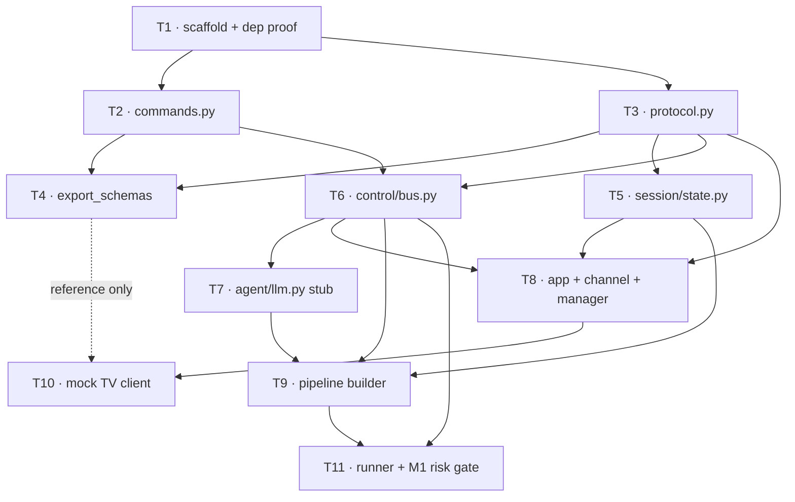

# Parallel Execution Guide — Two Claude Code Sessions

**Plan:** `docs/superpowers/plans/2026-09-19-tv-avatar-backend-phase1.md`
**Spec:** `docs/superpowers/specs/2026-09-19-tv-avatar-backend-design.md`

This file tells you which of the plan's 11 tasks can run at the same time in two separate Claude Code sessions, how to isolate them so they don't fight over git, and exactly what to paste into the second session.

---

## 1. Dependency graph



T1 is a universal ancestor and T11 a universal descendant, so neither parallelises. Everything between them has slack.

---

## 2. The schedule

Five waves. **A** and **B** are the two sessions; a wave ends when both sides finish, and the sync step in between is mandatory.

| Wave | Session A | Session B | Sync after? |
|---|---|---|---|
| 0 | **T1** — scaffold, pinned deps, dependency proof | *(idle — wait for A)* | **Yes, hard gate** |
| 1 | **T2** — command schemas | **T3** — wire protocol | Yes |
| 2 | **T6** — command bus | **T5** — session store | Yes |
| 3 | **T7** — stub LLM → then **T4** | **T8** — app + control socket | Yes |
| 4 | **T9** — pipeline builder | **T10** — mock TV client | Yes |
| 5 | **T11** — runner + interruption gate | *(idle — needs A's T9)* | Done |

**T4 is the floater.** It only needs T2 and T3, so from wave 2 onward either session can pick it up whenever it's between tasks. Parked in wave 3A above because that's A's shortest task.

**Effective speedup is ~1.6×, not 2×.** Waves 0 and 5 are single-session, and they're the two most important tasks — T1 proves the dependency stack, T11 answers the Anam interruption question. Budget accordingly.

---

## 3. Why these pairs are safe

Two concurrent tasks are only safe if they never touch the same file. They don't:

| Wave | A writes | B writes |
|---|---|---|
| 1 | `src/tv_avatar/agent/{__init__,commands}.py`, `tests/test_commands.py` | `src/tv_avatar/control/{__init__,protocol}.py`, `tests/test_protocol.py` |
| 2 | `src/tv_avatar/control/bus.py`, `tests/test_command_bus.py` | `src/tv_avatar/session/{__init__,state}.py`, `tests/test_session_state.py` |
| 3 | `src/tv_avatar/agent/llm.py`, `tests/test_stub_llm.py`, later `tools/export_schemas.py`, `contracts/` | `src/tv_avatar/app.py`, `src/tv_avatar/control/channel.py`, `src/tv_avatar/session/manager.py`, `tests/test_app.py` |
| 4 | `src/tv_avatar/pipeline/*`, `tests/test_pipeline_builder.py` | `tools/mock_tv_client/*`, **modifies** `src/tv_avatar/app.py` |

**One hazard, in wave 4:** T10 modifies `app.py`, which T8 created in wave 3. That's fine *because of the sync gate* — B owns `app.py` across both waves, and A never touches it. Don't reshuffle T10 to session A.

`pyproject.toml` and `uv.lock` are written only by T1. No task after it adds a dependency, so there is no lockfile contention.

---

## 4. Isolation: one worktree per session

Two sessions committing to `dev` in the same directory will corrupt each other's index. Give each its own worktree.

**Run these once, from the main checkout, before starting either session:**

```bash
cd /Users/arnabdey0503/Documents/hackbarna_2026

# .worktrees must be git-ignored or the worktree contents get committed
grep -qxF '.worktrees/' .gitignore || echo '.worktrees/' >> .gitignore
git add .gitignore && git commit -m "chore: ignore .worktrees"

git worktree add .worktrees/track-a -b feat/avatar-track-a dev
git worktree add .worktrees/track-b -b feat/avatar-track-b dev
git worktree list
```

Session A runs in `.worktrees/track-a`, session B in `.worktrees/track-b`. Each needs its own environment:

```bash
cd .worktrees/track-a && uv sync     # and the same in track-b
```

`.env` is git-ignored, so **copy it into both worktrees** once you have real keys — neither will inherit it.

---

## 5. Sync protocol between waves

After both sessions report their wave complete, run this from the **main checkout**:

```bash
cd /Users/arnabdey0503/Documents/hackbarna_2026
git checkout dev
git merge --no-ff feat/avatar-track-a -m "merge: track A wave <N>"
git merge --no-ff feat/avatar-track-b -m "merge: track B wave <N>"
uv sync && uv run pytest tests/ -v          # full suite must be green
git push origin dev
```

Then rebase both tracks onto the merged `dev` before the next wave:

```bash
git -C .worktrees/track-a rebase dev
git -C .worktrees/track-b rebase dev
```

**If the full suite fails after a merge, stop.** Do not start the next wave. A red baseline makes every subsequent failure ambiguous about which track caused it.

---

## 6. Prompt for session B

Open a second Claude Code session, `cd` into `.worktrees/track-b`, and paste this:

```text
We're executing a written plan in parallel across two Claude Code sessions.
I am SESSION B. Another session (A) is working concurrently in a sibling
worktree — do not touch its files.

Plan:  docs/superpowers/plans/2026-09-19-tv-avatar-backend-phase1.md
Spec:  docs/superpowers/specs/2026-09-19-tv-avatar-backend-design.md
Schedule: docs/superpowers/plans/2026-09-19-parallel-execution.md

Read all three first.

My assigned tasks, in this order, one wave at a time:
  Wave 1: Task 3  (control/protocol.py)
  Wave 2: Task 5  (session/state.py)
  Wave 3: Task 8  (app.py, control/channel.py, session/manager.py)
  Wave 4: Task 10 (tools/mock_tv_client/, and the app.py static mount)

Rules:
- Use the superpowers:executing-plans skill.
- Follow each task's steps exactly, including writing the test first and
  watching it fail before implementing.
- Commit after each task using the plan's commit message.
- STOP after finishing each wave and tell me. Do not start the next wave
  until I confirm the merge is done and you have rebased onto dev.
- Never create or edit files outside the "Session B writes" column in
  section 3 of the parallel-execution guide. If a task seems to need a
  file owned by session A, stop and ask instead of creating it.
- Do not run `git push`. I handle merges from the main checkout.

Start with Wave 1 / Task 3.
```

Session A's prompt is the same with the roles swapped:

```text
I am SESSION A.
  Wave 0: Task 1  (scaffold — session B is blocked until this lands)
  Wave 1: Task 2  (agent/commands.py)
  Wave 2: Task 6  (control/bus.py)
  Wave 3: Task 7  (agent/llm.py), then Task 4 (tools/export_schemas.py)
  Wave 4: Task 9  (pipeline/)
  Wave 5: Task 11 (pipeline/runner.py + the Anam interruption gate)
```

---

## 7. Honest assessment

**Is two sessions worth it here?** Marginally. The critical path is T1 → T2/T3 → T6 → T7 → T9 → T11, which is six of the eleven tasks and mostly lives in session A. Session B's track (T3 → T5 → T8 → T10) runs alongside it but never shortens it. You save roughly the cost of T4, T5, T8 and T10 — real, but the coordination overhead of four sync gates eats into it.

**Where it genuinely pays:** T8 and T10 are the largest tasks by volume (FastAPI wiring and a full mock client), and offloading them keeps session A's context focused on the pipeline, which is the part with actual unknowns.

**Where it would not pay:** do not try to parallelise T1 or T11. T1 is a hard gate — running anything before the dependency stack is proven risks discarding it. T11 is the M1 risk gate and needs a single person watching one avatar for one interruption.

**If you'd rather keep it simple**, run everything in one session. The plan is written to work sequentially and nothing in it requires parallelism.
