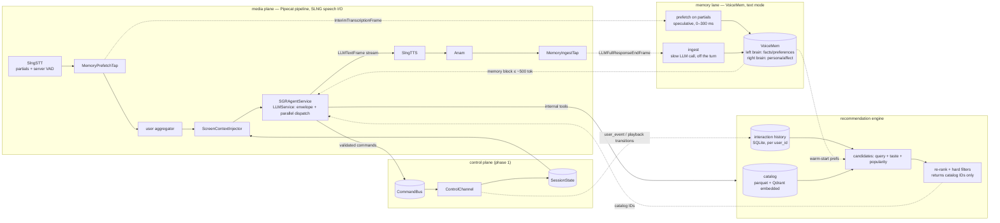

# TV Avatar Backend — Phase 2 Implementation Plan: Agent, Memory, Recommendations

> **For agentic workers:** REQUIRED SUB-SKILL: Use superpowers:subagent-driven-development (recommended) or superpowers:executing-plans to implement this plan task-by-task. Steps use checkbox (`- [ ]`) syntax for tracking.

**Goal:** Replace the phase-1 agent stub with a real voice agent — a Schema-Guided Reasoning (SGR) turn envelope over an OpenAI-compatible API, a VoiceMem memory lane running on cloud endpoints only, and a recommendation engine over the TMDB catalog — wired into the existing pipeline, command bus, and screen-state store without changing the phase-1 wire protocol.

**Architecture:** Phase 1's two planes stay untouched. Phase 2 adds three lanes that meet only inside the agent turn:



**Tech Stack:** phase-1 stack plus `voicemem`, `qdrant-client` (embedded mode — no server), `openai` (Nebius TokenFactory or any OpenAI-compatible endpoint), `polars`, `pyarrow`, `aiosqlite`.

**Upstream docs:** `docs/superpowers/specs/2026-09-19-tv-avatar-backend-design.md` (§8, §14), `docs/superpowers/plans/2026-09-19-tv-avatar-backend-phase1.md`, `docs/tv-buddy-architecture.mmd`.

## Phase-2 decisions

These extend the spec's locked-decision table; where one modifies a phase-1 decision it says so explicitly.

| # | Decision | Rationale |
|---|---|---|
| D6 | **VoiceMem runs in the text lane, not the audio lane.** SLNG already owns ASR; feeding audio to VoiceMem would duplicate STT and pull in its local audio stack (FunASR, sherpa-onnx, Qwen-Omni). We drive `ingest()` with final transcripts and `search()` with partial transcripts. | Zero duplicated STT cost; no local model downloads; the only audio-derived features lost are voiceprint and acoustic emotion — deferred, not needed for the demo. |
| D7 | **One LLM provider, two env vars: Nebius TokenFactory via `OPENAI_API_KEY` + `OPENAI_BASE_URL`.** The agent LLM, the catalog embedder, and VoiceMem's *LLM* role (`llm=openai`, `VOICEMEM_CHAT_MODEL`) read the same two variables. `Settings` exposes them as `openai_api_key` / `openai_base_url` — no separate `LLM_*` pair. **VoiceMem's embedding and slot classifier run locally** (`embedding=local`, `slots=local`, multilingual-e5) — revised from cloud after measuring the Nebius embedding endpoint's jitter (Task 1 Step 6). | VoiceMem reads `OPENAI_API_KEY`/`OPENAI_BASE_URL` directly through the openai SDK and mem0 and its own docs say not to rename them; those variables are process-global, so one endpoint per process is the only honest configuration. Nebius is OpenAI-compatible, so the variables express the protocol, not the vendor. Local E5 for memory is what makes VoiceMem's read path fit inside a voice turn. |
| D8 | **The turn is a single SGR envelope** `{intent, say, actions[]}` — constrained decoding via `response_format={"type": "json_schema"}`, with `say` ordered before `actions` and stream-extracted so filler reaches TTS while actions are still generating. Actions dispatch in parallel the moment each array element completes. | This *narrows* spec D3, which rejected a JSON envelope because of dead air before the first word. Stream-extracting `say` keeps time-to-first-word ≈ plain streaming, and constrained decoding makes invalid verbs *unrepresentable* — strictly stronger than phase-1 validation. Fallback if the incremental extractor proves flaky: native parallel `tool_calls` (same dispatch semantics, loses the validity guarantee). Verified in Task 7, not assumed. |
| D9 | **Three memory stores, three owners.** Current screen → `SessionState` + injector (phase 1, unchanged). Interaction history → new SQLite event log. Conversational/stated memory → VoiceMem. Screen state is *not* a VoiceMem plugin: snapshots are high-volume structured state that must render identically every turn, and history must be queryable relationally for CF signal — neither is what a memory graph is for. | Each store does the job it is shaped for; the agent turn merges all three in the prompt. |
| D10 | **Personalisation is keyed on `user_id`, not `session_id`.** `POST /sessions` accepts an optional `user_id`; VoiceMem gets one memory space per user, history one rowset per user. Sessions come and go; the couch persists. | Matches VoiceMem's `user_id`/`space` config keys and makes warm-start work across sessions. |
| D11 | **Catalog IDs are `str(tmdb_id)` from the dataset.** The rec engine returns IDs only; the agent may emit `focus`/`play`/`open_details` against them. The mock client's `tt_*` ids stay valid for protocol tests but the demo uses real catalog tiles via `GET /catalog/sample`. | One namespace end to end; no ID translation layer. |
| D12 | **Pipecat is the only orchestrator; SLNG owns all speech I/O.** Every phase-2 component is a Pipecat `FrameProcessor` or `LLMService` speaking Pipecat's frame vocabulary — no side channels, no second event loop, none of VoiceMem's own reply/TTS/realtime layers (only its memory core is used, D6). Concretely: STT partials are `InterimTranscriptionFrame` from `SlngSTTService`; the agent emits `LLMFullResponseStartFrame → LLMTextFrame* → LLMFullResponseEndFrame` so `SlngTTSService`'s sentence aggregation and Anam lip-sync work unchanged; interruption is Pipecat's `InterruptionFrame` propagating through the pipeline; turn boundaries are `UserStartedSpeakingFrame`/`UserStoppedSpeakingFrame`; latency is read from Pipecat's built-in TTFB/processing metrics. | This is where the control lives. Owning the frame graph means we choose exactly when memory prefetch starts (first interim), when filler speech starts (first `say` byte), when commands fire (each action element), and when ingest runs (after `LLMFullResponseEndFrame`) — all as frame observations, all testable with fake frames and no network. SLNG gives streaming partials and server VAD alongside local Silero; Anam's `_handle_interruption` already listens for `InterruptionFrame`, so a single frame stops the LLM stream, TTS, and the avatar together. |

**Pipecat 1.11.0 frame names, verified on the pinned version** (the spec's §9 mentions `StartInterruptionFrame`; that class does **not** exist on 1.11.0 — it is `InterruptionFrame`): `InterimTranscriptionFrame`, `TranscriptionFrame`, `LLMContextFrame` (the aggregator's output to the LLM; `OpenAILLMContextFrame`/`LLMMessagesFrame` are gone), `LLMRunFrame`, `LLMFullResponseStartFrame`, `LLMTextFrame`, `LLMFullResponseEndFrame`, `TTSSpeakFrame`, `InterruptionFrame`, `UserStartedSpeakingFrame`, `UserStoppedSpeakingFrame`, `BotStartedSpeakingFrame`, `BotStoppedSpeakingFrame`, `FunctionCallInProgressFrame`, `FunctionCallResultFrame`, `LLMSetToolsFrame`. `LLMService` exposes `push_frame`, `register_function`, `start_ttfb_metrics`/`stop_ttfb_metrics`, `start_processing_metrics`/`stop_processing_metrics`.

### Frame graph — where each phase-2 component sits and what it listens to

```python
Pipeline([
    transport.input(),          # SmallWebRTC + local Silero VAD
    stt,                        # SlngSTTService — partials on, server VAD on
    mem_tap,                    # NEW  MemoryPrefetchTap: InterimTranscriptionFrame → lane.prefetch (never blocks, passes frames through)
    user_agg,                   # LLMContextAggregatorPair.user() — gates on UserStoppedSpeakingFrame, emits LLMContextFrame
    screen_injector,            # NEW  ScreenContextInjector: rewrites the system message in LLMContextFrame with fresh screen + memory + history
    agent,                      # NEW  SGRAgentService(LLMService): LLMContextFrame → SGR stream → LLMTextFrame* + bus.dispatch; InterruptionFrame → cancel
    tts,                        # SlngTTSService — unchanged
    anam,                       # AnamVideoService — unchanged, flushes on InterruptionFrame
    transport.output(),
    assistant_agg,              # writes the spoken `say` text back into context
    ingest_tap,                 # NEW  MemoryIngestTap: on LLMFullResponseEndFrame → create_task(lane.ingest_turn) — off the turn
])
```

Everything marked NEW is a `FrameProcessor` that forwards every frame it does not act on. `mem_tap`, `ingest_tap`, and `screen_injector` never push frames of their own except pass-through — they observe and mutate. Only `agent` originates frames. Turn status for the TV (`agent_status`: listening/thinking/speaking) is derived by a Pipecat observer from `UserStartedSpeakingFrame`/`LLMFullResponseStartFrame`/`BotStartedSpeakingFrame`/`BotStoppedSpeakingFrame` and pushed over the control socket — no component tracks state by hand.

## Coordination with the phase-1 tracks

Phase 1 is being executed in two parallel worktrees (`feat/avatar-track-a`, `feat/avatar-track-b`; schedule in `docs/superpowers/plans/2026-09-19-parallel-execution.md`). This plan runs on `feat/agentic-layer` as a **third track** and must respect the same rule: never write a file another track owns until it has landed on `dev`.

**State on `origin/dev` as of 2026-09-19, 8554a44** — all eleven phase-1 tasks have landed and `feat/agentic-layer` has been fast-forwarded to it; `uv sync && uv run pytest` → **50 passed**. Re-check with `git fetch && git log --oneline origin/dev`:

| Phase-1 task | Landed on `dev`? | Phase-2 tasks that need it |
|---|---|---|
| T1 scaffold, T2 `commands.py`, T3 `protocol.py`, T4 contracts, T5 `session/state.py`, T6 `bus.py`, T7 `llm.py` stub, T9 `pipeline/`, T11 `runner.py` + findings | yes | all |
| T8 `app.py`, `control/channel.py`, `session/manager.py` | yes (8554a44) | Task 8 |
| T10 `tools/mock_tv_client/` | yes (8554a44) | Task 8 (demo tiles), Task 9 |
| M0/M1 live measurements (keys) | **pending** — findings doc has the table, no numbers | Task 9 |

**Seam found while reading the landed code:** `ControlChannel._write_loop` drains only `CommandMsg` from `CommandBus.next_outbound()`, and the single `AgentStatusMsg(idle)` is sent inline in `run()`. There is **no path for the server to push `agent_status` or `transcript` messages** after connect. Task 8 must add one — a `bus.push_server_message(msg: ServerMessage)` that shares the outbound deque (the queue's type widens from `CommandMsg` to `ServerMessage`; `cancel_turn` filters on `isinstance(m, CommandMsg)` so status messages are never dropped by an interruption). This is a small additive change to `bus.py` and `channel.py`, both already on `dev`, so it no longer crosses a track boundary.

**Facts confirmed by track A that this plan builds on:** `pipecat-ai` **1.11.0**; `pipecat.services.llm_service.LLMService` has **no abstract methods** and takes `run_in_parallel=True, group_parallel_tools=True, function_call_timeout_secs=None, enable_async_tool_cancellation=False, settings=None, **kwargs`; `builder.py` currently hardcodes `StubLLMService(bus=bus)` — the `AGENT_IMPL` switch (Task 8) replaces that one line. `AnamVideoService` handles `InterruptionFrame` explicitly (`_handle_interruption`), so phase-2's interruption path (Task 7) only needs to cancel the LLM stream and the bus turn — the avatar flush is the plugin's job.

**Branching rule for this track:** `feat/agentic-layer` is already at `dev`; phase 1 is complete, so the only remaining concurrent work is the M0/M1 live measurement, which touches `docs/findings/` and possibly `pipeline/services.py` (constructor kwargs). Phase 2 does not write either file before Task 9. Before each task, `git fetch && git merge --ff-only origin/dev` — if it is not a fast-forward, stop and look at what landed. The `.gitignore` gained `data/` and `.DS_Store` on this branch; nothing else outside the task file lists is touched.

## Global Constraints

- **All phase-1 constraints still apply** — uv only, no per-frame pixel work, `commands.py` is the single source of truth, fire-and-forget never awaits, `"v": 1` on every message.
- **`data/` is git-ignored.** The 630 MB CSV, the parquet catalog, the Qdrant files, the SQLite history DB, and VoiceMem's `memory_root` all live under `data/` and must never be committed. `.env.example` gains the new keys with blank values.
- **Nothing VoiceMem does may block the turn.** `vm.search`/`vm.ingest` are synchronous — every call goes through `asyncio.to_thread`. Prefetch rides STT partials; ingest rides a post-turn task the pipeline never awaits.
- **Request-response tools share the 400 ms rule.** `search_catalog` (client), `recommend_titles` (internal), `recall_memory` (internal) all degrade to a spoken fallback on timeout rather than hanging the turn.
- **`AGENT_IMPL=stub|sgr` env switch.** The stub stays the default in tests and remains the pipeline's deterministic test double.
- **Internal tools are not wire verbs.** `recommend_titles` and `recall_memory` exist only inside the agent — they never appear in `CommandMsg`, never reach the TV, and are excluded from `contracts/` export.
- **`loguru` is the only logger.** `from loguru import logger` everywhere (already a phase-1 dependency, already used in `channel.py`); no `logging.getLogger`, no `print`. Every log line inside a session is emitted through `logger.bind(session_id=..., user_id=..., turn_id=...)` so one `grep turn_id=` reconstructs a turn across the memory lane, the recs engine, the bus, and the socket. Third-party stdlib logging (VoiceMem, mem0, qdrant-client, openai, httpx) is routed into loguru by a single `InterceptHandler` installed in `tv_avatar/logging.py` at app start — VoiceMem also uses bare `print` in places (e.g. `llm_config.Models.update`); those are tolerated, not wrapped. Secrets, full prompts, and raw envelope JSON are never logged above `DEBUG`; `INFO` carries intents, verbs, IDs, and timings only.

---

### Task 1: Phase-2 environment — dependencies, config, gitignore

The riskiest thing this phase is whether `voicemem`'s dependency tree (`torch`, `transformers==4.52.3` pinned, `funasr`, `mem0ai`, …) resolves against the pinned Pipecat stack. Prove it before any code depends on it.

**Files:**
- Modify: `pyproject.toml`, `.gitignore`, `.env.example`, `src/tv_avatar/config.py`
- Create: `src/tv_avatar/logging.py` (`setup_logging(level)` — removes loguru's default sink, adds a stderr sink with a format that prints the bound `session_id`/`turn_id` when present, and installs an `InterceptHandler` on the root stdlib logger so VoiceMem/mem0/qdrant/openai/httpx lines arrive as loguru records; `LOG_LEVEL` env, default `INFO`; called from `create_app` and `tools/build_catalog.py`)
- Test: `tests/test_phase2_env.py`, `tests/test_logging.py` (a stdlib `logging.getLogger("mem0").warning(...)` lands in a loguru sink captured via `logger.add(list.append)`)

**Interfaces:**
- Produces: new `Settings` fields — `openai_api_key: str` (env `OPENAI_API_KEY`), `openai_base_url: str = "https://api.tokenfactory.nebius.com/v1/"` (env `OPENAI_BASE_URL`), `llm_model: str = "nvidia/Nemotron-3_5-Lightning"`, `llm_extra_body: dict = {"chat_template_kwargs": {"enable_thinking": False}}` (env `LLM_EXTRA_BODY`, JSON), `embedding_model: str = "Qwen/Qwen3-Embedding-8B"`, `embedding_dimensions: int = 1024`, `voicemem_local_models_dir: str = "data/voicemem_models"`, `catalog_path: str = "data/catalog.parquet"`, `qdrant_path: str = "data/qdrant_db"`, `history_db_path: str = "data/history.db"`, `memory_root: str = "data/voicemem"`, `catalog_index_limit: int = 100_000`, `mem_prefetch_min_chars: int = 6`, `tool_timeout_s: float = 0.4`, `agent_impl: str = "stub"`.

- [ ] **Step 1: Write the failing test**

`tests/test_phase2_env.py`:

```python
"""Phase-2 dependency proof — run before any phase-2 code exists."""
from importlib.metadata import version


def test_new_dependencies_import():
    import openai  # noqa: F401
    import polars  # noqa: F401
    import pyarrow  # noqa: F401
    import aiosqlite  # noqa: F401
    from qdrant_client import QdrantClient  # noqa: F401


def test_voicemem_imports_and_constructs_in_text_config():
    """Import alone must not load local models (they are lazy), and a
    VoiceMem instance must be constructible without downloading anything."""
    import voicemem
    assert hasattr(voicemem, "VoiceMem")


def test_pipecat_stack_unchanged():
    # Phase-1 pins must survive the new dependency tree.
    assert version("pipecat-anam") == "0.2.0a6"
    assert version("pipecat-slng") == "0.5.2"
```

- [ ] **Step 2: Run it and watch it fail**

```bash
uv run pytest tests/test_phase2_env.py -v
```

Expected: FAIL on imports.

- [ ] **Step 3: Add dependencies**

```bash
uv add openai polars pyarrow aiosqlite qdrant-client voicemem
uv sync
uv run pytest tests/test_phase2_env.py tests/test_environment.py -v
```

Expected: PASS. **If `uv` fails to resolve `voicemem`** (most likely on the `transformers==4.52.3` pin or a torch variant conflict), stop and take the documented fallback: create `services/voicemem/` as a separate uv project exposing `POST /search` and `POST /ingest` over localhost HTTP, and implement `MemoryLane` (Task 5) as an HTTP client instead of an in-process wrapper. The interface in Task 5 is identical either way — that is why it exists. Record which path was taken in the findings doc (Task 9).

- [ ] **Step 4: Update `.gitignore` and `.env.example`**

Append to `.gitignore`:

```gitignore
data/
```

Append to `.env.example`:

```dotenv
# LLM provider — Nebius TokenFactory (OpenAI-compatible). These two variables are
# read by the agent, the embedder, AND VoiceMem/mem0 directly, so they are the only
# provider config. Do not add LLM_* aliases.
OPENAI_API_KEY=
OPENAI_BASE_URL=https://api.tokenfactory.nebius.com/v1/

# Turn brain — chosen on measured TTFT (Task 1 Step 6). Thinking MUST be off.
LLM_MODEL=nvidia/Nemotron-3_5-Lightning
LLM_EXTRA_BODY={"chat_template_kwargs":{"enable_thinking":false}}
# fallback: LLM_MODEL=Qwen/Qwen3-30B-A3B-Instruct-2507  LLM_EXTRA_BODY={}

# Catalog + query embeddings (the only embedding model on Nebius)
EMBEDDING_MODEL=Qwen/Qwen3-Embedding-8B
EMBEDDING_DIMENSIONS=1024

# VoiceMem: ingest LLM is cloud (off the turn); embedding + slots are LOCAL e5 (on the turn)
VOICEMEM_CHAT_MODEL=deepseek-ai/DeepSeek-V4-Flash-0731
VOICEMEM_LOCAL_MODELS_DIR=data/voicemem_models

AGENT_IMPL=stub
LOG_LEVEL=INFO
```

The user's local `.env` already carries `OPENAI_API_KEY` for Nebius. **Do not read, print, or commit `.env`** — only `.env.example` with blank values goes in git. In `config.py`, `Settings` picks the variables up by field name (`openai_api_key`, `openai_base_url`) — pydantic-settings maps them case-insensitively, so no `alias` is needed. `Settings` also **must not** call `os.environ.setdefault` for these — they are already in the environment for VoiceMem to read; the config layer only reads.

- [ ] **Step 5: Extend `Settings` and the config test**

Add the fields listed in Interfaces to `src/tv_avatar/config.py`. Extend `tests/test_config.py` with:

```python
def test_phase2_defaults(monkeypatch):
    monkeypatch.setenv("SLNG_API_KEY", "sk")
    monkeypatch.setenv("ANAM_API_KEY", "an")
    monkeypatch.setenv("ANAM_AVATAR_ID", "av")
    monkeypatch.setenv("OPENAI_API_KEY", "nb-test")
    s = Settings(_env_file=None)
    assert s.openai_api_key == "nb-test"
    assert s.openai_base_url.startswith("https://api.tokenfactory.nebius.com")
    assert s.agent_impl == "stub"
    assert s.tool_timeout_s == 0.4
    assert s.qdrant_path.endswith("qdrant_db")
```

- [ ] **Step 6: Pick the models from measurements, not the catalog page**

D8 bets on constrained decoding and the whole design bets on TTFT. A first bench was run on 2026-09-19 against the live Nebius endpoint (`/v1/models` lists 24 models; the ones below are the low-latency candidates) with the real envelope schema — `intent`/`say`/`actions[anyOf…]`, `strict: true`, streamed, `temperature=0`, best of 2:

| Model | `extra_body` needed | TTFT | total | valid + key order |
|---|---|---|---|---|
| `nvidia/Nemotron-3_5-Lightning` | `chat_template_kwargs.enable_thinking=false` | **286 ms** | **530 ms** | yes |
| `google/gemma-3-27b-it` | — | **261 ms** | 1125 ms | yes |
| `Qwen/Qwen3-30B-A3B-Instruct-2507` | — | 382 ms | 1040 ms | yes |
| `nvidia/NVIDIA-Nemotron-3-Nano-30B-A3B` | `enable_thinking=false` | 337 ms | 1159 ms | yes |
| `openai/gpt-oss-120b` | `reasoning_effort="low"` | 478 ms | 690 ms | yes |
| `deepseek-ai/DeepSeek-V4-Flash-0731` | `chat_template_kwargs.thinking=false` | 782 ms | 1004 ms | yes |
| `deepseek-ai/DeepSeek-V4.1-Flash` | `chat_template_kwargs.thinking=false` | 842 ms | 1029 ms | yes |
| `zai-org/GLM-5.3-Flash` | `enable_thinking=false` | 1001 ms | 1782 ms | yes |

**Findings that shape the design:**

1. **`anyOf` discriminated unions in `json_schema` work on every model tested** — D8's action union needs no flattening. Keys stream in declared order (`intent`, `say`, `actions`) on all of them, so the `EnvelopeStreamer` assumption holds.
2. **Without the thinking-off switch, the reasoning models are unusable here.** DeepSeek Flash spent 2.4 s and the whole token budget on hidden reasoning before the first `say` byte; GLM-5.3-Flash took 18 s; Nemotron-Lightning streamed its chain-of-thought *as content*, breaking the JSON. `Settings` therefore gains `llm_extra_body: dict = {}` (env `LLM_EXTRA_BODY`, JSON) and `SGRAgentService` passes it on every call. The prompt's `intent` field is the SGR substitute for thinking — that's the point of the cascade.
3. **The "brain" on the turn should be `Nemotron-3_5-Lightning` (primary) with `Qwen3-30B-A3B-Instruct-2507` as the quality fallback.** Lightning's 286/530 ms is the only result that leaves room in the spec §5 budget; Qwen3-30B-A3B is the safer instruction-follower if Lightning hallucinates `title_id`s under the real prompt. Gemma has the best TTFT but is dense 27B — its total is 2× Lightning's, which matters for the second SGR cycle. **DeepSeek Flash is not the turn brain** — 800 ms+ TTFT even with thinking off; use it (thinking off) as `VOICEMEM_CHAT_MODEL` for ingest, where it runs off the turn and quality beats speed.
4. **The only embedding model is `Qwen/Qwen3-Embedding-8B` (4096 dims, `dimensions=` accepted) and its latency is erratic: 108 ms → 1.8 s across six identical calls.** Shared serverless — cannot be on the turn unguarded. This changes D7 for the *memory* lane: see the revision below.

These are n=2 numbers from one machine at one time of day. The bench script is committed as `tools/bench_llm.py` (the script used above, parameterised by model list) and **re-run at n=10 as the first act of Task 7**, with the table above updated in the Task 9 findings doc. Defaults in `.env.example` follow this table: `LLM_MODEL=nvidia/Nemotron-3_5-Lightning`, `LLM_EXTRA_BODY={"chat_template_kwargs":{"enable_thinking":false}}`, `EMBEDDING_MODEL=Qwen/Qwen3-Embedding-8B`, `EMBEDDING_DIMENSIONS=1024`, `VOICEMEM_CHAT_MODEL=deepseek-ai/DeepSeek-V4-Flash-0731`.

**D7 revision — embeddings split by lane, on latency evidence.**

| Lane | Embedder | Why |
|---|---|---|
| Recs catalog (offline index, Task 2) | Nebius `Qwen3-Embedding-8B`, `dimensions=1024` | Quality matters, latency does not; batches amortise the jitter; 1024 dims keeps the Qdrant index 4× smaller than 4096 with negligible recall loss for a 100 k corpus. |
| Recs query (on the turn, Task 4) | same model, **speculatively embedded from the STT partial** and cached per utterance; hard 400 ms timeout → fall back to `top_popular` + taste vector (already computed from stored catalog vectors, no embed call) | The query must live in the catalog's vector space, so it must be the same model. Speculation + fallback is the only way to keep an erratic endpoint off the critical path. |
| VoiceMem memory + slot classifier (Task 5) | **local** `intfloat/multilingual-e5-small` (VoiceMem's default) — `embedding={"provider":"local"}`, `slots={"provider":"local"}` | This is what gives VoiceMem its published 134 ms / 12 ms numbers. 118M params, 384 dims, ~470 MB of weights, and it removes *two* network hops (embedding + slot LLM) from the memory read path. Memory vectors never need to share a space with the catalog — the memory→recs warm start passes *text*, not vectors. |

**Local E5 cost, measured 2026-09-19 on the dev Mac (arm64, 14 cores), single query:** torch fp32 CPU with `torch.set_num_threads(2)` **p50 12.4 ms / p90 14.8 ms**; all-threads CPU 15.7/21.7 ms (more threads is slower — contention); MPS 10.6/11.8 ms; ONNX fp32 20/31 ms; ONNX qint8 14/17.7 ms. **Quantisation is not worth it** — the int8 file targets x86 AVX-512 VNNI and gives nothing on Apple silicon, and even unquantised the call is ~1 % of the turn budget. Decisions that follow: run E5 on **CPU pinned to 2 threads** (leaves the rest for the 25 fps passthrough and the event loop; MPS is not needed and would add a device-sync path), `warmup()` at app start because **load is the real cost — 4.6 s warm, ~27 s on first download**, and set `HF_HUB_ENABLE_HF_TRANSFER=0` / accept that the HF cache for this repo is ~2 GB because it ships ONNX variants alongside the safetensors (only ~470 MB is used). If a future host is a weak x86 box without AVX-512, re-run this table there before considering the qint8 ONNX file or a static-embedding model (model2vec, ~1 ms) — the latter would also change VoiceMem's slot classifier behaviour, so it is a measured trade, not a drop-in.

Memory `ingest` still uses the cloud `VOICEMEM_CHAT_MODEL` (D7) — it is off the turn. Resident RAM for E5 is ~600 MB; acceptable on the demo machine, and it is the same trade the VoiceMem authors made.

- [ ] **Step 7: Commit**

```bash
git add pyproject.toml uv.lock .gitignore .env.example src/tv_avatar/config.py tests/
git commit -m "feat: phase-2 env — voicemem, qdrant, openai-compatible LLM config"
```

---

### Task 2: Catalog build — CSV → parquet + embedded Qdrant

Offline indexing, run once per dataset version. The notebook (`tmdb-movies-recommendation-system copy.ipynb`) is the baseline: TF-IDF over `overview+genres+keywords`, `vote_count>=50`, popularity blend. We keep the filtering, swap TF-IDF for cloud embeddings, and add a real vector index.

**Files:**
- Create: `tools/build_catalog.py`, `src/tv_avatar/recs/__init__.py`, `src/tv_avatar/recs/catalog.py`
- Create: `tests/fixtures/catalog_sample.csv` (first ~200 rows of the dataset — public data)
- Test: `tests/test_catalog.py`

**Interfaces:**
- Produces: `CatalogItem(BaseModel)` — `title_id: str` (str(TMDB id)), `name`, `year: int|None`, `genres: list[str]`, `overview`, `vote_average`, `vote_count`, `popularity`, `poster_path`, `imdb_id`, `runtime`, `original_language`; `CatalogStore(catalog_path, qdrant_path)` with `lookup(title_id) -> CatalogItem | None`, `lookup_many(ids)`, `search(vector, filters: CatalogFilter, limit) -> list[tuple[CatalogItem, float]]`, `top_popular(limit) -> list[CatalogItem]`, `embed_text(item) -> str`; `CatalogFilter(BaseModel)` — `genres_any`, `exclude_ids: set`, `year_min/year_max`, `languages`, `min_vote_count`.
- `build_catalog(csv_path, out_parquet, qdrant_path, *, limit, embed_fn)` — streaming indexing entry point.

- [ ] **Step 1: Write the failing test**

`tests/test_catalog.py` (uses the committed fixture + `QdrantClient(":memory:")` + a deterministic fake `embed_fn` hashing tokens into fixed dims — no network):

```python
from tv_avatar.recs.catalog import CatalogFilter, CatalogStore


def test_lookup_by_title_id(sample_store):
    item = sample_store.lookup("27205")  # Inception
    assert item.name == "Inception"
    assert "Science Fiction" in item.genres


def test_search_respects_exclude_filter(sample_store):
    hits = sample_store.search([0.1] * 8, CatalogFilter(exclude_ids={"27205"}), limit=5)
    assert all(i.title_id != "27205" for i, _ in hits)


def test_genre_filter(sample_store):
    hits = sample_store.search([0.1] * 8, CatalogFilter(genres_any={"Horror"}), limit=10)
    assert all("Horror" in i.genres for i, _ in hits)
```

- [ ] **Step 2: Run it and watch it fail** — `ModuleNotFoundError`.

- [ ] **Step 3: Write `src/tv_avatar/recs/catalog.py`**

`CatalogStore` = `polars` lazyframe scan of the parquet (`.collect()` once into a dict index keyed by `title_id` — ~100 k rows is fine in memory) + `QdrantClient(path=qdrant_path)` collection `tmdb`. `embed_text` format (this string is what gets embedded — keep it stable):

```python
f"{item.name} ({item.year}). Genres: {', '.join(item.genres)}. " \
f"Keywords: {item.keywords}. {item.overview[:600]}"
```

- [ ] **Step 4: Write `tools/build_catalog.py`**

`polars.scan_csv` with filters (`status == "Released"`, `vote_count >= 50`, `overview`/`genres`/`poster_path` non-null), sort by `popularity` desc, head `settings.catalog_index_limit`. Write parquet. Then embed in batches of 256 via the configured embedding endpoint (`openai` client constructed from `settings.openai_api_key` / `settings.openai_base_url`) and upsert to Qdrant with payload `{title_id, name, genres, vote_average, vote_count, popularity}`. **Make indexing resumable** — skip points whose `title_id` already exists; 100 k docs is real money and time, an interrupted run must not restart. CLI:

```bash
uv run python tools/build_catalog.py --limit 1000   # smoke slice first
uv run python tools/build_catalog.py                # full run
```

- [ ] **Step 5: Smoke-run against the real dataset**

```bash
uv run python tools/build_catalog.py --limit 500
uv run pytest tests/test_catalog.py -v
```

Expected: PASS; `data/catalog.parquet` and `data/qdrant_db/` exist, both git-ignored.

- [ ] **Step 6: Commit** (fixture + code, never the artifacts)

---

### Task 3: Interaction history store — the per-user event log

D9's second store. Behavioural signal for recs (watched set, taste profile) and a "recently watched" line for the prompt. **Not VoiceMem's job** — this is high-volume structured data that must be counted and filtered, not recalled.

**Files:**
- Create: `src/tv_avatar/history/__init__.py`, `src/tv_avatar/history/store.py`, `src/tv_avatar/history/recorder.py`
- Test: `tests/test_history.py`

**Interfaces:**
- Produces: `EventKind(StrEnum)` — `PLAY_STARTED | PLAY_COMPLETED | PLAY_ABANDONED | FOCUS_DWELL | SEARCH_ISSUED | REC_SHOWN | REC_ACCEPTED | USER_EVENT`; `HistoryStore(db_path)` — async `record(Event)`, `watched_ids(user_id) -> set[str]`, `engaged_ids(user_id, min_watch_s=300) -> list[str]`, `recent_titles(user_id, limit=10) -> list[str]`, `render_for_prompt(user_id) -> str`; `HistoryRecorder(store, catalog)` — `on_command(msg)`, `on_screen_transition(old, new)`, `on_user_event(evt)`, `on_rec_shown(user_id, ids)`.

- [ ] **Step 1: Write the failing test**

```python
async def test_watched_ids_and_recents(tmp_path):
    store = HistoryStore(str(tmp_path / "h.db"))
    await store.record(Event(user_id="u1", kind=EventKind.PLAY_STARTED,
                             title_id="27205", detail={}))
    await store.record(Event(user_id="u2", kind=EventKind.PLAY_STARTED,
                             title_id="680", detail={}))
    assert await store.watched_ids("u1") == {"27205"}
    assert await store.watched_ids("u2") == {"680"}
```

Plus: a `stopped→playing` screen transition records `PLAY_STARTED`; a `playing→stopped` transition with `position_s >= 0.9 * runtime` records `PLAY_COMPLETED`, otherwise `PLAY_ABANDONED` (runtime from `catalog.lookup`); `render_for_prompt` lists recent names.

- [ ] **Step 2: Fail. Step 3: Implement.**

`store.py`: aiosqlite, WAL mode, one table `events(user_id, ts, kind, title_id, detail_json)` + index on `(user_id, kind)`. All calls async; callers fire-and-forget via `asyncio.create_task` — recording must never stall a turn (same rule as the bus).

`recorder.py`: pure transition logic — `on_screen_transition` diffs `playback.state`/`title_id`/`position_s` between consecutive `ScreenState`s. Keep it a pure function of `(old, new, runtime_s)` so it is trivially testable.

- [ ] **Step 4: Pass. Step 5: Commit.**

---

### Task 4: Recommendation engine — retrieve, filter, re-rank, IDs only

The mmd's `rec tool, inline in the turn`. Three candidate channels merged, hard-filtered, re-ranked, returning catalog IDs.

**Files:**
- Create: `src/tv_avatar/recs/engine.py`, `src/tv_avatar/recs/embedder.py`
- Test: `tests/test_recs.py`

**Interfaces:**
- Consumes: `CatalogStore`, `HistoryStore`, `MemoryBlock` (Task 5 — define against its render, not the class).
- Produces: `Embedder` protocol — `async embed(texts: list[str]) -> list[list[float]]` (`OpenAIEmbedder(base_url, key, model)` impl + `FakeEmbedder` for tests); `RecsContext(BaseModel)` — `user_id`, `query_text: str | None`, `constraints: CatalogFilter`, `memory_text: str | None`, `limit: int = 8`; `RecoItem(BaseModel)` — `title_id`, `name`, `score`, `reasons: list[str]`; `RecsEngine(catalog, history, embedder)` — `async recommend(ctx) -> list[RecoItem]`, `async similar(title_id, ctx) -> list[RecoItem]`, `async invalidate_taste(user_id)`.

- [ ] **Step 1: Write the failing test**

```python
async def test_watched_titles_never_recommended(engine, u1_with_history):
    recs = await engine.recommend(RecsContext(user_id="u1", query_text="heist"))
    assert "27205" not in {r.title_id for r in recs}


async def test_cold_start_falls_back_to_popular(engine):
    recs = await engine.recommend(RecsContext(user_id="new_user", limit=5))
    assert len(recs) == 5


async def test_recommend_returns_under_timeout(engine):
    # The 400 ms tool budget is a hard ceiling (phase-1 rule).
    import asyncio
    await asyncio.wait_for(
        engine.recommend(RecsContext(user_id="u1", query_text="space")), timeout=0.4)
```

- [ ] **Step 2: Fail. Step 3: Implement.**

```python
async def recommend(self, ctx: RecsContext) -> list[RecoItem]:
    watched = await self._history.watched_ids(ctx.user_id)
    filters = ctx.constraints.model_copy(update={"exclude_ids": watched})

    channels = []
    if ctx.query_text:
        qv = await self._query_vector(ctx)      # speculative cache first; else embed under tool_timeout_s; None on timeout
        if qv is not None:
            channels.append((self._catalog.search(qv, filters, limit=50), 1.0, "match"))
    taste = await self._taste_vector(ctx.user_id)        # mean of engaged embeddings, cached
    if taste is not None:
        channels.append((self._catalog.search(taste, filters, limit=50), 0.6, "for you"))
    if not channels:
        channels.append(([(i, 0.0) for i in self._catalog.top_popular(ctx.limit)], 1.0, "popular"))

    merged: dict[str, RecoItem] = {}
    for hits, w, tag in channels:
        for item, sim in hits:
            score = w * sim + 0.2 * _popularity_norm(item)
            ...  # merge by title_id, accumulate reasons, keep max score
    return sorted(merged.values(), key=lambda r: -r.score)[: ctx.limit]
```

`_query_vector(ctx)`: the Nebius embedding endpoint measured 108 ms–1.8 s for identical calls (Task 1 Step 6), so it is never awaited naked on the turn. `RecsEngine.prefetch_query(user_id, partial_text)` is called by the same `MemoryPrefetchTap` that warms VoiceMem (Task 8) and caches the vector keyed by `(user_id, normalised prefix)`; `_query_vector` returns the cached vector if the final query shares the prefix, otherwise embeds under `asyncio.wait_for(tool_timeout_s)` and returns `None` on timeout — the taste and popularity channels still produce a result, and `RecoItem.reasons` says `"for you"` rather than `"match"` so the agent's `say` stays honest. Log hit/miss/timeout at `DEBUG` with `user_id`.

`_taste_vector(user_id)`: mean of stored embeddings of `engaged_ids` — fetch vectors from Qdrant by ID (no re-embedding). Memory warm-start: when `ctx.memory_text` carries stated preferences ("hates horror"), embed it as a third channel at weight 0.5 and let the genre strings appear as reasons. Keep the blend weights module-level constants — tuning is demo-time work.

`similar(title_id)` — used when the user says "more like this": fetch the title's stored vector, search, exclude itself + watched.

- [ ] **Step 4: Pass against the fixture catalog. Step 5: Commit.**

---

### Task 5: Memory lane — VoiceMem behind an interface

VoiceMem is the mmd's "parallel lane, finished before the turn opens". It is also this phase's biggest unknown — so it sits behind a `MemoryLane` protocol with a fake for tests and a sidecar option if Task 1 forced it out of process.

**Files:**
- Create: `src/tv_avatar/memory/__init__.py`, `src/tv_avatar/memory/lane.py`, `src/tv_avatar/memory/voicemem_lane.py`, `src/tv_avatar/memory/fake.py`
- Test: `tests/test_memory_lane.py`

**Interfaces:**
- Produces:
  - `MemoryBlock(BaseModel)` — `left: str`, `right: str`, `speaker_id: str | None`, `token_est: int`, `stale: bool`; `render_for_prompt() -> str` (compact, ≤ ~500 tokens, `"(none yet)"` when empty).
  - `MemoryLane(Protocol)` — `async prefetch(user_id, partial: str)`, `async recall(user_id, final: str) -> MemoryBlock`, `async ingest_turn(user_id, user_text, assistant_text)`.
  - `VoiceMemLane(memory_root, settings)` — one `VoiceMem` per `user_id`, lazily constructed, all calls in `asyncio.to_thread`.
  - `FakeMemoryLane(blocks)` — canned `MemoryBlock`s, records calls for assertions.

- [ ] **Step 1: Write the failing test** (interface-level — runs against `FakeMemoryLane` and, behind a `@pytest.mark.skipif` on missing keys, `VoiceMemLane`):

```python
async def test_recall_returns_prefetched_when_final_matches_partial():
    lane = FakeMemoryLane()
    await lane.prefetch("u1", "what do I like")
    block = await lane.recall("u1", "what do I like again?")
    assert isinstance(block, MemoryBlock)


async def test_ingest_never_raises_into_the_turn():
    lane = FakeMemoryLane()
    await lane.ingest_turn("u1", "I love sci-fi", "noted")  # must swallow errors


@pytest.mark.skipif(not os.environ.get("OPENAI_API_KEY"), reason="live VoiceMem")
async def test_prefetch_is_not_serialised_behind_a_slow_ingest(live_lane):
    """mem0 holds locks in places; a multi-second ingest must not block the
    next turn's prefetch. Fires both, asserts prefetch returns inside budget."""
    ingest = asyncio.create_task(live_lane.ingest_turn("u1", "I hate horror films", "noted"))
    t0 = time.perf_counter()
    await asyncio.wait_for(live_lane.prefetch("u1", "what should I"), timeout=1.0)
    assert time.perf_counter() - t0 < 0.7
    await ingest
```

**Latency expectations for this lane, so Task 9 has a baseline to compare against.** With local E5-small for embedding + slots (D7 as revised), a `search` is two CPU inferences (measured p50 12 ms each at 2 threads on the dev Mac) plus a local vector lookup (~10 ms) — the configuration behind VoiceMem's published 134 ms, and well under it for a single-user store. Prefetch on the first interim transcript makes even that invisible: `recall` at `LLMContextFrame` time is normally a cache hit. `ingest` is 1–4 s of cloud LLM calls (`VOICEMEM_CHAT_MODEL`) and is never on the turn. Watch two things in Task 9: (a) E5 inference competing with the 25 fps video passthrough for CPU — `to_thread` keeps it off the event loop, but on a small demo box it can still show up as audio jitter; `torch.set_num_threads(2)` is set at lane construction regardless (it measured faster than all-threads, see Task 1 Step 6); (b) prefetch being serialised behind ingest (the test above fails) — give ingest its own single-worker `ThreadPoolExecutor` so `to_thread`'s shared pool is never saturated by writes.

- [ ] **Step 2: Fail. Step 3: Implement `lane.py` + `fake.py`.**

`recall` semantics: if a prefetch for this user completed in the last ~2 s and its query prefix-matches the final transcript's first 20 chars, reuse it (that's the speculative win) and log `logger.debug("memory prefetch hit", user_id=..., age_ms=...)`; else run `search` fresh and log the miss. `ingest_turn` wraps `vm.ingest` and swallows every exception with `logger.opt(exception=True).warning("memory ingest failed", user_id=...)` — a memory write failure is visible in the log and invisible to the conversation. Successful ingests log `facts_count` and `memory_ids` at `INFO`; never the transcript text above `DEBUG`.

- [ ] **Step 4: Implement `voicemem_lane.py`**

```python
def _make_vm(self, user_id: str) -> VoiceMem:
    return VoiceMem.from_config({
        "api_key": self._settings.openai_api_key,
        "base_url": self._settings.openai_base_url,
        "user_id": user_id,
        "memory_root": f"{self._settings.memory_root}/{user_id}",
        "top_k": 5,
        "embedding": {"provider": "local"},     # multilingual-e5, CPU — the read path stays local
        "slots": {"provider": "local"},         # shares the same E5 instance; no LLM hop
        "llm": {"provider": "openai",           # ingest / extraction only — off the turn
                "config": {"model": os.environ.get("VOICEMEM_CHAT_MODEL")}},
    })
```

Local models: `hf download zhifeixie/VoiceMem_Default_Models_Env --local-dir $VOICEMEM_LOCAL_MODELS_DIR` is a one-time step documented in the README (Task 9); the lane logs a clear error naming that command if the directory is missing. **Call `vm.warmup()` once per process at app start** (in a `create_task` so it does not delay the first WebRTC connect) — it exists precisely to pre-load E5 so the first `search` does not pay for it. Confirm on the installed version whether `warmup()` also tries to load the *audio* models (ASR/speaker/emotion) we do not use; if it does, warm E5 directly via `voicemem.leftbrain.local_e5_embedder.shared_e5()` instead and record that in the findings.

The text-lane open questions this step must answer by reading the installed package (record answers in findings): which `mode` accepts plain-text `ingest()` while still producing a rightbrain (`"normal"` vs `"leftbrain_only"` — the README only documents text ingest for the latter); whether `from_config` exists on the installed version (the config module documents it, but confirm `hasattr(VoiceMem, "from_config")` and fall back to `VoiceMem(**build_kwargs(config))`); whether search returns speaker/emotion fields on text input.

- [ ] **Step 5: Pass. Step 6: Commit.**

---

### Task 6: SGR turn envelope + incremental stream parser

The heart of the agent. One Pydantic schema IS the turn contract: `intent` routes (SGR routing), `say` is the spoken reply ordered before actions (SGR cascade — filler reaches TTS while actions generate), `actions[]` is a discriminated union enabling parallel dispatch (SGR cycle). The action union is *generated from* `COMMAND_MODELS`, preserving phase 1's no-drift rule.

**Files:**
- Create: `src/tv_avatar/agent/envelope.py`, `src/tv_avatar/agent/stream_parse.py`
- Test: `tests/test_envelope.py`, `tests/test_stream_parse.py`

**Interfaces:**
- Produces:
  - Internal tool models `RecommendTitles(verb="recommend_titles", query|None, genre|None, year_min|None, year_max|None, limit=8)` and `RecallMemory(verb="recall_memory", query)`; `INTERNAL_MODELS`, `INTERNAL_AWAIT: frozenset` (both await results, unlike TV commands).
  - `ALL_MODELS = COMMAND_MODELS | INTERNAL_MODELS`; `ActionUnion` (discriminated `verb`); `TurnPlan(BaseModel)` — `intent: Literal["control","navigate","recommend","search","answer","chitchat","clarify"]`, `say: str`, `actions: list[ActionUnion] = []`; `turn_plan_schema() -> dict` for `response_format`.
  - `EnvelopeStreamer` — `feed(delta: str) -> list[Event]` emitting `SayDelta(text)`, `ActionReady(dict)`, `Done()`; handles arbitrary key order (if the provider emits `actions` before `say`, actions dispatch early — a degradation, not a bug).

- [ ] **Step 1: Write the failing tests**

```python
def test_action_union_covers_tv_and_internal_verbs():
    plan = TurnPlan.model_validate({
        "intent": "recommend", "say": "one sec",
        "actions": [{"verb": "recommend_titles", "query": "heist"},
                    {"verb": "focus", "title_id": "27205"}]})
    assert [a.verb for a in plan.actions] == ["recommend_titles", "focus"]


def test_streamer_emits_say_deltas_then_actions():
    s = EnvelopeStreamer()
    events = []
    for ch in '{"say":"Putting that on.","actions":[{"verb":"play","title_id":"1"}]}':
        events += s.feed(ch)
    kinds = [type(e).__name__ for e in events]
    assert kinds[0] == "SayDelta"
    assert "ActionReady" in kinds and kinds[-1] == "Done"
    assert "".join(e.text for e in events if isinstance(e, SayDelta)) == "Putting that on."
```

Char-by-char feeding is deliberate — the parser must be chunk-boundary agnostic. Add a fixture test where `actions` precedes `say` in the stream.

- [ ] **Step 2: Fail. Step 3: Implement.**

`envelope.py`: build `ActionUnion` dynamically — `Annotated[Union[tuple(ALL_MODELS.values())], Field(discriminator="verb")]`; `turn_plan_schema()` returns `TurnPlan.model_json_schema()` wrapped `{"name": "turn_plan", "schema": ..., "strict": True}`. Also emit `describe_capabilities() -> str` — the prompt's capability manifest, generated from the same models (no drift).

`stream_parse.py`: a small state machine over the raw JSON text — track depth and in-string/escape state; while inside `"say": "…"` forward unescaped chars as `SayDelta`; inside `"actions": [ … ]` buffer each top-level `{…}` element and `json.loads` it on its closing brace into `ActionReady`. ~120 lines. Constrained decoding guarantees well-formed input, but the parser must still never raise mid-stream — on malformed input emit nothing and let the completed turn report failure.

- [ ] **Step 4: Pass. Step 5: Commit.**

---

### Task 7: The real agent service — a Pipecat `LLMService` running SGR over an OpenAI-compatible endpoint

Replaces the stub behind `AGENT_IMPL`. It is a first-class Pipecat `LLMService` (D12): it receives `LLMContextFrame`, streams `say` downstream as `LLMTextFrame`s so `SlngTTSService` speaks it exactly as it would any other LLM's output, dispatches actions in parallel as they complete, and runs a second cycle when an internal tool returns data — that second cycle is what turns "recommend me something" into an actual recommendation rather than filler.

**Files:**
- Create: `src/tv_avatar/agent/service.py`, `src/tv_avatar/agent/prompt.py`, `src/tv_avatar/agent/tools.py` (internal tool dispatch table)
- Test: `tests/test_agent_service.py`

**Interfaces:**
- Consumes: `Settings`, `CommandBus`, `MemoryLane`, `RecsEngine`, `HistoryStore`, `SessionState`; Pipecat `LLMService`, `LLMContextFrame`, `LLMFullResponseStartFrame`, `LLMTextFrame`, `LLMFullResponseEndFrame`, `InterruptionFrame`, `FrameDirection`.
- Produces: `SGRAgentService(LLMService)` with `__init__(settings, bus, lane, recs, history, session, client=None, **kwargs)`; `async process_frame(frame, direction)` (the Pipecat entry point — `LLMContextFrame` → `_run_turn`, `InterruptionFrame` → `_cancel_turn`, everything else `await self.push_frame(frame, direction)`); `async _run_turn(context) -> None`; `build_messages(context, memory, history_summary) -> list[dict]`; `async dispatch_action(verb, args, turn_id) -> dict`; `needs_second_cycle(results) -> bool`.
- `prompt.py`: `build_system_prompt() -> str` — phase-1's five sections (persona, generated capability manifest, rules, output contract) plus a sixth: `## Memory` (the `MemoryBlock` render) and `## Recent activity` (history render). Static sections first, volatile last — same cache-friendly ordering as phase 1.

- [ ] **Step 1: Confirm how the context reaches the service and how the assistant message is written back**

`LLMService.__init__` signature and the absence of abstract methods are already confirmed by track A (see Coordination). What still needs a look on the installed 1.11.0:

```bash
uv run python -c "
import inspect
from pipecat.processors.aggregators.llm_context import LLMContext
print([m for m in dir(LLMContext) if not m.startswith('_')])
from pipecat.frames.frames import LLMContextFrame
print(inspect.signature(LLMContextFrame))
from pipecat.services.openai.llm import OpenAILLMService
src = inspect.getsource(OpenAILLMService)
print('\n'.join(l for l in src.splitlines() if 'LLMFullResponse' in l or 'LLMTextFrame' in l or 'ttfb' in l.lower()))
"
```

Record: the `LLMContext` accessor for messages (`.messages` / `.get_messages()`), and the exact frame sequence `OpenAILLMService` pushes around a completion — `SGRAgentService` must emit the same sequence so the assistant aggregator and `SlngTTSService` cannot tell the difference. The assistant aggregator writes back whatever `LLMTextFrame`s it sees; because we only push `say` text, the conversation history sees prose, never the JSON envelope.

- [ ] **Step 2: Write the failing tests** — drive the service with real Pipecat frames through a two-processor test pipeline (`SGRAgentService → FrameSink`), with the OpenAI client replaced by a fake that streams a canned envelope (`respx` or an injected `client`):

```python
async def test_say_streams_as_llm_text_frames_before_actions_dispatch(agent, bus, sink):
    # fake stream: {"say":"On it.","actions":[{"verb":"play","title_id":"1"}]}
    await agent.process_frame(LLMContextFrame(context=_ctx("play the first one")), FrameDirection.DOWNSTREAM)
    kinds = [type(f).__name__ for f in sink.frames]
    assert kinds[0] == "LLMFullResponseStartFrame"
    assert "LLMTextFrame" in kinds and kinds[-1] == "LLMFullResponseEndFrame"
    assert "".join(f.text for f in sink.frames if isinstance(f, LLMTextFrame)) == "On it."
    assert sink.first_text_at < bus.first_dispatch_at          # filler before action
    assert (await bus.next_outbound()).verb == "play"


async def test_awaited_action_triggers_second_cycle(agent, recs, sink):
    # cycle 1 emits recommend_titles; fake engine returns 2 items;
    # cycle-2 envelope's say must name them; exactly one Start/End pair reaches TTS.
    ...


async def test_interruption_frame_cancels_stream_and_queued_commands(agent, bus, sink):
    task = asyncio.create_task(agent.process_frame(LLMContextFrame(context=_slow_ctx()), FrameDirection.DOWNSTREAM))
    await asyncio.sleep(0.01)
    await agent.process_frame(InterruptionFrame(), FrameDirection.DOWNSTREAM)
    await task
    assert bus.pending_count() == 0
    assert isinstance(sink.frames[-1], InterruptionFrame)     # propagated, not swallowed
    assert not any(isinstance(f, LLMFullResponseEndFrame) for f in sink.frames)  # aborted turn does not "end" cleanly
```

- [ ] **Step 3: Fail. Step 4: Implement.**

`_run_turn(context)`: `turn_id = session.new_turn()` → `await self.start_ttfb_metrics()` → `memory = await lane.recall(user_id, last_user_text)` (prefetch hit makes this ~free) → `build_messages` → `push_frame(LLMFullResponseStartFrame())` → `client.chat.completions.create(stream=True, response_format=turn_plan_schema())` → feed each `delta.content` into `EnvelopeStreamer` → `SayDelta` → `await self.stop_ttfb_metrics()` on the first one, then `push_frame(LLMTextFrame(text))`; `ActionReady` → `asyncio.create_task(dispatch_action(...))` (parallel, per the mmd and SGR cycle) → on `Done`, gather awaited results; if any, cycle 2 (see below); finally `push_frame(LLMFullResponseEndFrame())`. Pipecat's sentence aggregation between us and SLNG TTS is what turns `LLMTextFrame` deltas into clause-sized TTS requests — do not batch text ourselves.

`dispatch_action`: internal verbs → `RecsEngine`/`MemoryLane` with `asyncio.wait_for(settings.tool_timeout_s)`; TV verbs → `bus.dispatch` (phase-1 semantics preserved: fire-and-forget returns `{"status":"dispatched"}`, `search_catalog` awaits 400 ms). Cycle 2: append the results as a tool-style message and re-stream with the same schema **without** a new `LLMFullResponseStartFrame` — one turn, one Start/End pair, so TTS treats the filler and the answer as one utterance. Cap cycles at 2: no open-ended loops on a voice interface.

`process_frame` on `InterruptionFrame`: cancel the in-flight completion task, `bus.cancel_turn(turn_id)`, then `push_frame(frame, direction)` — the frame must keep flowing so `SlngTTSService` and `AnamVideoService._handle_interruption` see it. Dispatched-but-sent commands stay (phase-1 §9 rule 4). Wrap the service in `pipecat`'s metrics: `start_processing_metrics`/`stop_processing_metrics` around the turn so M4's latency numbers come from the pipeline, not ad-hoc timers.

- [ ] **Step 5: Pass. Step 6: Commit.**

---

### Task 8: Wiring — frame processors, status observer, history recorder, session user_id

Connect the lanes to the phase-1 skeleton through Pipecat's frame graph (D12). Every new piece here is a `FrameProcessor` or an observer; none of them talks to the agent directly — they only see frames.

**Files:**
- Create: `src/tv_avatar/agent/injector.py` (`ScreenContextInjector`), `src/tv_avatar/memory/taps.py` (`MemoryPrefetchTap`, `MemoryIngestTap`), `src/tv_avatar/pipeline/observers.py` (`AgentStatusObserver`, `TurnLatencyObserver`)
- Modify: `src/tv_avatar/pipeline/builder.py`, `src/tv_avatar/app.py`, `src/tv_avatar/control/bus.py` (add `push_server_message`, widen outbound to `ServerMessage`), `src/tv_avatar/control/channel.py` (`_handle` hooks; write loop unchanged — it already serialises whatever the bus yields), `src/tv_avatar/session/state.py`, `tools/mock_tv_client/client.js`
- Test: `tests/test_taps.py`, `tests/test_injector.py`, `tests/test_observers.py`, `tests/test_wiring.py`

**Interfaces:**
- `ScreenContextInjector(FrameProcessor)` — on `LLMContextFrame`, rewrites the context's system message with `build_system_prompt()` + `session.render_for_prompt()` enriched per tile via `catalog.lookup(title_id)` (`"Sicario (2015) — Crime, Thriller <- focused"`) + the latest `MemoryBlock` render + `history.render_for_prompt(user_id)`. Stamps, never stores — latest screen wins, history does not pollute it (D9). Passes every other frame through untouched.
- `MemoryPrefetchTap(FrameProcessor)` — after `SlngSTTService`; on `InterimTranscriptionFrame` with `len(text) >= settings.mem_prefetch_min_chars` and at most once per `UserStartedSpeakingFrame`, `create_task(lane.prefetch(user_id, text))`. Never awaits the lane; always forwards the frame.
- `MemoryIngestTap(FrameProcessor)` — after the assistant aggregator; on `LLMFullResponseEndFrame`, reads the last user/assistant pair from the context and `create_task(lane.ingest_turn(...))`. Off the critical path by D6. Skips ingest when an `InterruptionFrame` was seen since the last `LLMFullResponseStartFrame` — a cut-off turn is not a memory.
- `AgentStatusObserver` (Pipecat observer) — maps `UserStartedSpeakingFrame → listening`, `UserStoppedSpeakingFrame/LLMFullResponseStartFrame → thinking`, `BotStartedSpeakingFrame → speaking`, `BotStoppedSpeakingFrame → idle` and pushes `AgentStatusMsg` through `bus.push_server_message` (see the seam note in Coordination). Replaces any hand-tracked state. The same path carries optional `TranscriptMsg` captions from `TranscriptionFrame` / the spoken `say`.
- `TurnLatencyObserver` — collects Pipecat `MetricsFrame` (TTFB / processing) per turn plus our own marks: first interim → prefetch fired, `LLMContextFrame` → first `LLMTextFrame`, first `ActionReady` → `CommandMsg` on the socket. Emits **one** `logger.bind(session_id, user_id, turn_id).info("turn", **marks)` line per turn with every mark in milliseconds as a kwarg (`prefetch_ms`, `ttft_ms`, `first_cmd_ms`, `interrupt_stop_ms`, `intent`, `n_actions`, `prefetch_hit: bool`, `cycles`) — grep-able and trivially loaded into a dataframe. This is M4's data source and Task 9's findings table.
- `builder.py`: `AGENT_IMPL` switch replaces the single `StubLLMService(bus=bus)` line; taps, injector, and observers are inserted at the positions shown in the Frame graph section. `with_avatar` and everything phase 1 wired stay as they are.
- `POST /sessions` accepts `{"user_id": str | None}` (defaults to a per-session anon id) and echoes it; `SessionState` gains `user_id`.
- `HistoryRecorder` hooks: `ControlChannel._handle` calls `on_screen_transition`/`on_user_event`; the recs tool calls `on_rec_shown`; a `play` ack records `PLAY_STARTED`.
- Mock client: loads real tiles from `GET /catalog/sample?limit=8` when present, so demo grids show real catalog `title_id`s.

- [ ] **Step 1: Failing tests** — each processor tested in isolation by feeding real Pipecat frames into a `Pipeline([proc, FrameSink()])` with a fake lane/catalog: prefetch fires once per utterance and only past the threshold; ingest fires on `LLMFullResponseEndFrame` and not after an interruption; injector output contains the focused tile with genre/year and the memory block; status observer emits the four states in order for a scripted frame sequence; `POST /sessions` round-trips `user_id`.
- [ ] **Step 2: Fail. Step 3: Implement. Step 4: Full suite green with `AGENT_IMPL=stub` (default) — the stub still runs through the same taps/injector/observers, which is what makes them testable without a key.**
- [ ] **Step 5: Commit.**

---

### Task 9: End-to-end demo pass + findings document

**Files:**
- Create: `docs/findings/2026-09-19-phase2-agent-memory-recs.md`
- Modify: `README.md` (run instructions)

- [ ] **Step 1: Scripted demo path** — with `AGENT_IMPL=sgr` and real keys: "something like Sicario, but newer" → prefetch fired during speech → recs cycle → `focus`/`open_details` on a real `title_id` → second session, same `user_id`: "what did I watch last time?" answers from history/memory.

- [ ] **Step 2: Record findings** — per-turn numbers from `TurnLatencyObserver` against the spec §5 budget (first interim → prefetch, `LLMContextFrame` → first `LLMTextFrame`, first action → socket, `InterruptionFrame` → TTS/Anam stop); VoiceMem text-mode quirks (mode used, rightbrain behaviour without audio, whether `from_config` existed); Nebius model chosen + `anyOf`/union support and observed key order; embedding model + dims + index build time/cost for the chosen `catalog_index_limit`; measured prefetch hit rate and recs latency against the 400 ms budget; whether D8's envelope streaming held or the native-tool-calls fallback was taken.

- [ ] **Step 3: Commit.**

---

## Self-Review

**Coverage of the request.** Memory/recall via VoiceMem on cloud endpoints → Tasks 1, 5, 8 (D6–D7, D10). Recsys over the TMDB CSV with a vector store → Tasks 2, 4 (Qdrant embedded chosen over Redis: zero infra, payload filtering built in, same-machine files for a single-process backend — Redis stays a drop-in if multi-process ever matters). TV controls → unchanged `commands.py`, extended by generated union not edits (Task 6). Screen state + meta → injector enrichment in Task 8; the plugin-vs-DB question answered by D9 (current → SessionState, history → SQLite, conversation → VoiceMem). Parallel tool loop with spoken filler → D8 + Tasks 6–7. Personalised history via user id → D10 + Tasks 3, 8. VoiceMem as warm start for recs → Task 4's memory channel + Task 8 prefetch.

**SLNG + Pipecat as the control surface (D12).** Every phase-2 timing decision is a frame observation: prefetch on `InterimTranscriptionFrame` (Task 8), filler on the first `LLMTextFrame` (Task 7), actions per `ActionReady` (Tasks 6–7), ingest on `LLMFullResponseEndFrame` (Task 8), stop on `InterruptionFrame` (Task 7, propagated to SLNG TTS and Anam). Nothing bypasses the pipeline; the stub, the SGR agent, and every tap are exercised by the same frame-driven tests. One correction to the spec surfaced while verifying names: 1.11.0 has `InterruptionFrame`, not `StartInterruptionFrame` — the spec's §9 should be amended when phase 1's findings doc is finalised.

**Tensions flagged, not hidden.** D8 narrows spec D3 — the envelope is one JSON object, but `say` streams first, preserving the latency property D3 exists to protect; the native-`tool_calls` fallback is specified where the risk lives (Task 1 Step 6, Task 7 tests). VoiceMem's audio-derived features (voiceprint, acoustic emotion) are knowingly traded away by D6 — recorded as a finding, recoverable later by feeding it SLNG's audio tee. `OPENAI_BASE_URL` being process-global (D7) means agent LLM and memory LLM share a provider per process — split only by running the VoiceMem sidecar.

**Type consistency.** `bus.dispatch(verb, args, turn_id)` unchanged for all TV verbs — Task 7 calls it identically to phase 1. `CatalogFilter` is shared by Tasks 2 and 4. `MemoryBlock` is defined in Task 5 and consumed only by render in Tasks 4 and 7 — the rec engine never imports `voicemem`.
