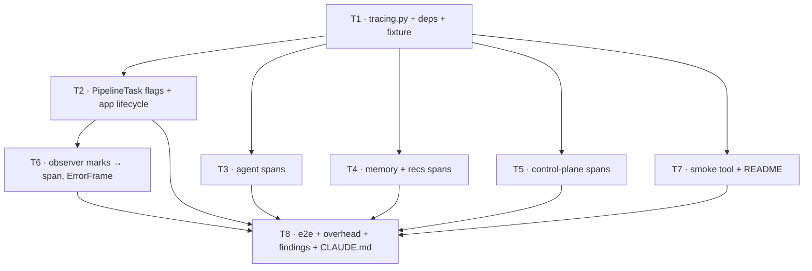

# TV Avatar Backend — Observability Plan: Pipecat Tracing + Langfuse for the Agent

> **For agentic workers:** REQUIRED SUB-SKILL: Use superpowers:subagent-driven-development (recommended) or superpowers:executing-plans to implement this plan task-by-task. Steps use checkbox (`- [ ]`) syntax for tracking. Section 8 tells you how to split the tasks across two sessions.

**Goal:** See a whole voice turn as one tree — STT partials → memory prefetch → SGR cycle 1 → tool calls → cycle 2 (or the templated fallback) → TTS → Anam → TV commands and their acks — with timings, prompts, envelopes and token counts, in Langfuse, without adding a millisecond to the media path or a second orchestrator to the codebase.

**Architecture:** Nothing new sits in the pipeline. OpenTelemetry is the one instrumentation API; Pipecat's own tracing produces the conversation/turn/STT/TTS spans, our code adds spans *under* Pipecat's turn span, and a single OTLP/HTTP exporter ships everything to Langfuse (or, for offline work, to any OTLP collector).

```mermaid
flowchart LR
    subgraph MEDIA["media plane — unchanged"]
        STT[SlngSTT<br/>@traced_stt] --> TAP[MemoryPrefetchTap] --> AGG[user_agg]
        AGG --> AGENT[SGRAgentService<br/>@traced_llm on _run_turn<br/>hosts TurnRunner · loop.py] --> TTS[SlngTTS<br/>@traced_tts] --> ANAM[Anam] --> OUT[output]
    end

    subgraph OTEL["OpenTelemetry — off the media path"]
        TTO[TurnTraceObserver<br/>conversation › turn spans]
        AG["agent.* spans<br/>recall · cycle · action · fallback<br/>(service.py + loop.py)"]
        MEM["memory.* / recs.* spans<br/>prefetch · recall · ingest · recommend"]
        CTL["tv.command / tv.command_result spans"]
        RED[RedactingSpanProcessor<br/>TRACE_CONTENT=false]
        BSP[BatchSpanProcessor<br/>background thread]
        EXP[OTLP HTTP/protobuf exporter]
    end

    subgraph SINKS
        LF[(Langfuse<br/>cloud or self-hosted)]
        JG[(any OTLP collector<br/>Jaeger / console)]
    end

    STT -. spans .-> TTO
    TTS -. spans .-> TTO
    AGENT -. child spans .-> AG
    TAP -. child spans .-> MEM
    AGENT -. bus.dispatch .-> CTL
    TTO --> RED
    AG --> RED
    MEM --> RED
    CTL --> RED
    RED --> BSP --> EXP
    EXP --> LF
    EXP -. OTEL_EXPORTER_OTLP_ENDPOINT override .-> JG
```

**Tech Stack:** phase-2 stack plus the `tracing` extra of `pipecat-ai` (`opentelemetry-sdk`, `opentelemetry-api`, `opentelemetry-instrumentation`), `opentelemetry-exporter-otlp-proto-http`, and `opentelemetry-processor-baggage` (D20). **No `langfuse` Python package** (D13).

**Upstream docs:** `docs/superpowers/specs/2026-09-19-tv-avatar-backend-design.md` (§5 latency budget, §12 testing), `docs/superpowers/plans/2026-09-19-tv-avatar-backend-phase2.md` (D12, Task 8 `TurnLatencyObserver`), `docs/superpowers/plans/2026-09-19-agent-sgr-cleanup.md` (§3 module layout), `docs/findings/2026-09-19-phase2-agent-memory-recs.md`. External: Pipecat OpenTelemetry reference (`docs.pipecat.ai/api-reference/server/utilities/opentelemetry`), Langfuse Pipecat guide (`langfuse.com/integrations/frameworks/pipecat`), **Langfuse OTel attribute mapping** (`langfuse.com/integrations/native/opentelemetry` — the authority for every `langfuse.*` key below), Langfuse observation types (`/docs/observability/features/observation-types`), Langfuse best practices (`/docs/observability/best-practices`, re-fetched in Task 8), `pipecat-examples/open-telemetry/langfuse`.

**Agent skill:** the official `langfuse` skill is installed at `.devin/skills/langfuse/` (from `github.com/langfuse/skills`). Its rules bind this plan: fetch Langfuse docs fresh before implementing (never from memory), use `npx langfuse-cli api …` to read back what was ingested, and finish instrumentation with a **self-audit loop** (run → fetch the trace → audit against the best-practices page → fix → repeat) — Task 8 is written as that loop. Its baseline checklist (model name, token usage, descriptive trace names, span hierarchy, correct observation types, masking, explicit input/output) is what D19–D21 exist to satisfy.

## Observability decisions

These extend the spec's locked-decision table and phase 2's D6–D12.

| # | Decision | Rationale |
|---|---|---|
| D13 | **OpenTelemetry is the only instrumentation API; Langfuse is a sink, not an SDK.** We depend on `pipecat-ai[tracing]` + `opentelemetry-exporter-otlp-proto-http` and never on the `langfuse` package. Langfuse-specific behaviour is expressed purely as span attributes (`langfuse.session.id`, `langfuse.user.id`, `langfuse.trace.input/output`). | Pipecat's tracing *is* OpenTelemetry, so one span tree covers STT, TTS, turns and our agent. A second SDK would double-instrument the `openai` client and produce two disconnected trees. Swapping the sink (Jaeger on a laptop, a collector in prod) is a URL change. Langfuse ingests OTLP **HTTP/protobuf only** — the gRPC exporter is rejected — which is why the http exporter is pinned, not the generic `opentelemetry-exporter-otlp`. |
| D14 | **One trace = one session, and the session/user identity rides on *every* span.** `PipelineTask(conversation_id=session.session_id)` names the trace; `langfuse.session.id`, `langfuse.user.id`, `langfuse.trace.name` and the trace-level metadata are propagated to every span by OTel **Baggage + `BaggageSpanProcessor`** (D20), not set by hand — root spans we create outside the pipeline (mid-session memory fold, `finish_session` after the pipeline ends, `command_result` acks) get them the same way. | Pipecat's conversation span already spans the whole pipeline, matching Langfuse's "Pipecat: one trace per conversation" note. But Langfuse's OTel docs are explicit: *"If you want to filter and aggregate by `userId`, `sessionId`, `metadata`, `version`, `release`, or `tags`, you need to propagate these trace-level attributes to every span in the trace"* — filters increasingly run per observation, not per trace. `additional_span_attributes` lands on the conversation span only, so on its own it would make the session filterable in the trace list but not in observation-level views. Baggage is the mechanism Langfuse recommends for exactly this. |
| D15 | **Agent spans hang under Pipecat's turn span via `@traced_llm` on `SGRAgentService._run_turn`; the loop instruments itself through the OTel API, not through Pipecat.** `_run_turn` (Pipecat glue, `service.py`) gets the decorator. The cycle loop lives in Pipecat-free `agent/loop.py` (`TurnRunner`, behind the `TurnHost` protocol) and opens its own spans (`agent.cycle`, `agent.fallback`) with `tracer().start_as_current_span`; `service.py` opens `agent.recall` and `agent.action`. Because the loop runs inside the decorated coroutine, every span it creates nests under the decorator's `llm` span → `turn` → `conversation` via `contextvars`, with no Pipecat import crossing into `loop.py`. | `_run_turn(self, context)` has exactly the `(self, context, …)` signature `traced_llm` wraps; the decorator captures messages (through the LLM adapter), aggregates output (partial output on interruption, thanks to its `finally`), records token usage through `start_llm_usage_metrics`, and parents on the turn context — all free. Writing our own `llm` span would duplicate this and lose the parent link. The agent cleanup deliberately made `loop.py` independent of Pipecat; `tracing.py` is likewise Pipecat-free (it imports only `pipecat.utils.tracing.setup`, and `loop.py` never calls that), so the instrumentation respects that boundary. **Caveat verified in Task 3 Step 1:** the decorator aggregates `LLMTextFrame`s, but `TurnHost.speak` pushes `AggregatedTextFrame`s — so Pipecat's `output` attribute will be empty and `langfuse.trace.output` must be set by us from `TurnTrace.spoken()`. |
| D16 | **`TurnMetrics` is the single producer; log line and span are two sinks.** The dataclass `SGRAgentService._turn` already fills (`cycles`, `n_actions`, `intent`, `recall_ms`, `ttft_ms`, `first_action_ms`, `total_ms`, `fallback`) gains `as_span_attributes() -> dict` next to its `as_log_fields()`; the former is set on the turn's `llm` span (`tv.turn.*`), the latter stays the `logger.info("turn", …)` line. Likewise `TurnLatencyObserver`'s marks are set on a `turn.latency` span parented on the current Pipecat turn. No timing is measured twice. | Two measurement paths drift. One dataclass, two exports means `grep turn_id=` on the console and the Langfuse span show identical numbers — and the cleanup's typed `TurnMetrics` makes a misspelt attribute a `dataclasses.fields()` mismatch rather than a silent key. |
| D17 | **Tracing is off by default and never on the media path.** `TRACING_ENABLED=false` → `enable_tracing=False`, no provider, zero cost; `create_app()` still boots with no `.env`. When on, spans are exported by `BatchSpanProcessor` on its own thread; span creation is a dict write. Tests run with tracing off, and the tests that assert spans inject an `InMemorySpanExporter` — never a network exporter. | Phase-2's `SessionEventsObserver` invariant, generalised: observation must not cost speech latency. The in-memory exporter is what lets the span tree be a unit-tested artefact rather than something eyeballed in a dashboard. |
| D18 | **Content is exported when tracing is on, redactable with one switch.** Prompts, transcripts, envelopes and `say` text are the point of Langfuse; `TRACE_CONTENT=false` installs a `RedactingSpanProcessor` that drops the content attributes — `langfuse.observation.input`, `langfuse.observation.output`, `langfuse.trace.input`, `langfuse.trace.output`, `gen_ai.prompt`, `gen_ai.completion`, and Pipecat's `messages`, `output`, `system_instructions`, `transcript` — from *every* span, Pipecat's included, before export. API keys never appear: the `openai` client is not instrumented, Pipecat's `traced_llm` only exports scalar `LLMSettings` fields, and baggage (D20) carries ids only. | Pipecat's decorators export message content unconditionally; the only place to enforce a policy for both their spans and ours is an OTel `SpanProcessor`. One switch, one code path. The key list is Langfuse's own input/output mapping table plus Pipecat's attribute names — anything else is metadata. |
| D19 | **Every span we create declares its Langfuse observation type**, via `langfuse.observation.type`: `agent.cycle` and `memory.finish_session` are `generation` (one LLM call each, with `gen_ai.request.model` + `gen_ai.usage.*`); `agent.action` is `tool` for both internal tools and TV verbs (a TV command *is* an action with a side effect); `agent.recall`, `memory.recall`, `recs.recommend` are `retriever` (lookups that change no state); `tv.command_result` and `turn.latency` are `event`; everything else is `span`. Pipecat's own spans are left to Langfuse's inference (its `llm` span carries a model attribute → `generation`). | The skill's baseline requires "generations marked as generations, and each other call given its most specific type" — types drive Langfuse's per-model analytics and the Agent Graph. Langfuse infers `generation` only as a fallback from a model attribute; everything else lands as a generic `span` unless told otherwise. Declaring the type is one attribute per span and makes "which cycle blew the budget" a filter instead of a scroll. |
| D20 | **Trace-level identity is baggage; filterable facts are `langfuse.*.metadata.*`; everything else is `tv.*`.** `tracing.py` exposes `session_scope(session, settings)` — a context manager that attaches `langfuse.session.id`, `langfuse.user.id`, `langfuse.trace.name = "tv-avatar-session"` and `langfuse.trace.metadata.{avatar_id,language,agent_impl}` as OTel baggage; a `BaggageSpanProcessor(ALLOW_ALL_BAGGAGE_KEYS)` copies them onto every span created under that context. Facts we want to **filter or group by** in Langfuse are written as `langfuse.observation.metadata.<key>` (e.g. `…metadata.intent`, `…metadata.fallback`, `…metadata.source`, `…metadata.verb`, `…metadata.trigger`); unmapped `tv.*` attributes are still exported but land in the non-filterable `metadata.attributes` catch-all, so `tv.*` is reserved for numbers you read on the span, not query across spans. | Langfuse's mapping doc: *"Unless you explicitly use the `langfuse.trace.metadata.*` or `langfuse.observation.metadata.*` prefix, these attributes end up in the `metadata.attributes` catch-all and are not directly filterable."* Deciding per attribute whether it is a filter or a detail is the whole design work of the vocabulary table, so the table carries that split explicitly. `session_scope` is entered in exactly three places — the pipeline runner, the control-channel handler, and the memory lane's detached folds — which is the complete set of tasks that create spans for a session. |
| D21 | **Token usage is captured from the stream.** `TurnRunner._cycle` requests `stream_options={"include_usage": True}` and, when the final chunk carries `usage`, sets `gen_ai.usage.input_tokens` / `gen_ai.usage.output_tokens` on the `agent.cycle` span; absent usage sets nothing. **Verified against the live Nebius endpoint in Task 3 Step 1 before the request change ships** — if the endpoint rejects or ignores `stream_options`, the attribute is simply absent and the request is left as it was. | The skill's baseline: token usage "enables automatic cost calculation". Streaming completions omit usage unless asked; Pipecat's `traced_llm` hooks `start_llm_usage_metrics`, but our loop never calls it, so today no token count reaches any span. This is the one plan item that touches the request to the model; the verification step exists because a bad `extra_body`/`stream_options` combination on a shared endpoint has already cost a debugging session in this repo (CLAUDE.md gotchas). |

**Pipecat 1.11.0 tracing surface, verified on the pinned version:** `pipecat.utils.tracing.setup.setup_tracing(service_name, exporter, console_export) -> bool` and `is_tracing_available()`; `PipelineTask(..., enable_tracing: bool = False, enable_turn_tracking: bool = True, conversation_id: str | None, additional_span_attributes: dict | None)` — the attributes land on the **conversation** span; `pipecat.utils.tracing.turn_trace_observer.TurnTraceObserver` starts the conversation span on turn 1, names turn spans `turn` with `turn.number`, `turn.type`, `turn.was_interrupted`, `turn.user_bot_latency_seconds`, and is reachable as `task.turn_trace_observer` (`.get_current_turn_context() -> SpanContext | None`); `pipecat.utils.tracing.service_decorators.traced_llm / traced_stt / traced_tts`; services see `self._tracing_enabled` (set from the `StartFrame` by `AIService.setup`) and `self._tracing_context`. `pipecat_slng.stt` and `pipecat_slng.tts` are already decorated with `@traced_stt` / `@traced_tts`. `pipecat_anam` is not decorated. The `tracing` extra requires `opentelemetry-sdk>=1.33,<2`, `opentelemetry-api>=1.33,<2`, `opentelemetry-instrumentation>=0.54b0,<1`.

**Langfuse OTLP contract, from `langfuse.com/integrations/native/opentelemetry` (fetched 2026-09-19):** endpoint `https://cloud.langfuse.com/api/public/otel` (EU; `us.` / `jp.` / `hipaa.` prefixes for other regions; `<host>/api/public/otel` when self-hosted, ≥ v3.22); the signal-specific traces path is `/api/public/otel/v1/traces`. **OTLP over HTTP only** (`HTTP/protobuf` or `HTTP/JSON`); gRPC is not supported. Headers `Authorization=Basic <base64("pk-lf-…:sk-lf-…")>` and **`x-langfuse-ingestion-version=4` — without it directly-ingested OTel data can lag up to 10 minutes** (this is the first thing to check when "no traces appear"). When passed through `OTEL_EXPORTER_OTLP_HEADERS` the space must be URL-encoded (`Basic%20…`) — we pass headers as a dict to the exporter constructor instead. Attribute mapping that this plan relies on: trace-level `langfuse.session.id`, `langfuse.user.id`, `langfuse.trace.name`, `langfuse.trace.tags`, `langfuse.trace.metadata.*` (filterable), `langfuse.trace.input/output` (deprecated in v4, still honoured — the root observation's input/output is the v4 way, and Pipecat owns our root); observation-level `langfuse.observation.type` (`span | generation | event | embedding | agent | tool | chain | retriever | guardrail | evaluator`; a recognised explicit type always wins), `langfuse.observation.level` (`DEBUG | DEFAULT | WARNING | ERROR`, else inferred from span status), `langfuse.observation.status_message`, `langfuse.observation.metadata.*` (filterable), `langfuse.observation.input/output` (JSON string), `gen_ai.request.model`, `gen_ai.request.*` → model parameters, `gen_ai.usage.*` → usage (generation only). Everything not in that list is exported but lands under `metadata.attributes` and cannot be filtered on.

### Span vocabulary — the one table every task conforms to

Attribute keys are constants in `src/tv_avatar/tracing.py` (Task 1); no task invents a name outside this table without adding it here. Three namespaces (D20): **baggage** (on every span, listed once under `conversation`), **`langfuse.observation.metadata.<key>`** (filterable — the "Filter on" column), and **`tv.<key>`** (detail — the "Detail" column). `type` is `langfuse.observation.type` (D19). Content-bearing values go to `langfuse.observation.input` / `.output` (redacted by D18).

| Span | Parent | Created by | Type | Filter on (`…metadata.*`) | Detail (`tv.*`) / input / output |
|---|---|---|---|---|---|
| `conversation` | root | Pipecat | *(inferred)* | **baggage on every span:** `langfuse.session.id`, `langfuse.user.id`, `langfuse.trace.name = tv-avatar-session`, `langfuse.trace.metadata.{avatar_id, language, agent_impl, half_duplex}` | `conversation.id` (Pipecat) |
| `turn` | conversation | Pipecat | *(inferred)* | — | `turn.number`, `turn.was_interrupted`, `turn.user_bot_latency_seconds` (Pipecat) |
| `stt` / `tts` | turn | pipecat-slng | *(inferred)* | — | Pipecat's (`transcript`, `metrics.ttfb_ms`, `voice_id`, `character_count`) |
| `llm` | turn | `@traced_llm` on `_run_turn` | *(inferred: generation)* | `intent`, `cycles`, `fallback`, `interrupted`, `greeting` | from `TurnMetrics.as_span_attributes()`: `tv.turn.n_actions`, `tv.turn.recall_ms`, `tv.turn.ttft_ms`, `tv.turn.first_action_ms`, `tv.turn.total_ms`; from the service: `tv.turn_id`, `tv.turn.dropped_commands`, `tv.turn.offered_ids`; **input** = user text; **output** = `TurnTrace.spoken()`; plus `langfuse.trace.input` (session's first non-greeting user text) and `langfuse.trace.output` (last spoken, wins) for the trace-level view; Pipecat's `messages`, `gen_ai.usage.*` if any |
| `agent.recall` | llm | Task 3 (`service.py`) | `retriever` | `source` = `prefetch_hit \| search \| stale \| empty` | `tv.memory.empty`, `tv.memory.stale`, `tv.memory.token_est`, `tv.history.chars`; **input** = user text; **output** = memory block render |
| `agent.cycle` | llm | Task 3 (`loop.py`) | `generation` | `cycle` (number), `over_budget` | `tv.cycle.max`, `gen_ai.request.model`, `gen_ai.request.temperature`, `gen_ai.request.max_tokens`, `gen_ai.usage.input_tokens/output_tokens` (D21), `tv.cycle.ttft_ms`, `tv.cycle.budget_ms`, `tv.cycle.n_actions`, `tv.cycle.n_rejected`; **input** = the cycle's messages (JSON); **output** = raw envelope; a `tv.action.rejected` event per rejected element (`verb`, `reason`) — malformed, or an observation tool on the final cycle whose narrowed schema excludes it (`tv.cycle.n_skipped` was retired with the runtime cap skip, 2026-09-20) |
| `agent.action` | agent.cycle | Task 3 (`service.py`) | `tool` | `verb`, `kind` = `internal \| tv`, `status` | `tv.action.awaits_result`, `tv.action.returns_observation` (was `earns_cycle`), `tv.action.ms`, `tv.action.n_titles`, `tv.action.matched`; **input** = args; **output** = result dict; bus `ValueError` → span status `ERROR` + `langfuse.observation.status_message` |
| `agent.fallback` | llm | Task 3 (`loop.py`) | `span` | `cycle` | `tv.fallback.n_actions`; `langfuse.observation.level = WARNING`; **output** = templated text |
| `memory.prefetch` | turn (via tap) | Task 4 | `retriever` | — | `tv.memory.chars`, `tv.memory.prefix_reused` |
| `memory.recall` | agent.recall | Task 4 | `retriever` | `source` | `tv.memory.waited_ms` |
| `memory.ingest` | llm (outlives it) | Task 4 | `span` | `refresh_triggered` | `tv.memory.interrupted`, `tv.memory.said_chars`, `tv.memory.pending_turns` |
| `memory.finish_session` | root (detached; baggage supplies session/user) | Task 4 | `generation` | `trigger` = `session_end \| every_n_turns \| warmup` | `gen_ai.request.model`, `tv.memory.turns`, `tv.memory.profile_chars`; **input** = previous profile + transcript (content); **output** = new profile; failure → status `ERROR`, event `transcript kept for retry` |
| `recs.recommend` | agent.action | Task 4 | `retriever` | `query_embed` = `hit \| miss \| timeout \| none` | `tv.recs.channels`, `tv.recs.n`, `tv.recs.limit`; **input** = `RecsContext` (query, filters); **output** = title ids + reasons |
| `tv.command` | agent.action | Task 5 | `tool` | `verb`, `status` | `tv.command.id`, `tv.command.awaits_result` |
| `tv.command_result` | root (baggage), linked to `tv.command` | Task 5 | `event` | `status` | `tv.command.id`, `tv.command.roundtrip_ms` |
| `turn.latency` | turn | Task 6 | `event` | `n_errors` | `tv.latency.interim_to_context_ms`, `tv.latency.ttft_ms`, `tv.latency.turn_total_ms`, `tv.latency.pipecat_ttfb_ms`, `tv.latency.pipecat_processing_ms`, `tv.latency.interrupt_stop_ms`; `tv.error` events (`message`, `fatal`) |


## Coordination with the existing branches

This plan runs on **`feat/observability`**, branched from `feat/agentic-layer` at `cd3206d` and then carrying the **agent cleanup** (`docs/superpowers/plans/2026-09-19-agent-sgr-cleanup.md`, commits `4d6c673..a11e7f0`; `uv run pytest` → **243 passed**). The cleanup is a prerequisite, not a sibling: it is what made the agent instrumentable without threading a span through eight positional parameters. Nothing here changes the wire protocol, `agent/commands.py`, or `contracts/`, so there is no contract regeneration and no frontend impact.

**Branching rule:** before each task, `git fetch && git merge --ff-only feat/agentic-layer` — if that is not a fast-forward, stop and look at what landed. If the plan is executed in two sessions (§8), the per-session worktrees branch from `feat/observability` and merge back into it, never into `feat/agentic-layer` directly.

**The agent as this plan finds it (post-cleanup) — read this before Task 3:**

| Concern | Where | What the observability work attaches to |
|---|---|---|
| Pipecat glue: `process_frame`, `_run_turn` → `_turn`, `LLMFullResponseStart/End`, interruption + `bus.cancel_turn`, ingest scheduling, `build_messages` (the **only** writer of the system prompt — the injector is out of the `sgr` graph), `dispatch_action`, `speak` | `agent/service.py` (251 lines) | `@traced_llm` on `_run_turn`; `agent.recall` + `agent.action` spans; `tv.turn.*` attributes in `_turn`'s `finally` |
| The SGR loop: `TurnRunner.run` → one `for cycle in 1..agent_max_cycles`; a cycle ends the turn when it yields no observation; cycles after the first run under `asyncio.timeout(cycle_first_byte_s)` disarmed at the first `say` byte, `CycleOverBudget` → `_speak_fallback`; the final cycle is decoded against `turn_plan_schema(final=True)` (no observation tools) so the cap is the schema's, not the loop's. Talks to Pipecat only through `TurnHost` (`speak`, `dispatch_action`, `start/stop_ttfb_metrics`) | `agent/loop.py` (**no Pipecat import**) | `agent.cycle` + `agent.fallback` spans via `tv_avatar.tracing.tracer()` |
| Typed turn state: `TurnContext` (turn_id, user_id, t0, bound log), `TurnMetrics` (the former `marks`; `as_log_fields()`), `TurnTrace` (user_text, said, candidates, `offered_ids()`), `ToolResult.is_observation`, `CycleOutcome.observations/.done` | `agent/turn.py` | `TurnMetrics.as_span_attributes()`; `TurnTrace.spoken()` → `langfuse.trace.output`; `offered_ids()` → `tv.turn.offered_ids` |
| `REGISTRY: dict[str, ActionSpec]` — `kind`, `awaits_result`, `doc` per verb, `returns_observation` derived; `parse_action(final=)`, `turn_plan_schema(final=)`; `recall_memory` **deleted** | `agent/envelope.py` | `…metadata.kind` and `tv.action.awaits_result/returns_observation` read from the spec, never re-derived |
| `render_fallback(results)` | `agent/fallback.py` | pure; nothing to trace, `agent.fallback` wraps the call site in `loop.py` |
| `InternalTools.run(action, user_id)` — `match` on the typed union | `agent/tools.py` | sets `…metadata.status` and `tv.action.matched/n_titles` on the current span |
| Memory profile now refreshed **mid-session** every `memory_refresh_every_turns` ingests (`SummaryMemoryLane.ingest_turn` → `create_task(finish_session)`), and `_commit` archives only the consumed lines | `memory/summary_lane.py` | `memory.finish_session` span (type `generation`) with `…metadata.trigger=every_n_turns`, detached from the turn but still carrying the session baggage; `…metadata.refresh_triggered` on `memory.ingest` |
| `rec_shown` recorded at **turn end** from `TurnTrace.offered_ids()`, not from the tool result | `service.py:_record_offered` | `tv.turn.offered_ids` on the `llm` span |

**Other seams, confirmed in the landed code:** `MemoryLane._LaneBase.recall` already knows whether it served a prefetch hit, waited on an in-flight prefetch, searched, or returned stale; `CommandBus.dispatch` already returns `{"status": "dispatched"}` vs an awaited result; `TurnLatencyObserver` already collects the per-turn marks and `MetricsFrame`s; `PipelineTask` is built in exactly one place (`pipeline/builder.py`) and `setup_logging` is called in exactly one place (`app.py:create_app`).

## Global Constraints

- **All phase-1 and phase-2 constraints still apply** — uv only, `loguru` only, no secret in source, `commands.py` is the single source of truth, fire-and-forget never awaits, `"v": 1` on every wire message.
- **No span on the media path may await anything.** Span creation and `set_attribute` are synchronous dict writes; export is `BatchSpanProcessor`'s background thread. Never use `SimpleSpanProcessor` outside a test.
- **Tracing off ⇒ zero code paths change.** Every `tracer.start_as_current_span` goes through the OTel API, which returns a no-op span when no provider is installed. There must be no `if tracing_enabled:` branches in business code — the toggle lives in `tracing.py` and `builder.py` only.
- **Tests never construct a network exporter.** `tests/conftest.py` gains a session-scoped `otel` fixture that installs one `TracerProvider` with an `InMemorySpanExporter` for the whole test process (OTel allows exactly one global provider per process — a second `set_tracer_provider` is ignored with a warning). Tests assert on `exporter.get_finished_spans()` and call `exporter.clear()`.
- **Attribute names come from `tracing.py` constants and the vocabulary table.** No string literals for attribute keys in business code. Spans are opened through `tracing.observation(name, type=...)` so every span we own carries a `langfuse.observation.type` (D19); filterable facts go under `langfuse.observation.metadata.*`, content under `langfuse.observation.input/output`, details under `tv.*` (D20).
- **Baggage carries identifiers only.** `session_scope` puts session id, user id, trace name and three enum-ish metadata values into baggage — never text, never keys. Baggage propagates on outbound HTTP to third parties by default in OTel; nothing sensitive may ride on it.
- **Docs before code, Langfuse read-back before "done".** Per the installed `langfuse` skill: fetch the relevant Langfuse page before writing against a `langfuse.*` attribute, and verify what was ingested with `npx langfuse-cli api …` rather than the dashboard alone (Task 2 Step 4, Task 8 Step 2).
- **Nothing in `contracts/`, `agent/commands.py`, `control/protocol.py` changes.** The TV app's schedule is unaffected.
- **Every new setting goes into `.env.example` with a blank value** (`LANGFUSE_SECRET_KEY=`), and `README.md` gets the two-line "how to see a trace" recipe.

---

### Task 1: Tracing bootstrap — dependencies, settings, `tracing.py`, test fixture

Prove the OTel stack resolves against the pinned Pipecat, then build the one module every other task imports from.

**Files:**
- Modify: `pyproject.toml`, `uv.lock`, `.env.example`, `src/tv_avatar/config.py`, `tests/conftest.py`
- Create: `src/tv_avatar/tracing.py`
- Test: `tests/test_tracing.py`

**Interfaces:**
- New `Settings` fields (pydantic-settings maps env names case-insensitively, so the Langfuse SDK's conventional names work unchanged): `tracing_enabled: bool = False` (`TRACING_ENABLED`), `trace_content: bool = True` (`TRACE_CONTENT`), `langfuse_public_key: str = ""`, `langfuse_secret_key: str = ""`, `langfuse_host: str = "https://cloud.langfuse.com"` with `validation_alias=AliasChoices("LANGFUSE_HOST", "LANGFUSE_BASE_URL")` — the `langfuse-cli` the skill uses reads `LANGFUSE_BASE_URL`, so one `.env` serves both (same pattern as `cycle_first_byte_s`), `otel_exporter_otlp_endpoint: str = ""` (override: any OTLP/HTTP collector; when set, Langfuse keys are ignored), `otel_exporter_otlp_headers: str = ""` (raw `k=v,k2=v2` for the override case), `otel_console_export: bool = False`, `otel_service_name: str = "tv-avatar"`.
- `tracing.py`:
  - Constants for every key in the vocabulary table, in three groups: `BAGGAGE_*` (`langfuse.session.id`, `langfuse.user.id`, `langfuse.trace.name`, `langfuse.trace.metadata.*`), `META_*` (the `langfuse.observation.metadata.<key>` filter keys), `ATTR_*` (the `tv.*` details, `gen_ai.*`, `langfuse.observation.type/level/status_message/input/output`); `OBS_TYPE_*` literals (`generation`, `tool`, `retriever`, `event`, `span`); `CONTENT_ATTRS: frozenset[str]` — the D18 set `RedactingSpanProcessor` strips.
  - `session_scope(session: SessionState, settings) -> ContextManager[None]` — attaches the D20 baggage (`baggage.set_baggage` per key on the current context, `context.attach`, detach on exit). Ids and enum-ish strings only; never content (baggage propagates to third parties).
  - `observation(name: str, *, type: str, **detail) -> ContextManager[Span]` — thin wrapper over `tracer().start_as_current_span` that sets `langfuse.observation.type` and any initial attributes; the one helper business code uses to open a span, so the type can never be forgotten.
  - `tracing_wanted(settings) -> bool` — `tracing_enabled and (langfuse keys present or otel endpoint set)`; logs one `WARNING` when enabled but unconfigured.
  - `build_exporter(settings) -> SpanExporter` — `OTLPSpanExporter(endpoint=..., headers={...})` from Langfuse keys (`f"{langfuse_host}/api/public/otel/v1/traces"`, `Authorization: Basic <b64>`, `x-langfuse-ingestion-version: 4`) or from the raw override. Headers passed as a dict, never via env, so no `%20` encoding trap. **The `/v1/traces` suffix is ours to add:** verified on `opentelemetry-exporter-otlp-proto-http` 1.44.0 — an explicit `endpoint=` is used verbatim, while the `OTEL_EXPORTER_OTLP_ENDPOINT` env path appends `/v1/traces` itself. The Langfuse guide relies on the env path; we construct explicitly, so without the suffix every export would POST to `/api/public/otel` and fail silently inside the batch thread. Same rule for the raw override: append `/v1/traces` unless the user already gave a path ending in it. Comment this at the call site.
  - `setup_tracing(settings, *, exporter: SpanExporter | None = None) -> bool` — idempotent; returns False and does nothing when `tracing_wanted` is False and no exporter was injected; otherwise builds the provider through Pipecat's `setup_tracing(service_name=..., exporter=..., console_export=...)`, then adds **`BaggageSpanProcessor(ALLOW_ALL_BAGGAGE_KEYS)`** (from `opentelemetry.processor.baggage`; signature `(baggage_key_predicate)` verified on 0.65b0 — it runs `on_start`, so it must be registered regardless of redaction) and `RedactingSpanProcessor` **before** the batch processor when `trace_content` is False. Remembers the provider so `shutdown_tracing()` can `force_flush()` + `shutdown()` at app exit.
  - `tracer() -> Tracer` — `trace.get_tracer("tv_avatar")`.
  - `session_attributes(session: SessionState, settings) -> dict[str, str]` — the same dict `session_scope` puts in baggage, for `PipelineTask(additional_span_attributes=...)`. Belt and braces: the conversation span is created by Pipecat's observer on turn 1 — inside the runner task, so baggage should reach it, but the explicit attributes guarantee the trace-level view even if Task 2's live check finds otherwise.
  - `RedactingSpanProcessor(SpanProcessor)` — `on_end` cannot mutate a `ReadableSpan`, so it wraps the downstream processor and forwards a copy with `CONTENT_ATTRS` removed (`ReadableSpan` exposes `_attributes`; build a new `BoundedAttributes` — verify in Step 3 and record the exact mechanism in a code comment, this is library-workaround territory).

- [ ] **Step 1: Write the failing dependency test**

Extend `tests/test_phase2_env.py` (it is the dependency-proof file already):

```python
def test_tracing_dependencies_import():
    from opentelemetry import trace  # noqa: F401
    from opentelemetry.exporter.otlp.proto.http.trace_exporter import OTLPSpanExporter  # noqa: F401
    from opentelemetry.sdk.trace.export.in_memory_span_exporter import InMemorySpanExporter  # noqa: F401
    from pipecat.utils.tracing.setup import is_tracing_available
    assert is_tracing_available()
```

- [ ] **Step 2: Run it and watch it fail** — `uv run pytest tests/test_phase2_env.py -v` → `ModuleNotFoundError: opentelemetry`.

- [ ] **Step 3: Add the dependencies**

Edit the `pipecat-ai` line in `pyproject.toml` to `"pipecat-ai[silero,webrtc,runner,tracing]>=1.8.0,<2.0.0"` (extras are part of the requirement string; `uv add` would add a second entry), then:

```bash
uv add "opentelemetry-exporter-otlp-proto-http>=1.33,<2" "opentelemetry-semantic-conventions>=0.54b0" "opentelemetry-processor-baggage>=0.54b0"
uv sync
uv run pytest tests/test_phase2_env.py tests/test_environment.py -v
```

Add `from opentelemetry.processor.baggage import BaggageSpanProcessor  # noqa: F401` to the dependency test. **Why the second and third packages carry an explicit pre-release marker:** `opentelemetry-semantic-conventions`, a hard dependency of `opentelemetry-sdk`, has only ever shipped `0.xxb` pre-releases, and this repo pins `prerelease = "explicit"` in `[tool.uv]` (needed for pipecat-anam — see CLAUDE.md). Under that policy uv admits a pre-release only for packages whose *own* requirement carries a pre-release marker, so a bare `uv add opentelemetry-exporter-otlp-proto-http` fails to resolve with "`opentelemetry-sdk==1.33.0` depends on `opentelemetry-semantic-conventions==0.54b0`… cannot be used" (reproduced 2026-09-19 with `uv run --with`; `--prerelease=allow` resolves to sdk/api/exporter 1.44.0 + semconv 0.65b0). Naming it with `>=0.54b0` is the explicit marker. Do **not** widen `prerelease` to `allow` — that would let the legacy pipecat-anam 0.1.0 line back in (CLAUDE.md gotcha). Same treatment for `opentelemetry-instrumentation>=0.54b0` if the resolver asks for it.

Expected: PASS, and `pipecat-anam==0.2.0a6` / `pipecat-slng==0.5.2` pins survive (`test_pipecat_stack_unchanged`). **Do not** add `opentelemetry-exporter-otlp` (it pulls the gRPC exporter and `grpcio`, which Langfuse cannot receive from — D13). Record `uv pip list | rg opentelemetry` in the findings doc (Task 8).

- [ ] **Step 4: Write the failing `tests/test_tracing.py`**

```python
from opentelemetry.sdk.trace.export.in_memory_span_exporter import InMemorySpanExporter

from tv_avatar.config import Settings
from tv_avatar.tracing import (ATTR_SESSION_ID, CONTENT_ATTRS, RedactingSpanProcessor,
                               build_exporter, setup_tracing, tracer, tracing_wanted)


def _settings(**kw) -> Settings:
    return Settings(_env_file=None, slng_api_key="s", anam_api_key="a", anam_avatar_id="v",
                    openai_api_key="o", **kw)


def test_tracing_off_by_default_and_when_unconfigured():
    assert tracing_wanted(_settings()) is False
    assert tracing_wanted(_settings(tracing_enabled=True)) is False  # enabled but no sink


def test_langfuse_keys_build_basic_auth_http_exporter():
    s = _settings(tracing_enabled=True, langfuse_public_key="pk-lf-x", langfuse_secret_key="sk-lf-y")
    exp = build_exporter(s)
    assert exp._endpoint == "https://cloud.langfuse.com/api/public/otel/v1/traces"
    assert exp._headers["Authorization"] == "Basic cGstbGYteDpzay1sZi15"
    assert exp._headers["x-langfuse-ingestion-version"] == "4"


def test_endpoint_override_wins_over_langfuse_keys():
    s = _settings(tracing_enabled=True, langfuse_public_key="pk", langfuse_secret_key="sk",
                  otel_exporter_otlp_endpoint="http://localhost:4318", otel_exporter_otlp_headers="a=b")
    exp = build_exporter(s)
    assert exp._endpoint == "http://localhost:4318/v1/traces"
    assert "Authorization" not in exp._headers


def test_spans_reach_injected_exporter(otel):
    with tracer().start_as_current_span("probe") as span:
        span.set_attribute(ATTR_SESSION_ID, "sess_1")
    otel.force_flush()
    names = [s.name for s in otel.exporter.get_finished_spans()]
    assert "probe" in names


def test_redacting_processor_strips_content_attrs(otel):
    sink = InMemorySpanExporter()
    ...  # wrap a SimpleSpanProcessor(sink) in RedactingSpanProcessor, end a span carrying
    ...  # "messages", "langfuse.observation.input" and "langfuse.trace.output"; assert none of
    ...  # CONTENT_ATTRS survive and a "langfuse.observation.metadata.intent" attr does


def test_session_scope_puts_identity_on_every_span(otel):
    session = SessionState("sess_1", "tok", 0, user_id="u1")
    with session_scope(session, _settings()):
        with observation("outer", type="span"):
            with observation("inner", type="tool"):
                pass
    otel.force_flush()
    for s in otel.exporter.get_finished_spans():
        assert s.attributes["langfuse.session.id"] == "sess_1"
        assert s.attributes["langfuse.user.id"] == "u1"
        assert s.attributes["langfuse.trace.name"] == "tv-avatar-session"
    inner = next(s for s in otel.exporter.get_finished_spans() if s.name == "inner")
    assert inner.attributes["langfuse.observation.type"] == "tool"


def test_spans_outside_session_scope_carry_no_identity(otel):
    with observation("orphan", type="span"):
        pass
    otel.force_flush()
    assert "langfuse.session.id" not in otel.exporter.get_finished_spans()[-1].attributes
```

The `otel` fixture (in `tests/conftest.py`, session-scoped) calls `setup_tracing(_settings(), exporter=InMemorySpanExporter())` once, yields an object with `.exporter`, `.force_flush()`, and clears the exporter between tests via an autouse function-scoped helper. Because the provider is process-global, this is the only place in the test suite that installs one.

`_endpoint` and `_headers` are the exporter's attribute names on 1.44.0 (checked); if `uv.lock` resolves a different version and they moved, assert through a constructor spy — the point is the contract, not the field name.

- [ ] **Step 5: Fail. Step 6: Implement `tracing.py`, extend `Settings`, add the fixture.**

Keep `tracing.py` free of Pipecat imports except `pipecat.utils.tracing.setup` — it must be importable by `memory/` and `recs/`, which know nothing about the pipeline.

- [ ] **Step 7: `.env.example`**

```dotenv
# Tracing — OpenTelemetry → Langfuse (D13). Off by default; nothing is exported and
# nothing changes in the pipeline until TRACING_ENABLED=true AND a sink is configured.
TRACING_ENABLED=false
# Set to false to strip prompts, transcripts, envelopes and spoken text from every span.
TRACE_CONTENT=true
LANGFUSE_PUBLIC_KEY=
LANGFUSE_SECRET_KEY=
# EU cloud; US is https://us.cloud.langfuse.com; self-hosted: your host. Also read as
# LANGFUSE_BASE_URL by the langfuse-cli (npx langfuse-cli api ...) used to inspect traces.
LANGFUSE_HOST=https://cloud.langfuse.com
# Any OTLP/HTTP collector instead of Langfuse (Jaeger: http://localhost:4318). Wins over the keys.
OTEL_EXPORTER_OTLP_ENDPOINT=
OTEL_EXPORTER_OTLP_HEADERS=
# Also print spans to stderr (debugging the exporter, not the app).
OTEL_CONSOLE_EXPORT=false
```

- [ ] **Step 8: Full suite green, commit**

```bash
uv run pytest && uvx ruff check src tests tools
git add pyproject.toml uv.lock .env.example src/tv_avatar/config.py src/tv_avatar/tracing.py tests/
git commit -m "feat(obs): OpenTelemetry bootstrap — settings, OTLP/HTTP exporter for Langfuse, redaction, test fixture"
```

---

### Task 2: Pipeline tracing — `PipelineTask` flags, app lifecycle

Turn Pipecat's own tracing on. After this task, a live session produces `conversation → turn → stt / tts` spans in Langfuse with no code of ours in them.

**Files:**
- Modify: `src/tv_avatar/pipeline/builder.py`, `src/tv_avatar/pipeline/runner.py`, `src/tv_avatar/app.py`
- Test: `tests/test_pipeline_builder.py`, `tests/test_runner.py`, `tests/test_app.py`

**Interfaces:**
- `build_pipeline(...)` gains no parameters. It reads `settings` (already a kwarg) and passes `enable_tracing=tracing_wanted(settings)`, `conversation_id=session.session_id`, `additional_span_attributes=session_attributes(session, settings)` to `PipelineTask`. `enable_turn_tracking` stays at Pipecat's default (`True`) — it is what emits `on_turn_started/ended` and it is already running today.
- `run_session(...)` wraps `PipelineRunner(...).run(task)` **and** the `finish_session` task creation in `with session_scope(session, settings):` (D20). Everything Pipecat spawns for the session — observers, service tasks, our taps' `create_task`s — descends from that task and inherits the baggage; so does the session-end memory fold. The test asserts it: with the `otel` fixture and a stub transport, a span created by a processor inside the pipeline carries `langfuse.session.id`.
- `create_app()`: `setup_tracing(settings)` right after `setup_logging(...)`; `shutdown_tracing()` in the lifespan's shutdown branch so the last batch is flushed on Ctrl-C (without it, the final turn's spans are lost on every reload).

- [ ] **Step 1: Failing tests**

`tests/test_pipeline_builder.py`:

```python
def test_task_carries_tracing_flags_from_settings(stub_transport, session, bus, settings_tracing_on):
    task = build_pipeline(stub_transport, session, bus, with_avatar=False, greet=False,
                          settings=settings_tracing_on, runtime=fake_runtime)
    assert task._enable_tracing is True            # PipelineWorker attribute, verified on 1.11.0
    assert task._conversation_id == session.session_id
    assert task._additional_span_attributes["langfuse.session.id"] == session.session_id


def test_tracing_off_leaves_task_untraced(stub_transport, session, bus):
    task = build_pipeline(stub_transport, session, bus, with_avatar=False, greet=False, runtime=fake_runtime)
    assert task._enable_tracing is False
```

`tests/test_app.py`: `create_app()` with no `.env` and no Langfuse keys still returns 200 on `GET /config` (the `_missing_settings()` path must keep absorbing only `ValidationError` — `setup_tracing` must not raise when unconfigured).

- [ ] **Step 2: Fail. Step 3: Implement.** Three lines in `builder.py`, two in `app.py`.

- [ ] **Step 4: Live check with keys (manual; record in Task 8)**

`TRACING_ENABLED=true` + Langfuse keys, `OTEL_CONSOLE_EXPORT=true` for the first run so the exporter can be seen working before looking at the dashboard. Open `/demo/`, speak one turn, hang up. Then read it back the way the skill prescribes, without a browser:

```bash
npx langfuse-cli api traces list --help          # discover the filter args first
npx langfuse-cli api traces list --sessionId <session_id> --limit 1
npx langfuse-cli api traces get <trace_id>       # observations with their attributes/metadata
```

Expect: one trace named `tv-avatar-session` (baggage), `sessionId` and `userId` populated **on the trace and on every observation**, `turn` children, `stt`/`tts` grandchildren with `metrics.ttfb_ms`. If `sessionId` is empty on the trace but present on observations (or vice versa), the baggage did not reach the conversation span — that is what `session_attributes` is the fallback for; record which path worked. **Check and record:** does the greeting (LLM run on `on_client_connected`, no user speech) appear as turn 1 or as a pre-turn span? Pipecat starts the conversation span on `on_turn_started(1)` — if the greeting's `llm`/`tts` spans are emitted before that, they will be parented on the service context and show as separate traces. If so, the fix is `task.turn_trace_observer.start_conversation_tracing(session_id)` from the same `on_client_connected` handler before `queue_frame(LLMRunFrame())` — not a guess, a documented public method; apply it only if the live check shows the orphan.

- [ ] **Step 5: Commit** — `feat(obs): enable Pipecat turn/conversation tracing per session; flush on shutdown`

---

### Task 3: Agent spans — the SGR turn under Pipecat's turn

The reason this plan exists. After this task a Langfuse turn shows: what the user said, what memory came back and from where, what envelope each cycle produced, which actions ran in parallel and how long each took, which were rejected at parse or refused at the cycle cap, whether the last cycle spoke or the template did, what was said, which titles were actually *offered*, and — on barge-in — how far it got and how many commands were dropped.

The cleanup split the agent into Pipecat glue (`service.py`), a Pipecat-free loop (`loop.py`) and typed turn state (`turn.py`). Instrumentation follows that split: the decorator and the `agent.recall`/`agent.action` spans live in the glue; the `agent.cycle`/`agent.fallback` spans live in the loop; the attribute *values* come from the typed state. Nothing here re-introduces a Pipecat import into `loop.py` or `turn.py`.

**Files:**
- Modify: `src/tv_avatar/agent/service.py`, `src/tv_avatar/agent/loop.py`, `src/tv_avatar/agent/turn.py`, `src/tv_avatar/agent/tools.py`
- Test: `tests/test_agent_service.py`, `tests/test_turn_types.py`, `tests/test_agent_tools.py`

**Interfaces:**
- `turn.py`: `TurnMetrics.as_span_attributes() -> dict[str, int | str | bool]` — same field walk as `as_log_fields()`, keys prefixed `tv.turn.` via the `tracing.py` constants, `None`s dropped (OTel rejects `None` values). `TurnTrace` is unchanged; the service reads `spoken()` and `offered_ids()`.
- `turn.py`: `TurnMetrics.as_span_attributes()` splits per the vocabulary: `intent`, `cycles`, `fallback` → `langfuse.observation.metadata.*` (filterable), the timings and `n_actions` → `tv.turn.*`.
- `service.py`: `_run_turn` decorated with `@traced_llm`. Inside `_turn`: `span = trace.get_current_span()` is the decorator's `llm` span (a no-op span when tracing is off — no branch needed). Set `tv.turn_id`, `…metadata.greeting` (`is_greeting(user_text)`) and `langfuse.observation.input = user_text` up front; wrap the `lane.recall` + `history.render_for_prompt` awaits in `observation("agent.recall", type="retriever")` with `…metadata.source`, input = user text, output = the memory block render; after `self._runner.run(...)` returns, in a `finally`: `span.set_attributes(metrics.as_span_attributes())`, `tv.turn.offered_ids` (the same list `_record_offered` logs), `langfuse.observation.output = self._trace.spoken()` **and** `langfuse.trace.output` = the same (D15: Pipecat's own `output` is empty because `speak` pushes `AggregatedTextFrame`, not `LLMTextFrame`; the trace-level copy keeps Langfuse's trace list readable since Pipecat owns the root), and `langfuse.trace.input = user_text` on the session's first non-greeting turn. `_cancel_turn` sets `…metadata.interrupted=True` and `tv.turn.dropped_commands` on the span it captured at turn open (`self._turn_span`), since by then `get_current_span()` is the interruption frame's context, not the turn's. `dispatch_action` wraps itself in `observation("agent.action", type="tool")` with `…metadata.verb/kind/status` (`kind` from `REGISTRY[verb].kind`), `tv.action.awaits_result/earns_cycle/ms`, input = args JSON, output = result JSON; a bus `ValueError` sets span status `ERROR` + `langfuse.observation.status_message`.
- `loop.py`: `TurnRunner._cycle` runs inside `observation("agent.cycle", type="generation")` — `…metadata.cycle`, `tv.cycle.max`, `gen_ai.request.model/temperature/max_tokens`, `langfuse.observation.input = json.dumps(messages)` at open; `tv.cycle.ttft_ms` when the first `SayDelta` lands; a `tv.action.rejected` event per `ValidationError` and `tv.cycle.n_rejected`; `tv.cycle.n_skipped` for the cycle-cap refusal; `tv.cycle.n_actions`; `langfuse.observation.output = "".join(raw)` in the existing `finally` (so a budget-cancelled cycle still records what it had streamed). **D21:** the `create(...)` call gains `stream_options={"include_usage": True}` *only if Step 1(d) confirms the endpoint honours it*; the final chunk's `usage` → `gen_ai.usage.input_tokens/output_tokens`. `_cycle_with_budget` sets `…metadata.over_budget=True` + `tv.cycle.budget_ms` on the cycle's span before it cancels the task — pass the span in via the `first_say` mechanism's sibling (a small `CycleSpan` holder) rather than reaching for `get_current_span()` from the outer task. `_speak_fallback` runs inside `observation("agent.fallback", type="span")` with `…metadata.cycle`, `langfuse.observation.level = WARNING`, output = the templated text, `tv.fallback.n_actions`.
- `tools.py`: `InternalTools.run` sets `…metadata.status` = `ok|unavailable|error` on the current span (it is called inside `agent.action`) and, for `RecommendTitles`, `tv.action.n_titles` and `tv.action.matched` from the result it is about to return. It creates no span of its own — the recs engine does, in Task 4.

- [ ] **Step 1: Confirm the adapter path and the output-capture gap on the installed 1.11.0**

```bash
uv run python -c "
from pipecat.services.llm_service import LLMService
import inspect
print(hasattr(LLMService, 'get_llm_adapter'), inspect.signature(LLMService.__init__))
from pipecat.utils.tracing.service_decorators import _get_model_name
print(inspect.getsource(_get_model_name))
"
uv run python - <<'EOF'
import inspect
from pipecat.utils.tracing import service_decorators as d
src = inspect.getsource(d.traced_llm)
print("captures:", [l.strip() for l in src.splitlines() if "__name__ ==" in l])
EOF
```

```bash
# (d) D21 — does the live endpoint return usage on a streamed json_schema completion?
uv run python - <<'EOF'
import asyncio
from openai import AsyncOpenAI
from tv_avatar.config import Settings
from tv_avatar.agent.envelope import turn_plan_schema
s = Settings()
async def main():
    c = AsyncOpenAI(api_key=s.nebius_api_key, base_url=s.nebius_base_url)
    stream = await c.chat.completions.create(
        model=s.llm_model, stream=True, stream_options={"include_usage": True}, max_tokens=60,
        messages=[{"role": "user", "content": "say hi"}],
        response_format={"type": "json_schema", "json_schema": turn_plan_schema()},
        extra_body=s.llm_extra_body or None)
    last = None
    async for chunk in stream: last = chunk
    print("usage on final chunk:", getattr(last, "usage", None))
asyncio.run(main())
EOF
```

Record: (a) whether `SGRAgentService` inherits a default `get_llm_adapter()` whose `get_messages_for_logging(context)` works on a plain `LLMContext` — if it returns `None`/raises, the decorator swallows it with `logging.warning("Error setting up LLM tracing")` and the `messages` attribute is simply absent; `agent.cycle`'s `langfuse.observation.input` carries each cycle's messages regardless, which is the better view since the cycles differ; (b) which attribute `_get_model_name` reads so the `llm` span shows `nvidia/Nemotron-3_5-Lightning` rather than `unknown` — `LLMSettings(model=...)` is already passed to `super().__init__`, so this is likely already right; (c) confirm the decorator's output capture matches only `LLMTextFrame` by class name — this is why the output comes from `TurnTrace.spoken()` and not from Pipecat; (d) whether the final streamed chunk carries `usage` — if it prints `None` or the request is rejected, **do not** add `stream_options` in Step 4 and note in the findings that token/cost tracking needs a different provider or a non-streaming count.

- [ ] **Step 2: Failing tests** (drive the service exactly as the existing tests do — `FakeOpenAI` streaming canned envelopes, `_run(agent, sink, [LLMContextFrame(...)])`, `_settings().model_copy(update={...})` for `agent_max_cycles` / `cycle_first_byte_s` — plus `agent._tracing_enabled = True` so the decorator engages without a `StartFrame`; without a `_tracing_context` the `llm` span is a root, which is fine for asserting the subtree). `tests/test_turn_types.py` gets the `as_span_attributes` cases (drops `None`, prefixes, `fallback` only when true):

```python
def _spans(otel) -> dict[str, list]:
    otel.force_flush()
    out: dict[str, list] = {}
    for s in otel.exporter.get_finished_spans():
        out.setdefault(s.name, []).append(s)
    return out


def test_turn_metrics_span_attributes_drop_none_and_prefix():
    m = TurnMetrics(cycles=1, n_actions=1, intent="control", ttft_ms=420)
    attrs = m.as_span_attributes()
    assert attrs["langfuse.observation.metadata.cycles"] == 1 and attrs["tv.turn.ttft_ms"] == 420
    assert "tv.turn.recall_ms" not in attrs and "langfuse.observation.metadata.fallback" not in attrs
    assert TurnMetrics(fallback=True).as_span_attributes()["langfuse.observation.metadata.fallback"] is True


async def test_turn_produces_llm_recall_cycle_action_spans(otel):
    agent = _agent(FakeOpenAI([PLAY]), RecordingBus(), tools=FakeTools())
    agent._tracing_enabled = True
    await _run(agent, TimingSink(), [LLMContextFrame(context=_ctx("play the first one"))])
    spans = _spans(otel)
    llm, = spans["llm"]
    assert llm.attributes["langfuse.observation.metadata.intent"] == "control"
    assert llm.attributes["langfuse.observation.metadata.cycles"] == 1
    assert llm.attributes["langfuse.observation.output"] == "On it." == llm.attributes["langfuse.trace.output"]
    assert llm.attributes["langfuse.observation.input"] == "play the first one"
    recall, = spans["agent.recall"]
    assert recall.parent.span_id == llm.context.span_id
    assert recall.attributes["langfuse.observation.type"] == "retriever"
    cycle, = spans["agent.cycle"]
    assert cycle.parent.span_id == llm.context.span_id and cycle.attributes["tv.cycle.max"] == 2
    assert cycle.attributes["langfuse.observation.type"] == "generation"
    assert cycle.attributes["gen_ai.request.model"] == _settings().llm_model
    action, = spans["agent.action"]
    assert action.attributes["langfuse.observation.type"] == "tool"
    assert action.attributes["langfuse.observation.metadata.verb"] == "play"
    assert action.attributes["langfuse.observation.metadata.kind"] == "tv"
    assert action.attributes["tv.action.earns_cycle"] is False
    assert action.parent.span_id == cycle.context.span_id


async def test_two_cycle_turn_records_both_cycles_and_offered_ids(otel):
    agent = _agent(FakeOpenAI([RECO_1, RECO_2]), RecordingBus(), tools=FakeTools())
    agent._tracing_enabled = True
    await _run(agent, TimingSink(), [LLMContextFrame(context=_ctx("recommend me a heist movie"))])
    spans = _spans(otel)
    cycles = sorted(spans["agent.cycle"], key=lambda s: s.attributes["langfuse.observation.metadata.cycle"])
    assert [c.attributes["langfuse.observation.metadata.cycle"] for c in cycles] == [1, 2]
    recommend = next(a for a in spans["agent.action"]
                     if a.attributes["langfuse.observation.metadata.verb"] == "recommend_titles")
    assert recommend.attributes["langfuse.observation.metadata.kind"] == "internal"
    assert recommend.attributes["tv.action.n_titles"] == 2
    llm, = spans["llm"]
    assert llm.attributes["langfuse.observation.metadata.cycles"] == 2
    assert set(llm.attributes["tv.turn.offered_ids"]) == {"949", "27205"}   # Heat, Inception — both named


async def test_slow_follow_up_cycle_records_over_budget_and_fallback(otel):
    # Same TwoSpeeds fake and cycle_first_byte_s=0.15 as test_slow_second_cycle_falls_back_to_templated_answer
    ...
    spans = _spans(otel)
    cycle2 = next(c for c in spans["agent.cycle"] if c.attributes["langfuse.observation.metadata.cycle"] == 2)
    assert cycle2.attributes["langfuse.observation.metadata.over_budget"] is True
    assert cycle2.attributes["tv.cycle.budget_ms"] == 150
    fallback, = spans["agent.fallback"]
    assert fallback.attributes["langfuse.observation.metadata.cycle"] == 2
    assert fallback.attributes["langfuse.observation.level"] == "WARNING"
    assert spans["llm"][0].attributes["langfuse.observation.metadata.fallback"] is True


async def test_cycle_cap_refusal_and_parse_rejection_are_counted(otel):
    # agent_max_cycles=1 with an envelope carrying a malformed seek, a reject_title and a recommend_titles:
    # recommend_titles is refused (cap), seek is rejected (ValidationError), reject_title runs.
    ...
    cycle, = _spans(otel)["agent.cycle"]
    assert cycle.attributes["tv.cycle.n_skipped"] == 1 and cycle.attributes["tv.cycle.n_rejected"] == 1
    assert [e.name for e in cycle.events] == ["tv.action.rejected"]


async def test_interruption_records_partial_turn(otel):
    # Same slow stream + InterruptionFrame choreography as test_interruption_frame_cancels_stream_and_queued_commands
    ...
    llm, = _spans(otel)["llm"]
    assert llm.attributes["langfuse.observation.metadata.interrupted"] is True
    assert "tv.turn.dropped_commands" in llm.attributes
    assert "langfuse.observation.output" in _spans(otel)["agent.cycle"][0].attributes   # partial envelope kept


async def test_tracing_off_changes_nothing():
    # _tracing_enabled stays False and no span is asserted: the existing
    # test_say_streams_as_llm_text_frames_before_actions_dispatch must pass unchanged —
    # that test IS this test; do not duplicate it, just keep it green.
    ...
```

- [ ] **Step 3: Fail. Step 4: Implement.**

Rules while editing: the decorator temporarily replaces `self.push_frame` — `_turn` runs in a task the decorator awaits, so every `push_frame` inside the turn goes through the wrapper; do not cache `self.push_frame` into a local. `asyncio.create_task` copies `contextvars`, so spans opened inside `TurnRunner._cycle` and the `dispatch_action` tasks inherit the `llm` span as parent without any explicit context passing; the one exception is `_cancel_turn`, which runs from a different frame — hence `self._turn_span`. `TurnMetrics.as_span_attributes()` is set on the span in a `finally` in `_turn`, in the same place the `turn` log line is emitted (D16). Never `await` inside a span's `__exit__` path beyond what is already awaited. `loop.py` imports `tv_avatar.tracing` and `opentelemetry.trace` only — if you find yourself wanting a Pipecat symbol there, the attribute belongs in `service.py`.

- [ ] **Step 5: Pass. Existing agent tests unchanged and green; `loop.py` and `turn.py` still import no Pipecat.** Step 6: Commit — `feat(obs): agent.recall/cycle/action/fallback spans under Pipecat's turn; TurnMetrics as span attributes`

---

### Task 4: Memory and recs spans — the lanes that decide the turn's latency

**Files:**
- Modify: `src/tv_avatar/memory/lane.py`, `src/tv_avatar/memory/summary_lane.py`, `src/tv_avatar/memory/taps.py`, `src/tv_avatar/recs/engine.py`
- Test: `tests/test_memory_lane.py`, `tests/test_taps.py`, `tests/test_recs.py`, `tests/test_summary_lane.py`

**Interfaces:**
- `_LaneBase.prefetch` → `observation("memory.prefetch", type="retriever")`; `_LaneBase.recall` → `observation("memory.recall", type="retriever")` with `…metadata.source` from the existing branches (`prefetch_hit` / `search` / `stale` / `empty`) and `tv.memory.waited_ms` for the `wait_for(shield(pending))` phase; `ingest_turn` → `observation("memory.ingest", type="span")` (created inside the turn's context via the task, so it parents on `llm` and may end after it — OTel and Langfuse both accept that) with `tv.memory.pending_turns` and `…metadata.refresh_triggered`.
- `SummaryMemoryLane.finish_session` is now called from **three** places — the pipeline runner at session end, `ingest_turn` every `memory_refresh_every_turns` ingests, and `warmup()` at app start. It gets one span, `observation("memory.finish_session", type="generation")` — it *is* one LLM call, so it carries `gen_ai.request.model`, input = previous profile + transcript, output = the new profile — with `…metadata.trigger` = `session_end|every_n_turns|warmup` passed by the caller (add a keyword-only `trigger` parameter with a default of `session_end` so the runner's call is unchanged). The mid-session fold runs in a task created *inside* `ingest_turn`, so it would inherit the turn's context and parent on a long-gone `llm` span — **detach the parent, keep the baggage**: start it with `context=baggage-only context` (strip the span from the current context with `trace.set_span_in_context(INVALID_SPAN)`, which leaves baggage entries intact) so it is a root span that still receives `langfuse.session.id`/`user.id` from `BaggageSpanProcessor`. The `warmup()` path has no baggage — it runs before any session — so it sets `langfuse.user.id` explicitly and no session id. `tv.memory.turns` is the folded count; a summariser failure sets status `ERROR` + `status_message` with the exception type and an event `transcript kept for retry`.
- `MemoryPrefetchTap._prefetch` wraps the fire in `memory.prefetch`'s parent context — the tap runs on the media path; it opens **no** span itself, it only ensures the task it fires inherits the current (turn) context, which `create_task` already does.
- `RecsEngine.recommend` → `observation("recs.recommend", type="retriever")` with `…metadata.query_embed` (`hit|miss|timeout|none` — the engine already logs these at DEBUG), `tv.recs.channels`, `tv.recs.n`, `tv.recs.limit`, input = the `RecsContext` (query + filters), output = `[{title_id, score, reasons}]`.

- [ ] **Step 1: Failing tests** — with the `otel` fixture: `FakeMemoryLane` subclass of `_LaneBase` (or the existing fake if it inherits) → `recall` after a matching `prefetch` yields `memory.recall` typed `retriever` with `…metadata.source == "prefetch_hit"`; `recall` without prefetch → `"search"`; a search that exceeds `recall_budget_s` → `"stale"` or `"empty"`. `RecsEngine.recommend` with `FakeEmbedder` → `tv.recs.channels` contains `"match"`; with an embedder that sleeps past `tool_timeout_s` → `…metadata.query_embed == "timeout"` and `"match"` absent. `SummaryMemoryLane.finish_session` inside a `session_scope` → root span typed `generation` with `langfuse.session.id` (from baggage) and `…metadata.trigger == "session_end"`; with `memory_refresh_every_turns=2`, two `ingest_turn`s inside a `session_scope` → a `memory.finish_session` span with `trigger == "every_n_turns"` whose `parent is None` (detached) **and** whose `langfuse.session.id` is still set (baggage survived the detach), and the second `memory.ingest` span carrying `…metadata.refresh_triggered is True`.
- [ ] **Step 2: Fail. Step 3: Implement.** No `await` added anywhere; attributes only.
- [ ] **Step 4: Pass. Step 5: Commit** — `feat(obs): memory.* and recs.* spans with source/timeout attribution`

---

### Task 5: Control-plane spans — commands out, acks back

Closes the loop the media plane cannot see: did the TV actually execute `play`, and how long after the agent decided?

**Files:**
- Modify: `src/tv_avatar/control/bus.py`, `src/tv_avatar/control/channel.py`
- Test: `tests/test_command_bus.py`, `tests/test_app.py`

**Interfaces:**
- `CommandBus.dispatch` → `observation("tv.command", type="tool")` (`…metadata.verb/status`, `tv.command.id`, `tv.command.awaits_result`, input = args); for `AWAITS_RESULT` verbs the span covers the wait; for fire-and-forget it ends at enqueue. The bus records `(span_context, monotonic)` per `command_id` in a bounded dict (the same lifetime it already tracks for pending results) so the ack can link back.
- `ControlChannel.run` enters `session_scope(session, settings)` for the lifetime of the socket — the websocket handler is its own task, so it does not inherit the runner's baggage (D20's third and last entry point). `_handle` on `command_result` → `observation("tv.command_result", type="event")` as a root span with `links=[Link(span_context)]` to the originating `tv.command`, `…metadata.status`, `tv.command.roundtrip_ms`, output = the result payload; `langfuse.session.id`/`user.id` arrive via baggage. On `screen_state` → no span (high volume; the agent stamps the latest screen into the prompt, which the `llm` span's input shows). On `cancel_turn` → a `tv.turn.cancelled` **event** on the current span with `dropped_commands`.
- `channel.py` keeps its layer boundary: it imports `tracing.py`, never the agent.

- [ ] **Step 1: Failing tests** — `bus.dispatch("play", ...)` → one `tv.command` span with `status == "dispatched"`; `search_catalog` with a fake ack → span duration covers the wait and `status == "ok"`; `cancel_turn` after two queued commands → event with `dropped_commands == 2`; through `TestClient` websocket: a `command_result` for a known `command_id` → `tv.command_result` typed `event`, carrying `langfuse.session.id` (the channel's own `session_scope`), with a link whose `span_id` equals the `tv.command` span's; for an unknown `command_id` → no span, existing `error` reply unchanged.
- [ ] **Step 2: Fail. Step 3: Implement. Step 4: Pass. Step 5: Commit** — `feat(obs): tv.command / tv.command_result spans linked by command_id`

---

### Task 6: Observer marks → `turn.latency` span; `ErrorFrame`s → span events

Makes `TurnLatencyObserver`'s marks and the pipeline's error frames visible in the same tree (D16), and stops errors like `SLNG TTS context … abandoned` or `Anam … does not exist` from living only in the console.

**Files:**
- Modify: `src/tv_avatar/pipeline/observers.py`, `src/tv_avatar/pipeline/builder.py`
- Test: `tests/test_observers.py`, `tests/test_pipeline_builder.py`

**Interfaces:**
- `TurnLatencyObserver.__init__(session, *, turn_context: Callable[[], SpanContext | None] | None = None)`. `builder.py` passes `lambda: task.turn_trace_observer.get_current_turn_context() if task.turn_trace_observer else None` after the task exists (the observer is constructed before the task — hence a callable, evaluated at emit time). On `_emit`, it opens and immediately closes `observation("turn.latency", type="event")` with `context=trace.set_span_in_context(NonRecordingSpan(ctx))`, setting every mark as `tv.latency.*` and `…metadata.n_errors`. Zero-duration span, attributes only; when `turn_context()` is `None` (tracing off, or before turn 1) it becomes a no-op span.
- `ErrorFrame` (any direction): `logger.warning` if not already logged by Pipecat, plus `span.add_event("tv.error", {"message": ..., "fatal": ...})` on the current turn span via the same callable; a `fatal` error also sets `langfuse.observation.level = ERROR` on the `turn.latency` span so it surfaces in Langfuse's level filter. Also counted in the marks as `n_errors`.

- [ ] **Step 1: Failing tests** — scripted frame sequence (already used by `test_observers.py`) with a fake `turn_context` returning a real span's context → one `turn.latency` span whose parent is that span and whose `tv.latency.ttft_ms` matches `last_marks["ttft_ms"]`; an `ErrorFrame` in the sequence → an event named `tv.error` on that span and `n_errors == 1` in the marks; with `turn_context=None` → no span, marks unchanged (existing tests still pass).
- [ ] **Step 2: Fail. Step 3: Implement. Step 4: Pass. Step 5: Commit** — `feat(obs): turn.latency span from observer marks; ErrorFrame → span event`

---

### Task 7: Developer ergonomics — credentials smoke test, README, dashboards

The Langfuse handshake has four ways to fail silently (wrong region host, gRPC exporter, header encoding, missing `x-langfuse-ingestion-version: 4` → data lags up to 10 minutes and looks "missing"). Give the developer a 5-second check that is not "speak into the mic and refresh the dashboard".

**Files:**
- Create: `tools/langfuse_smoke.py`
- Modify: `README.md`

**Interfaces:**
- `tools/langfuse_smoke.py`: loads `Settings`, calls `setup_tracing`, emits one root span `tv.smoke` inside a `session_scope` for a synthetic session `smoke`, `force_flush()`es, and prints the exporter's endpoint and the HTTP status of the export (`BatchSpanProcessor` hides it — use `SimpleSpanProcessor` here, *this is the one permitted place*), exiting non-zero on failure. Then **reads it back**: `npx langfuse-cli api traces list --sessionId smoke --limit 1` (the CLI takes `LANGFUSE_PUBLIC_KEY`/`SECRET_KEY`/`LANGFUSE_BASE_URL` from the same `.env`; the tool exports `LANGFUSE_BASE_URL` from `settings.langfuse_host` for the subprocess) and reports whether the trace is visible — a 200 on export but nothing on read within ~5 s is the ingestion-version-header failure mode. `uv run python tools/langfuse_smoke.py`.
- `README.md`: a "Tracing" section — the `.env` lines, the smoke command, the read-back CLI one-liner, what a turn looks like in Langfuse (the span vocabulary table's first column plus the observation types), that `sessionId`/`userId` filter across observations because of baggage, how to point at a local Jaeger instead (`docker run --rm -p 16686:16686 -p 4318:4318 jaegertracing/all-in-one` + `OTEL_EXPORTER_OTLP_ENDPOINT=http://localhost:4318`), and the `TRACE_CONTENT=false` switch.

- [ ] **Step 1: Test** — `tests/test_tools.py::test_langfuse_smoke_exits_nonzero_when_unconfigured` runs the tool via `subprocess` with an empty env and asserts exit code 2 and a helpful message; no network test.
- [ ] **Step 2: Implement. Step 3: Run the smoke against the real project once. Step 4: Commit** — `docs(obs): tracing section, langfuse smoke tool`

---

### Task 8: End-to-end pass, overhead measurement, findings, CLAUDE.md

**Files:**
- Create: `docs/findings/2026-09-19-observability.md`
- Modify: `CLAUDE.md` (Invariants + Gotchas + Current state), `README.md` if Task 7's text needs correcting after the live run

- [ ] **Step 1: Scripted live path** (`AGENT_IMPL=sgr`, real keys, `TRACING_ENABLED=true`): the three-turn script from the 22:00 session in the logs — greeting; "no, I want something else like Frozen" (recs → cycle 2 or fallback); "okay" (`play`). Then barge in mid-sentence once. Then hang up. Run it twice: once through the real pipeline (`/demo/`), once through `uv run python tools/smoke_turn.py --greet ...` — the smoke tool drives `SGRAgentService` without Pipecat's turn tracker, so its `llm` spans will be roots; that is expected and is the quickest way to inspect the agent subtree in isolation. Set `MEMORY_REFRESH_EVERY_TURNS=2` for the run so the detached mid-session `memory.finish_session` span appears within the script.
- [ ] **Step 2: The skill's self-audit loop — fetch, audit, fix, repeat.** This step is not done when the tree "looks right" in the UI.
  1. Fetch the trace you just produced: `npx langfuse-cli api traces list --sessionId <session_id>`, then `npx langfuse-cli api traces get <trace_id>` (and `observations list --traceId …` if the tree is long). Save the JSON next to the findings doc — it is the evidence.
  2. **Re-fetch `https://langfuse.com/docs/observability/best-practices` (as `.md`) and audit against it fresh** — the skill forbids auditing from memory. Then the vocabulary table: every row present at least once, parents as specified, `langfuse.observation.type` correct on every span we own (`generation` on `agent.cycle` and `memory.finish_session`, `tool` on `agent.action`/`tv.command`, `retriever` on the recall/recs spans, `event` on `tv.command_result`/`turn.latency`), `sessionId`/`userId` present on **every** observation (D20), the `…metadata.*` keys filterable in the observations view (try one filter: `metadata.fallback = true`), `gen_ai.usage.*` populated on `agent.cycle` if D21 shipped, `memory.ingest` ending after its `llm` parent without being orphaned, the detached `memory.finish_session` grouped under the session, `tv.command_result` linked to `tv.command`.
  3. For each observation ask the skill's question: *is everything a future reader needs to understand exactly what context the agent had when it decided available here?* The obvious candidates for gaps: does the `agent.cycle` input show the rendered screen and memory sections (it should — `build_messages` is the only writer); does `agent.action` output show the recs `note` when only popular fill-ins came back; does an interrupted turn show what was said before the cut.
  4. Fix every gap, re-run Step 1, re-fetch. Repeat until clean. Record what was audited and what changed; link the final trace id in the findings doc.
- [ ] **Step 3: Measure overhead** — 10 turns with `TRACING_ENABLED=false`, 10 with `true`, same script; compare `ttft_ms` and `turn_total_ms` medians from the `turn` log line (D16 makes this a one-liner over the console log). Expected: within noise. If the tracing-on median is more than ~20 ms worse, find the synchronous export or the await added inside a span and fix it before merging.
- [ ] **Step 4: Findings doc** — the measured overhead table; whether the greeting orphaned (Task 2 Step 4) and what was done; the adapter/model-name answer from Task 3 Step 1; how `RedactingSpanProcessor` actually copies attributes on this SDK version; Langfuse quirks hit (region host, ingestion-version header, trace naming, v4 observations model vs `langfuse.trace.*`, whether baggage reached Pipecat's conversation span); the D21 usage answer; the self-audit log from Step 2 (what the best-practices page asked for that the first trace lacked); which spans turned out to be noise and were removed.
- [ ] **Step 5: `CLAUDE.md`** — Invariants: "**Tracing is off the media path and off by default.** Spans are attribute writes; export is batched on a background thread; no `if tracing_enabled` in business code — `tracing.py`, `builder.py` and `runner.py` own the toggle and the session scope." "**Every span declares a Langfuse observation type and puts filterable facts under `langfuse.observation.metadata.*`** — open spans through `tracing.observation()`, never `tracer.start_span` directly." Gotchas: "Langfuse ingests OTLP **HTTP/protobuf** only — never add `opentelemetry-exporter-otlp` (gRPC)"; "the OTel provider is process-global: only `tests/conftest.py::otel` installs one"; "`opentelemetry-semantic-conventions` / `-processor-baggage` are pre-releases — keep the explicit `>=0.54b0` markers or `uv` will not resolve them under `prerelease = "explicit"`"; "an explicit OTLP `endpoint=` needs `/v1/traces` appended; the env-var path adds it, the constructor does not". Current state: phase 2 + agent cleanup + observability done, what M3 is. Also mention the installed `.devin/skills/langfuse` skill and that it is the way to read traces back (`npx langfuse-cli api …`).
- [ ] **Step 6: Commit** — `docs(obs): findings — trace tree, overhead, Langfuse quirks; CLAUDE.md invariants`

---

## 8. Parallel execution — two sessions on `feat/observability`

Same discipline as `2026-09-19-parallel-execution.md`: a wave ends when both sides finish, the sync step between waves is mandatory, and two tasks may run together only if they never write the same file.

### Dependency graph



T1 is a universal ancestor (everything imports `tracing.py` and the `otel` fixture) and T8 a universal descendant. Everything in between is independent by file.

### Schedule

| Wave | Session A | Session B | Sync after? |
|---|---|---|---|
| 0 | **T1** — deps, settings, `tracing.py`, fixture | *(idle — wait for A)* | **Yes, hard gate** |
| 1 | **T2** — pipeline + app tracing | **T3** — agent spans | Yes |
| 2 | **T6** — observer marks, `ErrorFrame` | **T4** — memory + recs spans | Yes |
| 3 | **T5** — control-plane spans | **T7** — smoke tool + README | Yes |
| 4 | **T8** — live pass, overhead, findings | *(idle)* | Done |

**T7 is the floater.** It only needs T1; either session can take it whenever it is between tasks. Parked in wave 3B because B's T4 is the longer wave-2 task.

**Effective speedup ≈ 1.5×.** T1 and T8 are single-session and T8 needs one person at one microphone with one Langfuse tab. T3 is the largest task and the one with unknowns (the adapter path), so it goes to the session that will not also be touching `builder.py`.

### File ownership

| Wave | A writes | B writes |
|---|---|---|
| 0 | `pyproject.toml`, `uv.lock`, `.env.example`, `src/tv_avatar/config.py`, `src/tv_avatar/tracing.py`, `tests/conftest.py`, `tests/test_tracing.py`, `tests/test_phase2_env.py` | — |
| 1 | `src/tv_avatar/pipeline/builder.py`, `src/tv_avatar/pipeline/runner.py`, `src/tv_avatar/app.py`, `tests/test_pipeline_builder.py`, `tests/test_runner.py`, `tests/test_app.py` | `src/tv_avatar/agent/service.py`, `src/tv_avatar/agent/loop.py`, `src/tv_avatar/agent/turn.py`, `src/tv_avatar/agent/tools.py`, `tests/test_agent_service.py`, `tests/test_turn_types.py`, `tests/test_agent_tools.py` |
| 2 | `src/tv_avatar/pipeline/observers.py`, **`src/tv_avatar/pipeline/builder.py`** (again — A owns it across waves), `tests/test_observers.py` | `src/tv_avatar/memory/lane.py`, `src/tv_avatar/memory/summary_lane.py`, `src/tv_avatar/memory/taps.py`, `src/tv_avatar/recs/engine.py`, `tests/test_memory_lane.py`, `tests/test_taps.py`, `tests/test_recs.py`, `tests/test_summary_lane.py` |
| 3 | `src/tv_avatar/control/bus.py`, `src/tv_avatar/control/channel.py`, `tests/test_command_bus.py`, **`tests/test_app.py`** (again — A owns it) | `tools/langfuse_smoke.py`, `tests/test_tools.py`, `README.md` |
| 4 | `docs/findings/2026-09-19-observability.md`, `CLAUDE.md`, `README.md` | — |

**Hazards:** `builder.py` and `tests/test_app.py` are touched in two waves — both by session A, never by B; do not reshuffle T2/T5/T6 to B. `tracing.py` is written only in T1; later tasks that need a new attribute constant **add it to the vocabulary table and to `tracing.py` in their own commit** — since only one session per wave is ever adding constants to it in practice (T3/T4 in B, T5/T6 in A touch different rows), append-only edits merge cleanly; if both sessions need to add a constant in the same wave, B appends and A rebases. `pyproject.toml`/`uv.lock` change only in T1.

### Isolation: one worktree per session

```bash
cd /Users/macbook/Documents/GitHub/hackbarna_2026
git checkout feat/observability

grep -qxF '.worktrees/' .gitignore || (echo '.worktrees/' >> .gitignore && git add .gitignore && git commit -m "chore: ignore .worktrees")

git worktree add .worktrees/obs-a -b feat/observability-track-a feat/observability
git worktree add .worktrees/obs-b -b feat/observability-track-b feat/observability
(cd .worktrees/obs-a && uv sync) && (cd .worktrees/obs-b && uv sync)
```

`.env` is git-ignored — copy it into both worktrees. Only session A (wave 4) needs Langfuse keys; B never runs a live pipeline.

### Sync protocol between waves

```bash
cd /Users/macbook/Documents/GitHub/hackbarna_2026
git checkout feat/observability
git merge --no-ff feat/observability-track-a -m "merge: obs track A wave <N>"
git merge --no-ff feat/observability-track-b -m "merge: obs track B wave <N>"
uv sync && uv run pytest && uvx ruff check src tests tools
git -C .worktrees/obs-a rebase feat/observability
git -C .worktrees/obs-b rebase feat/observability
```

**If the suite is red after a merge, stop.** Do not start the next wave.

### Prompt for session B

```text
We're executing a written plan in parallel across two sessions. I am SESSION B.
Another session (A) is working concurrently in a sibling worktree — do not touch its files.

Plan: docs/superpowers/plans/2026-09-19-tv-avatar-observability.md  (read §8 for my files)
Spec: docs/superpowers/specs/2026-09-19-tv-avatar-backend-design.md
Also read CLAUDE.md, docs/superpowers/plans/2026-09-19-tv-avatar-backend-phase2.md (D12), and
docs/superpowers/plans/2026-09-19-agent-sgr-cleanup.md §3 (the agent's current shape:
service.py = Pipecat glue, loop.py = Pipecat-free TurnRunner, turn.py = typed state).

My tasks, one wave at a time:
  Wave 1: Task 3 (agent/service.py, loop.py, turn.py, tools.py spans — loop.py and turn.py
          must stay free of Pipecat imports)
  Wave 2: Task 4 (memory/*, recs/engine.py spans)
  Wave 3: Task 7 (tools/langfuse_smoke.py, README.md)

Rules:
- Use the superpowers:executing-plans skill. Write the failing test first; watch it fail.
- Attribute names come from src/tv_avatar/tracing.py constants and the vocabulary table.
  If you need a new one, add it to BOTH, append-only.
- Open spans only via tracing.observation(name, type=...). Filterable facts →
  langfuse.observation.metadata.<key>; content → langfuse.observation.input/output; details → tv.*.
- Before using any langfuse.* attribute, fetch its mapping from
  https://langfuse.com/integrations/native/opentelemetry.md (the langfuse skill is installed at
  .devin/skills/langfuse — follow its rules).
- Never add an await inside a span on the media path. Never construct a network exporter in a test.
- Commit after each task with the plan's commit message. Do not push; I merge from the main checkout.
- STOP after each wave and tell me. Do not start the next wave until I confirm the merge and you have rebased.
- Never create or edit files outside the "Session B writes" column in §8. Ask instead.

Start with Wave 1 / Task 3. Task 3 Step 1 is a verification command — run it and report before editing.
```

Session A's prompt is the same with roles swapped: Wave 0 T1 (B is blocked until it lands), Wave 1 T2, Wave 2 T6, Wave 3 T5, Wave 4 T8.

### Honest assessment

Two sessions pay off here more than they did in phase 1: after T1 the work is four independent instrumentation passes over disjoint modules, with no shared interface to negotiate beyond the attribute table. What they do not shorten is the live verification in T8 — and that is where the real information is (does the greeting orphan, is the overhead nil, does Langfuse render the linked acks). If you'd rather run one session, do T1 → T2 → T3 → T8-Step-1 early to *see a trace*, then T4–T7, then the rest of T8. Nothing in the plan requires parallelism.

---

## Self-Review

**Coverage of the request.** "Observability for Pipecat" → Pipecat's own OTel tracing switched on per session (T2), its turn/STT/TTS spans reaching Langfuse unmodified, plus our observer marks and `ErrorFrame`s joining that tree (T6). "Langfuse for the agent to see what's going on" → the SGR turn decomposed into recall / cycle / action / fallback spans under Pipecat's turn with the envelope, the tool results, the budget decision and the interruption outcome as attributes (T3), and the two lanes that decide the turn's latency attributed to their source (T4). "Does Pipecat support Langfuse?" → answered in D13 and the verified-surface paragraph: yes, via OpenTelemetry, HTTP/protobuf only, no SDK.

**Tensions flagged, not hidden.** Langfuse's v4 model wants input/output on the root observation, but Pipecat owns the root (`conversation`) span and only accepts static attributes there — so we use the deprecated-but-honoured `langfuse.trace.input/output` from the `llm` span, exactly as Langfuse's own Pipecat guide does; noted in D13/T3, re-evaluated in T8's findings. The greeting turn may orphan under Pipecat's turn-1-starts-the-conversation rule; T2 Step 4 checks for it and names the public-method fix rather than pre-emptively patching. `RedactingSpanProcessor` touches `ReadableSpan` internals; T1 verifies the mechanism and the code comment records it (this codebase's rule: library workarounds are commented at the call site).

**Invariants preserved.** Nothing new sits in the pipeline; observers stay observers; no `await` added to any span; the toggle lives in two files; tests remain key-free and network-free; `create_app()` still boots with no `.env`; `contracts/` and `commands.py` untouched; every setting lands in `.env.example` blank. **The agent cleanup's boundaries survive:** `loop.py` and `turn.py` stay Pipecat-free (they gain `opentelemetry.trace` + `tv_avatar.tracing` only), `REGISTRY` remains the one place that says what a verb is (span attributes read it, never re-derive it), `TurnMetrics` remains the one producer of turn numbers, and `service.py` stays under its 300-line budget — if Task 3 pushes it over, the `agent.action` span wrapper moves into a small helper in `turn.py`, not into a new module.

**Revised 2026-09-19 (second pass, with the `langfuse` skill installed)** — audited against `langfuse.com/integrations/native/opentelemetry` and the skill's instrumentation baseline: added D19 (observation types on every span), D20 (baggage propagation of session/user/trace-name to every span via `BaggageSpanProcessor`; three-namespace attribute split — `langfuse.observation.metadata.*` filterable, `langfuse.observation.input/output` content, `tv.*` detail), D21 (token usage via `stream_options`, verified live first); vocabulary table re-cut with Type / Filter / Detail columns; `LANGFUSE_HOST`↔`LANGFUSE_BASE_URL` alias so the `langfuse-cli` shares `.env`; `runner.py` and `channel.py` enter `session_scope`; Task 8 Step 2 rewritten as the skill's fetch → audit against the freshly-fetched best-practices page → fix loop, with `langfuse-cli` read-back. Also verified: `x-langfuse-ingestion-version: 4` is what prevents a 10-minute ingestion lag; `opentelemetry-processor-baggage` 0.65b0 resolves under `--prerelease=allow` and needs the same explicit marker as semconv.

**Revised 2026-09-19 (first pass)** after the agent cleanup landed on this branch (`4d6c673..a11e7f0`, 243 passed): D15/D16 rewritten for `TurnRunner`/`TurnMetrics`; `recall_memory` removed from the vocabulary; `tv.turn.offered_ids`, cycle-cap/parse-rejection counters, `tv.cycle.max` and the detached mid-session `memory.finish_session` (trigger `every_n_turns`) added; Task 3 now spans `service.py`, `loop.py`, `turn.py`, `tools.py`; §8 ownership updated accordingly.
