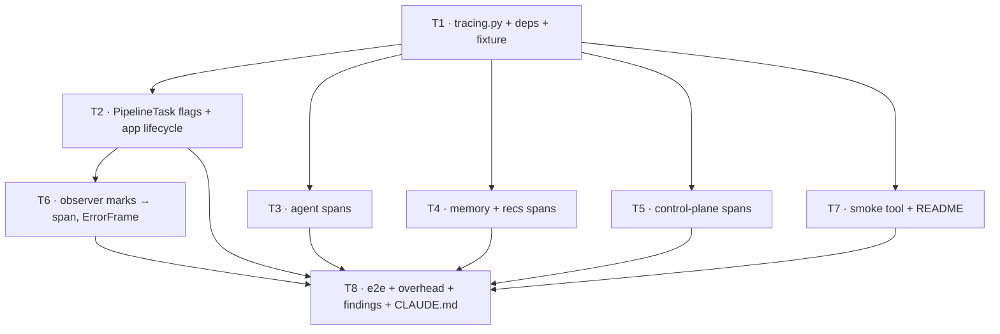

# TV Avatar Backend — Observability Plan: Pipecat Tracing + Langfuse for the Agent

> **For agentic workers:** REQUIRED SUB-SKILL: Use superpowers:subagent-driven-development (recommended) or superpowers:executing-plans to implement this plan task-by-task. Steps use checkbox (`- [ ]`) syntax for tracking. Section 8 tells you how to split the tasks across two sessions.

**Goal:** See a whole voice turn as one tree — STT partials → memory prefetch → SGR cycle 1 → tool calls → cycle 2 (or the templated fallback) → TTS → Anam → TV commands and their acks — with timings, prompts, envelopes and token counts, in Langfuse, without adding a millisecond to the media path or a second orchestrator to the codebase.

**Architecture:** Nothing new sits in the pipeline. OpenTelemetry is the one instrumentation API; Pipecat's own tracing produces the conversation/turn/STT/TTS spans, our code adds spans *under* Pipecat's turn span, and a single OTLP/HTTP exporter ships everything to Langfuse (or, for offline work, to any OTLP collector).

```mermaid
flowchart LR
    subgraph MEDIA["media plane — unchanged"]
        STT[SlngSTT<br/>@traced_stt] --> TAP[MemoryPrefetchTap] --> AGG[user_agg] --> INJ[ScreenContextInjector]
        INJ --> AGENT[SGRAgentService<br/>@traced_llm on _run_turn] --> TTS[SlngTTS<br/>@traced_tts] --> ANAM[Anam] --> OUT[output]
    end

    subgraph OTEL["OpenTelemetry — off the media path"]
        TTO[TurnTraceObserver<br/>conversation › turn spans]
        AG["agent.* spans<br/>recall · cycle · action · fallback"]
        MEM["memory.* / recs.* spans<br/>prefetch · recall · ingest · recommend"]
        CTL["tv.command / tv.command_result spans"]
        RED[RedactingSpanProcessor<br/>TRACE_CONTENT=false]
        BSP[BatchSpanProcessor<br/>background thread]
        EXP[OTLP HTTP/protobuf exporter]
    end

    subgraph SINKS
        LF[(Langfuse<br/>cloud or self-hosted)]
        JG[(any OTLP collector<br/>Jaeger / console)]
    end

    STT -. spans .-> TTO
    TTS -. spans .-> TTO
    AGENT -. child spans .-> AG
    TAP -. child spans .-> MEM
    AGENT -. bus.dispatch .-> CTL
    TTO --> RED
    AG --> RED
    MEM --> RED
    CTL --> RED
    RED --> BSP --> EXP
    EXP --> LF
    EXP -. OTEL_EXPORTER_OTLP_ENDPOINT override .-> JG
```

**Tech Stack:** phase-2 stack plus the `tracing` extra of `pipecat-ai` (`opentelemetry-sdk`, `opentelemetry-api`, `opentelemetry-instrumentation`) and `opentelemetry-exporter-otlp-proto-http`. **No `langfuse` Python package** (D13).

**Upstream docs:** `docs/superpowers/specs/2026-09-19-tv-avatar-backend-design.md` (§5 latency budget, §12 testing), `docs/superpowers/plans/2026-09-19-tv-avatar-backend-phase2.md` (D12, Task 8 `TurnLatencyObserver`), `docs/findings/2026-09-19-phase2-agent-memory-recs.md`. External: Pipecat OpenTelemetry reference (`docs.pipecat.ai/api-reference/server/utilities/opentelemetry`), Langfuse Pipecat guide (`langfuse.com/integrations/frameworks/pipecat`), `pipecat-examples/open-telemetry/langfuse`.

## Observability decisions

These extend the spec's locked-decision table and phase 2's D6–D12.

| # | Decision | Rationale |
|---|---|---|
| D13 | **OpenTelemetry is the only instrumentation API; Langfuse is a sink, not an SDK.** We depend on `pipecat-ai[tracing]` + `opentelemetry-exporter-otlp-proto-http` and never on the `langfuse` package. Langfuse-specific behaviour is expressed purely as span attributes (`langfuse.session.id`, `langfuse.user.id`, `langfuse.trace.input/output`). | Pipecat's tracing *is* OpenTelemetry, so one span tree covers STT, TTS, turns and our agent. A second SDK would double-instrument the `openai` client and produce two disconnected trees. Swapping the sink (Jaeger on a laptop, a collector in prod) is a URL change. Langfuse ingests OTLP **HTTP/protobuf only** — the gRPC exporter is rejected — which is why the http exporter is pinned, not the generic `opentelemetry-exporter-otlp`. |
| D14 | **One trace = one session.** `PipelineTask(conversation_id=session.session_id)`; every root span we create outside the pipeline (memory ingest that outlives the turn, `finish_session` after the pipeline ends, `command_result` acks) carries `langfuse.session.id=session_id` and `langfuse.user.id=user_id`. | Pipecat's conversation span already spans the whole pipeline, matching Langfuse's "Pipecat: one trace per conversation" note. The session/user attributes are what keep the off-turn work grouped with the conversation in Langfuse's session view instead of appearing as orphan traces. |
| D15 | **Agent spans hang under Pipecat's turn span via `@traced_llm` on `SGRAgentService._run_turn`.** Our own spans (`agent.recall`, `agent.cycle`, `agent.action`, `agent.fallback`) are created with `tracer.start_as_current_span` inside `_turn` and therefore nest under the decorator's `llm` span, which nests under `turn`, which nests under `conversation`. | `_run_turn(self, context)` has exactly the `(self, context, …)` signature `traced_llm` wraps; the decorator captures messages (through the LLM adapter), aggregates `LLMTextFrame` output (partial output on interruption, thanks to its `finally`), records token usage through `start_llm_usage_metrics`, and parents on the turn context — all free. Writing our own `llm` span would duplicate this and lose the parent link. The SGR-specific facts (intent, cycles, over-budget, dropped commands) are what the nested spans add. |
| D16 | **`marks` is the single producer; log line and span are two sinks.** The dict `SGRAgentService._turn` already assembles becomes span attributes on the turn's `llm` span (`tv.turn.*`) *and* stays the `logger.info("turn", **marks)` line. Likewise `TurnLatencyObserver`'s marks are set on a `turn.latency` span parented on the current Pipecat turn. No timing is measured twice. | Two measurement paths drift. One dict, two exports means `grep turn_id=` on the console and the Langfuse span show identical numbers. |
| D17 | **Tracing is off by default and never on the media path.** `TRACING_ENABLED=false` → `enable_tracing=False`, no provider, zero cost; `create_app()` still boots with no `.env`. When on, spans are exported by `BatchSpanProcessor` on its own thread; span creation is a dict write. Tests run with tracing off, and the tests that assert spans inject an `InMemorySpanExporter` — never a network exporter. | Phase-2's `SessionEventsObserver` invariant, generalised: observation must not cost speech latency. The in-memory exporter is what lets the span tree be a unit-tested artefact rather than something eyeballed in a dashboard. |
| D18 | **Content is exported when tracing is on, redactable with one switch.** Prompts, transcripts, envelopes and `say` text are the point of Langfuse; `TRACE_CONTENT=false` installs a `RedactingSpanProcessor` that drops the content attributes (`input`, `output`, `messages`, `system_instructions`, `gen_ai.*.content`, `tv.*.text`) from *every* span — Pipecat's included — before export. API keys never appear: the `openai` client is not instrumented, and Pipecat's `traced_llm` only exports scalar `LLMSettings` fields. | Pipecat's decorators export message content unconditionally; the only place to enforce a policy for both their spans and ours is an OTel `SpanProcessor`. One switch, one code path. |

**Pipecat 1.11.0 tracing surface, verified on the pinned version:** `pipecat.utils.tracing.setup.setup_tracing(service_name, exporter, console_export) -> bool` and `is_tracing_available()`; `PipelineTask(..., enable_tracing: bool = False, enable_turn_tracking: bool = True, conversation_id: str | None, additional_span_attributes: dict | None)` — the attributes land on the **conversation** span; `pipecat.utils.tracing.turn_trace_observer.TurnTraceObserver` starts the conversation span on turn 1, names turn spans `turn` with `turn.number`, `turn.type`, `turn.was_interrupted`, `turn.user_bot_latency_seconds`, and is reachable as `task.turn_trace_observer` (`.get_current_turn_context() -> SpanContext | None`); `pipecat.utils.tracing.service_decorators.traced_llm / traced_stt / traced_tts`; services see `self._tracing_enabled` (set from the `StartFrame` by `AIService.setup`) and `self._tracing_context`. `pipecat_slng.stt` and `pipecat_slng.tts` are already decorated with `@traced_stt` / `@traced_tts`. `pipecat_anam` is not decorated. The `tracing` extra requires `opentelemetry-sdk>=1.33,<2`, `opentelemetry-api>=1.33,<2`, `opentelemetry-instrumentation>=0.54b0,<1`.

**Langfuse OTLP contract, from the official Pipecat guide:** endpoint `https://cloud.langfuse.com/api/public/otel` (EU; `us.` / `jp.` / `hipaa.` prefixes for other regions; `<host>/api/public/otel` when self-hosted); headers `Authorization=Basic <base64("pk-lf-…:sk-lf-…")>` and `x-langfuse-ingestion-version=4`; when passed through `OTEL_EXPORTER_OTLP_HEADERS` the space must be URL-encoded (`Basic%20…`) — we pass headers as a dict to the exporter constructor instead, which sidesteps that. Grouping attributes: `langfuse.session.id`, `langfuse.user.id`, `langfuse.trace.name`; `langfuse.trace.input` / `langfuse.trace.output` are trace-level, deprecated in v4 but still honoured and the only way to set a trace's I/O from a child span.

### Span vocabulary — the one table every task conforms to

Attribute names follow OTel GenAI semantic conventions where one exists and the `tv.` namespace otherwise. Defined once as constants in `src/tv_avatar/tracing.py` (Task 1); no task invents a name outside this table without adding it here.

| Span | Parent | Created by | Key attributes |
|---|---|---|---|
| `conversation` | root | Pipecat | `conversation.id`, `langfuse.session.id`, `langfuse.user.id`, `tv.avatar_id`, `tv.language`, `tv.agent_impl`, `tv.half_duplex` |
| `turn` | conversation | Pipecat | `turn.number`, `turn.was_interrupted`, `turn.user_bot_latency_seconds` |
| `stt` / `tts` | turn | pipecat-slng | Pipecat's STT/TTS attributes (`transcript`, `metrics.ttfb_ms`, `voice_id`, `character_count`) |
| `llm` | turn | `@traced_llm` on `_run_turn` | Pipecat's (`messages`, `output`, `gen_ai.usage.*`, `metrics.ttfb_ms`) **plus ours:** `tv.turn_id`, `tv.turn.intent`, `tv.turn.cycles`, `tv.turn.n_actions`, `tv.turn.recall_ms`, `tv.turn.ttft_ms`, `tv.turn.first_action_ms`, `tv.turn.total_ms`, `tv.turn.fallback`, `tv.turn.interrupted`, `tv.turn.dropped_commands`, `langfuse.trace.input` (first user text), `langfuse.trace.output` (spoken text, last wins) |
| `agent.recall` | llm | Task 3 | `tv.memory.empty`, `tv.memory.stale`, `tv.memory.token_est`, `tv.memory.source` = `prefetch_hit\|search\|stale\|empty` |
| `agent.cycle` | llm | Task 3 | `tv.cycle.number`, `gen_ai.request.model`, `gen_ai.request.temperature`, `gen_ai.request.max_tokens`, `tv.cycle.ttft_ms`, `tv.cycle.raw` (envelope JSON, content), `tv.cycle.over_budget`, `tv.cycle.budget_ms` |
| `agent.action` | agent.cycle | Task 3 | `tv.action.verb`, `tv.action.kind` = `internal\|tv`, `tv.action.status`, `tv.action.ms`, `tv.action.args` (content), `tv.action.n_titles` |
| `agent.fallback` | llm | Task 3 | `tv.fallback.text` (content), `tv.fallback.n_actions` |
| `memory.prefetch` | turn (via tap) | Task 4 | `tv.memory.chars`, `tv.memory.prefix_reused` |
| `memory.recall` | agent.recall | Task 4 | `tv.memory.waited_ms`, `tv.memory.source` |
| `memory.ingest` | llm (outlives it) | Task 4 | `tv.memory.facts_count`, `tv.memory.interrupted`, `tv.memory.said_chars` |
| `memory.finish_session` | root + `langfuse.session.id` | Task 4 | `tv.memory.turns`, `tv.memory.profile_chars` |
| `recs.recommend` | agent.action | Task 4 | `tv.recs.channels` (`match,for_you,popular`), `tv.recs.query_embed` = `hit\|miss\|timeout\|none`, `tv.recs.n`, `tv.recs.limit` |
| `tv.command` | agent.action | Task 5 | `tv.command.id`, `tv.command.verb`, `tv.command.awaits_result`, `tv.command.status` |
| `tv.command_result` | root + `langfuse.session.id`, linked to `tv.command` | Task 5 | `tv.command.id`, `tv.command.status`, `tv.command.roundtrip_ms` |
| `turn.latency` | turn | Task 6 | the `TurnLatencyObserver` marks: `tv.latency.interim_to_context_ms`, `tv.latency.ttft_ms`, `tv.latency.turn_total_ms`, `tv.latency.pipecat_ttfb_ms`, `tv.latency.pipecat_processing_ms`, `tv.latency.interrupt_stop_ms`; `tv.error` events for `ErrorFrame`s |

## Coordination with the existing branches

This plan runs on **`feat/observability`**, branched from `feat/agentic-layer` at `cd3206d` (phase 2 complete; `uv run pytest` green). `feat/agentic-layer` is still the integration branch for the agent work; nothing here changes the wire protocol, `agent/commands.py`, or `contracts/`, so there is no contract regeneration and no frontend impact.

**Branching rule:** before each task, `git fetch && git merge --ff-only feat/agentic-layer` — if that is not a fast-forward, stop and look at what landed. If the plan is executed in two sessions (§8), the per-session worktrees branch from `feat/observability` and merge back into it, never into `feat/agentic-layer` directly.

**Seams this plan relies on, confirmed in the landed code:** `SGRAgentService._turn` already builds `marks` and emits it as one `logger.info("turn", **marks)` line; `_cycle_with_budget` already knows `budget_ms` and whether the fallback fired; `dispatch_action` already distinguishes internal verbs (`INTERNAL_MODELS`) from TV verbs; `MemoryLane._LaneBase.recall` already knows whether it served a prefetch hit, waited on an in-flight prefetch, searched, or returned stale; `CommandBus.dispatch` already returns `{"status": "dispatched"}` vs an awaited result; `TurnLatencyObserver` already collects the per-turn marks and `MetricsFrame`s; `PipelineTask` is built in exactly one place (`pipeline/builder.py`) and `setup_logging` is called in exactly one place (`app.py:create_app`).

## Global Constraints

- **All phase-1 and phase-2 constraints still apply** — uv only, `loguru` only, no secret in source, `commands.py` is the single source of truth, fire-and-forget never awaits, `"v": 1` on every wire message.
- **No span on the media path may await anything.** Span creation and `set_attribute` are synchronous dict writes; export is `BatchSpanProcessor`'s background thread. Never use `SimpleSpanProcessor` outside a test.
- **Tracing off ⇒ zero code paths change.** Every `tracer.start_as_current_span` goes through the OTel API, which returns a no-op span when no provider is installed. There must be no `if tracing_enabled:` branches in business code — the toggle lives in `tracing.py` and `builder.py` only.
- **Tests never construct a network exporter.** `tests/conftest.py` gains a session-scoped `otel` fixture that installs one `TracerProvider` with an `InMemorySpanExporter` for the whole test process (OTel allows exactly one global provider per process — a second `set_tracer_provider` is ignored with a warning). Tests assert on `exporter.get_finished_spans()` and call `exporter.clear()`.
- **Attribute names come from `tracing.py` constants and the vocabulary table.** No string literals for attribute keys in business code.
- **Nothing in `contracts/`, `agent/commands.py`, `control/protocol.py` changes.** The TV app's schedule is unaffected.
- **Every new setting goes into `.env.example` with a blank value** (`LANGFUSE_SECRET_KEY=`), and `README.md` gets the two-line "how to see a trace" recipe.

---

### Task 1: Tracing bootstrap — dependencies, settings, `tracing.py`, test fixture

Prove the OTel stack resolves against the pinned Pipecat, then build the one module every other task imports from.

**Files:**
- Modify: `pyproject.toml`, `uv.lock`, `.env.example`, `src/tv_avatar/config.py`, `tests/conftest.py`
- Create: `src/tv_avatar/tracing.py`
- Test: `tests/test_tracing.py`

**Interfaces:**
- New `Settings` fields (pydantic-settings maps env names case-insensitively, so the Langfuse SDK's conventional names work unchanged): `tracing_enabled: bool = False` (`TRACING_ENABLED`), `trace_content: bool = True` (`TRACE_CONTENT`), `langfuse_public_key: str = ""`, `langfuse_secret_key: str = ""`, `langfuse_host: str = "https://cloud.langfuse.com"`, `otel_exporter_otlp_endpoint: str = ""` (override: any OTLP/HTTP collector; when set, Langfuse keys are ignored), `otel_exporter_otlp_headers: str = ""` (raw `k=v,k2=v2` for the override case), `otel_console_export: bool = False`, `otel_service_name: str = "tv-avatar"`.
- `tracing.py`:
  - `ATTR_*` constants for every key in the vocabulary table; `CONTENT_ATTRS: frozenset[str]` — the set `RedactingSpanProcessor` strips.
  - `tracing_wanted(settings) -> bool` — `tracing_enabled and (langfuse keys present or otel endpoint set)`; logs one `WARNING` when enabled but unconfigured.
  - `build_exporter(settings) -> SpanExporter` — `OTLPSpanExporter(endpoint=..., headers={...})` from Langfuse keys (`f"{langfuse_host}/api/public/otel/v1/traces"`, `Authorization: Basic <b64>`, `x-langfuse-ingestion-version: 4`) or from the raw override. Headers passed as a dict, never via env, so no `%20` encoding trap. **The `/v1/traces` suffix is ours to add:** verified on `opentelemetry-exporter-otlp-proto-http` 1.44.0 — an explicit `endpoint=` is used verbatim, while the `OTEL_EXPORTER_OTLP_ENDPOINT` env path appends `/v1/traces` itself. The Langfuse guide relies on the env path; we construct explicitly, so without the suffix every export would POST to `/api/public/otel` and fail silently inside the batch thread. Same rule for the raw override: append `/v1/traces` unless the user already gave a path ending in it. Comment this at the call site.
  - `setup_tracing(settings, *, exporter: SpanExporter | None = None) -> bool` — idempotent; returns False and does nothing when `tracing_wanted` is False and no exporter was injected; otherwise builds the provider through Pipecat's `setup_tracing(service_name=..., exporter=..., console_export=...)`, then adds `RedactingSpanProcessor` **before** the batch processor when `trace_content` is False. Remembers the provider so `shutdown_tracing()` can `force_flush()` + `shutdown()` at app exit.
  - `tracer() -> Tracer` — `trace.get_tracer("tv_avatar")`.
  - `session_attributes(session: SessionState, settings) -> dict[str, str]` — the conversation-span dict from the vocabulary table (`langfuse.session.id`, `langfuse.user.id`, `tv.avatar_id`, `tv.language`, `tv.agent_impl`, `tv.half_duplex`).
  - `RedactingSpanProcessor(SpanProcessor)` — `on_end` cannot mutate a `ReadableSpan`, so it wraps the downstream processor and forwards a copy with `CONTENT_ATTRS` removed (`ReadableSpan` exposes `_attributes`; build a new `BoundedAttributes` — verify in Step 3 and record the exact mechanism in a code comment, this is library-workaround territory).

- [ ] **Step 1: Write the failing dependency test**

Extend `tests/test_phase2_env.py` (it is the dependency-proof file already):

```python
def test_tracing_dependencies_import():
    from opentelemetry import trace  # noqa: F401
    from opentelemetry.exporter.otlp.proto.http.trace_exporter import OTLPSpanExporter  # noqa: F401
    from opentelemetry.sdk.trace.export.in_memory_span_exporter import InMemorySpanExporter  # noqa: F401
    from pipecat.utils.tracing.setup import is_tracing_available
    assert is_tracing_available()
```

- [ ] **Step 2: Run it and watch it fail** — `uv run pytest tests/test_phase2_env.py -v` → `ModuleNotFoundError: opentelemetry`.

- [ ] **Step 3: Add the dependencies**

Edit the `pipecat-ai` line in `pyproject.toml` to `"pipecat-ai[silero,webrtc,runner,tracing]>=1.8.0,<2.0.0"` (extras are part of the requirement string; `uv add` would add a second entry), then:

```bash
uv add "opentelemetry-exporter-otlp-proto-http>=1.33,<2" "opentelemetry-semantic-conventions>=0.54b0"
uv sync
uv run pytest tests/test_phase2_env.py tests/test_environment.py -v
```

**Why the second package is named explicitly:** `opentelemetry-semantic-conventions`, a hard dependency of `opentelemetry-sdk`, has only ever shipped `0.xxb` pre-releases, and this repo pins `prerelease = "explicit"` in `[tool.uv]` (needed for pipecat-anam — see CLAUDE.md). Under that policy uv admits a pre-release only for packages whose *own* requirement carries a pre-release marker, so a bare `uv add opentelemetry-exporter-otlp-proto-http` fails to resolve with "`opentelemetry-sdk==1.33.0` depends on `opentelemetry-semantic-conventions==0.54b0`… cannot be used" (reproduced 2026-09-19 with `uv run --with`; `--prerelease=allow` resolves to sdk/api/exporter 1.44.0 + semconv 0.65b0). Naming it with `>=0.54b0` is the explicit marker. Do **not** widen `prerelease` to `allow` — that would let the legacy pipecat-anam 0.1.0 line back in (CLAUDE.md gotcha). Same treatment for `opentelemetry-instrumentation>=0.54b0` if the resolver asks for it.

Expected: PASS, and `pipecat-anam==0.2.0a6` / `pipecat-slng==0.5.2` pins survive (`test_pipecat_stack_unchanged`). **Do not** add `opentelemetry-exporter-otlp` (it pulls the gRPC exporter and `grpcio`, which Langfuse cannot receive from — D13). Record `uv pip list | rg opentelemetry` in the findings doc (Task 8).

- [ ] **Step 4: Write the failing `tests/test_tracing.py`**

```python
from opentelemetry.sdk.trace.export.in_memory_span_exporter import InMemorySpanExporter

from tv_avatar.config import Settings
from tv_avatar.tracing import (ATTR_SESSION_ID, CONTENT_ATTRS, RedactingSpanProcessor,
                               build_exporter, setup_tracing, tracer, tracing_wanted)


def _settings(**kw) -> Settings:
    return Settings(_env_file=None, slng_api_key="s", anam_api_key="a", anam_avatar_id="v",
                    openai_api_key="o", **kw)


def test_tracing_off_by_default_and_when_unconfigured():
    assert tracing_wanted(_settings()) is False
    assert tracing_wanted(_settings(tracing_enabled=True)) is False  # enabled but no sink


def test_langfuse_keys_build_basic_auth_http_exporter():
    s = _settings(tracing_enabled=True, langfuse_public_key="pk-lf-x", langfuse_secret_key="sk-lf-y")
    exp = build_exporter(s)
    assert exp._endpoint == "https://cloud.langfuse.com/api/public/otel/v1/traces"
    assert exp._headers["Authorization"] == "Basic cGstbGYteDpzay1sZi15"
    assert exp._headers["x-langfuse-ingestion-version"] == "4"


def test_endpoint_override_wins_over_langfuse_keys():
    s = _settings(tracing_enabled=True, langfuse_public_key="pk", langfuse_secret_key="sk",
                  otel_exporter_otlp_endpoint="http://localhost:4318", otel_exporter_otlp_headers="a=b")
    exp = build_exporter(s)
    assert exp._endpoint == "http://localhost:4318/v1/traces"
    assert "Authorization" not in exp._headers


def test_spans_reach_injected_exporter(otel):
    with tracer().start_as_current_span("probe") as span:
        span.set_attribute(ATTR_SESSION_ID, "sess_1")
    otel.force_flush()
    names = [s.name for s in otel.exporter.get_finished_spans()]
    assert "probe" in names


def test_redacting_processor_strips_content_attrs(otel):
    sink = InMemorySpanExporter()
    ...  # wrap a SimpleSpanProcessor(sink) in RedactingSpanProcessor, end a span carrying
    ...  # "messages", "output" and "tv.cycle.raw"; assert none of CONTENT_ATTRS survive and
    ...  # a non-content attr does
```

The `otel` fixture (in `tests/conftest.py`, session-scoped) calls `setup_tracing(_settings(), exporter=InMemorySpanExporter())` once, yields an object with `.exporter`, `.force_flush()`, and clears the exporter between tests via an autouse function-scoped helper. Because the provider is process-global, this is the only place in the test suite that installs one.

`_endpoint` and `_headers` are the exporter's attribute names on 1.44.0 (checked); if `uv.lock` resolves a different version and they moved, assert through a constructor spy — the point is the contract, not the field name.

- [ ] **Step 5: Fail. Step 6: Implement `tracing.py`, extend `Settings`, add the fixture.**

Keep `tracing.py` free of Pipecat imports except `pipecat.utils.tracing.setup` — it must be importable by `memory/` and `recs/`, which know nothing about the pipeline.

- [ ] **Step 7: `.env.example`**

```dotenv
# Tracing — OpenTelemetry → Langfuse (D13). Off by default; nothing is exported and
# nothing changes in the pipeline until TRACING_ENABLED=true AND a sink is configured.
TRACING_ENABLED=false
# Set to false to strip prompts, transcripts, envelopes and spoken text from every span.
TRACE_CONTENT=true
LANGFUSE_PUBLIC_KEY=
LANGFUSE_SECRET_KEY=
LANGFUSE_HOST=https://cloud.langfuse.com
# Any OTLP/HTTP collector instead of Langfuse (Jaeger: http://localhost:4318). Wins over the keys.
OTEL_EXPORTER_OTLP_ENDPOINT=
OTEL_EXPORTER_OTLP_HEADERS=
# Also print spans to stderr (debugging the exporter, not the app).
OTEL_CONSOLE_EXPORT=false
```

- [ ] **Step 8: Full suite green, commit**

```bash
uv run pytest && uvx ruff check src tests tools
git add pyproject.toml uv.lock .env.example src/tv_avatar/config.py src/tv_avatar/tracing.py tests/
git commit -m "feat(obs): OpenTelemetry bootstrap — settings, OTLP/HTTP exporter for Langfuse, redaction, test fixture"
```

---

### Task 2: Pipeline tracing — `PipelineTask` flags, app lifecycle

Turn Pipecat's own tracing on. After this task, a live session produces `conversation → turn → stt / tts` spans in Langfuse with no code of ours in them.

**Files:**
- Modify: `src/tv_avatar/pipeline/builder.py`, `src/tv_avatar/app.py`
- Test: `tests/test_pipeline_builder.py`, `tests/test_app.py`

**Interfaces:**
- `build_pipeline(...)` gains no parameters. It reads `settings` (already a kwarg) and passes `enable_tracing=tracing_wanted(settings)`, `conversation_id=session.session_id`, `additional_span_attributes=session_attributes(session, settings)` to `PipelineTask`. `enable_turn_tracking` stays at Pipecat's default (`True`) — it is what emits `on_turn_started/ended` and it is already running today.
- `create_app()`: `setup_tracing(settings)` right after `setup_logging(...)`; `shutdown_tracing()` in the lifespan's shutdown branch so the last batch is flushed on Ctrl-C (without it, the final turn's spans are lost on every reload).

- [ ] **Step 1: Failing tests**

`tests/test_pipeline_builder.py`:

```python
def test_task_carries_tracing_flags_from_settings(stub_transport, session, bus, settings_tracing_on):
    task = build_pipeline(stub_transport, session, bus, with_avatar=False, greet=False,
                          settings=settings_tracing_on, runtime=fake_runtime)
    assert task._enable_tracing is True            # PipelineWorker attribute, verified on 1.11.0
    assert task._conversation_id == session.session_id
    assert task._additional_span_attributes["langfuse.session.id"] == session.session_id


def test_tracing_off_leaves_task_untraced(stub_transport, session, bus):
    task = build_pipeline(stub_transport, session, bus, with_avatar=False, greet=False, runtime=fake_runtime)
    assert task._enable_tracing is False
```

`tests/test_app.py`: `create_app()` with no `.env` and no Langfuse keys still returns 200 on `GET /config` (the `_missing_settings()` path must keep absorbing only `ValidationError` — `setup_tracing` must not raise when unconfigured).

- [ ] **Step 2: Fail. Step 3: Implement.** Three lines in `builder.py`, two in `app.py`.

- [ ] **Step 4: Live check with keys (manual; record in Task 8)**

`TRACING_ENABLED=true` + Langfuse keys, `OTEL_CONSOLE_EXPORT=true` for the first run so the exporter can be seen working before looking at the dashboard. Open `/demo/`, speak one turn, hang up. Expect in Langfuse: one trace named after the session id, `turn` children, `stt`/`tts` grandchildren with `metrics.ttfb_ms`. **Check and record:** does the greeting (LLM run on `on_client_connected`, no user speech) appear as turn 1 or as a pre-turn span? Pipecat starts the conversation span on `on_turn_started(1)` — if the greeting's `llm`/`tts` spans are emitted before that, they will be parented on the service context and show as separate traces. If so, the fix is `task.turn_trace_observer.start_conversation_tracing(session_id)` from the same `on_client_connected` handler before `queue_frame(LLMRunFrame())` — not a guess, a documented public method; apply it only if the live check shows the orphan.

- [ ] **Step 5: Commit** — `feat(obs): enable Pipecat turn/conversation tracing per session; flush on shutdown`

---

### Task 3: Agent spans — the SGR turn under Pipecat's turn

The reason this plan exists. After this task a Langfuse turn shows: what the user said, what memory came back and from where, what envelope cycle 1 produced, which actions ran in parallel and how long each took, whether cycle 2 spoke or the template did, what was said, and — on barge-in — how far it got and how many commands were dropped.

**Files:**
- Modify: `src/tv_avatar/agent/service.py`, `src/tv_avatar/agent/tools.py`
- Test: `tests/test_agent_service.py`, `tests/test_agent_tools.py`

**Interfaces:**
- `SGRAgentService._run_turn` decorated with `@traced_llm`. Inside `_turn`: `span = trace.get_current_span()` is the decorator's `llm` span; `span.set_attribute(ATTR_TURN_ID, turn_id)` up front, `langfuse.trace.input` = `user_text` on the session's first non-greeting turn, `langfuse.trace.output` = `"".join(self._turn_said)` at the end, all `marks` as `tv.turn.*` in the `finally` (so an interrupted turn still records `cycles`, `n_actions`, `interrupted=True`, `dropped_commands`).
- `_recall` section wrapped in `agent.recall`; each `_cycle` call in `agent.cycle` (`tv.cycle.number`, `gen_ai.request.*`, `tv.cycle.ttft_ms` set when `first_say` fires, `tv.cycle.raw` = `"".join(raw)` in `finally`); `_cycle_with_budget` sets `tv.cycle.over_budget=True` + `tv.cycle.budget_ms` on the cycle span it cancels, then `_speak_fallback` runs inside `agent.fallback`; `dispatch_action` wraps itself in `agent.action` (`verb`, `kind`, `status`, `ms`, `args` as JSON — a content attr, `n_titles` when the result carries `titles`). Rejected actions (`ValueError` from the bus) set span status `ERROR` with the reason.
- `InternalTools.run` sets `tv.action.status` = `ok|timeout|error` and `tv.action.ms` on the current span (it is called inside `agent.action`; it creates no span of its own — the recs engine does, in Task 4).

- [ ] **Step 1: Confirm the adapter path on the installed 1.11.0**

```bash
uv run python -c "
from pipecat.services.llm_service import LLMService
import inspect
print(hasattr(LLMService, 'get_llm_adapter'), inspect.signature(LLMService.__init__))
from pipecat.utils.tracing.service_decorators import _get_model_name
print(inspect.getsource(_get_model_name))
"
```

Record: whether `SGRAgentService` inherits a default `get_llm_adapter()` whose `get_messages_for_logging(context)` works on a plain `LLMContext` (if it returns `None`/raises, the decorator swallows it with `logging.warning("Error setting up LLM tracing")` and the `messages` attribute is simply absent — acceptable, but then our `agent.cycle` span must carry the messages instead, as `gen_ai.input.messages`), and which attribute `_get_model_name` reads so the `llm` span shows `nvidia/Nemotron-3_5-Lightning` rather than `unknown`.

- [ ] **Step 2: Failing tests** (drive the service exactly as the existing tests do — `FakeOpenAI` streaming a canned envelope, `process_frame(LLMContextFrame(...))` — plus `agent._tracing_enabled = True` so the decorator engages without a `StartFrame`; without a `_tracing_context` the `llm` span is a root, which is fine for asserting the subtree):

```python
def _spans(otel) -> dict[str, list]:
    otel.force_flush()
    out: dict[str, list] = {}
    for s in otel.exporter.get_finished_spans():
        out.setdefault(s.name, []).append(s)
    return out


async def test_turn_produces_llm_recall_cycle_action_spans(agent_play, otel):
    await agent_play.process_frame(LLMContextFrame(context=_ctx("play the first one")), FrameDirection.DOWNSTREAM)
    spans = _spans(otel)
    llm, = spans["llm"]
    assert llm.attributes["tv.turn.intent"] == "answer"
    assert llm.attributes["tv.turn.cycles"] == 1
    assert llm.attributes["langfuse.trace.output"] == "On it."
    assert spans["agent.recall"][0].parent.span_id == llm.context.span_id
    action, = spans["agent.action"]
    assert action.attributes["tv.action.verb"] == "play" and action.attributes["tv.action.kind"] == "tv"
    assert action.parent.span_id == spans["agent.cycle"][0].context.span_id


async def test_second_cycle_spans_and_fallback_marks_over_budget(agent_recs_slow_cycle2, otel):
    # settings.cycle2_first_byte_s=0.15, cycle-2 fake stream stalls: fallback must fire
    ...
    spans = _spans(otel)
    cycles = sorted(spans["agent.cycle"], key=lambda s: s.attributes["tv.cycle.number"])
    assert cycles[1].attributes["tv.cycle.over_budget"] is True
    assert spans["agent.fallback"] and spans["llm"][0].attributes["tv.turn.fallback"] is True


async def test_interruption_records_partial_turn(agent_slow, otel):
    task = asyncio.create_task(agent_slow.process_frame(LLMContextFrame(context=_slow_ctx()), FrameDirection.DOWNSTREAM))
    await asyncio.sleep(0.01)
    await agent_slow.process_frame(InterruptionFrame(), FrameDirection.DOWNSTREAM)
    await task
    llm, = _spans(otel)["llm"]
    assert llm.attributes["tv.turn.interrupted"] is True
    assert "tv.turn.dropped_commands" in llm.attributes


async def test_tracing_off_changes_nothing(agent_play):
    # No provider engaged for this agent (_tracing_enabled stays False): identical frame
    # sequence to the existing test_say_streams_as_llm_text_frames_before_actions_dispatch.
    ...
```

- [ ] **Step 3: Fail. Step 4: Implement.**

Rules while editing `service.py`: the decorator temporarily replaces `self.push_frame` — `_turn` runs in a task the decorator awaits, so every `push_frame` inside the turn goes through the wrapper and output aggregation works; do not cache `self.push_frame` into a local. `asyncio.create_task` copies `contextvars`, so spans opened inside `_turn`/`_cycle`/dispatch tasks inherit the `llm` span as parent without any explicit context passing. The `marks` dict is set on the span in a `finally` in `_turn`, in the same place the `turn` log line is emitted (D16) — one helper `_record_turn(span, marks)`. Never `await` inside a span's `__exit__` path beyond what is already awaited.

- [ ] **Step 5: Pass. Existing agent tests unchanged and green.** Step 6: Commit — `feat(obs): agent.recall/cycle/action/fallback spans under Pipecat's turn; marks as span attributes`

---

### Task 4: Memory and recs spans — the lanes that decide the turn's latency

**Files:**
- Modify: `src/tv_avatar/memory/lane.py`, `src/tv_avatar/memory/summary_lane.py`, `src/tv_avatar/memory/taps.py`, `src/tv_avatar/recs/engine.py`
- Test: `tests/test_memory_lane.py`, `tests/test_taps.py`, `tests/test_recs.py`, `tests/test_summary_lane.py`

**Interfaces:**
- `_LaneBase.prefetch` → `memory.prefetch`; `_LaneBase.recall` → `memory.recall` with `tv.memory.source` from the existing branches (`prefetch_hit` / `search` / `stale` / `empty`) and `tv.memory.waited_ms` for the `wait_for(shield(pending))` phase; `ingest_turn` → `memory.ingest` (created inside the turn's context via the task, so it parents on `llm` and may end after it — OTel and Langfuse both accept that); `SummaryLane.finish_session` → root `memory.finish_session` with `langfuse.session.id` / `langfuse.user.id` set explicitly (the pipeline is gone; there is no ambient context).
- `MemoryPrefetchTap._prefetch` wraps the fire in `memory.prefetch`'s parent context — the tap runs on the media path; it opens **no** span itself, it only ensures the task it fires inherits the current (turn) context, which `create_task` already does.
- `RecsEngine.recommend` → `recs.recommend` with `tv.recs.channels`, `tv.recs.query_embed` (`hit|miss|timeout|none` — the engine already logs these at DEBUG), `tv.recs.n`, `tv.recs.limit`.

- [ ] **Step 1: Failing tests** — with the `otel` fixture: `FakeMemoryLane` subclass of `_LaneBase` (or the existing fake if it inherits) → `recall` after a matching `prefetch` yields `memory.recall` with `tv.memory.source == "prefetch_hit"`; `recall` without prefetch → `"search"`; a search that exceeds `recall_budget_s` → `"stale"` or `"empty"`. `RecsEngine.recommend` with `FakeEmbedder` → `tv.recs.channels` contains `"match"`; with an embedder that sleeps past `tool_timeout_s` → `tv.recs.query_embed == "timeout"` and `"match"` absent. `SummaryLane.finish_session` → root span with `langfuse.session.id`.
- [ ] **Step 2: Fail. Step 3: Implement.** No `await` added anywhere; attributes only.
- [ ] **Step 4: Pass. Step 5: Commit** — `feat(obs): memory.* and recs.* spans with source/timeout attribution`

---

### Task 5: Control-plane spans — commands out, acks back

Closes the loop the media plane cannot see: did the TV actually execute `play`, and how long after the agent decided?

**Files:**
- Modify: `src/tv_avatar/control/bus.py`, `src/tv_avatar/control/channel.py`
- Test: `tests/test_command_bus.py`, `tests/test_app.py`

**Interfaces:**
- `CommandBus.dispatch` → `tv.command` span (`tv.command.id`, `verb`, `awaits_result`, `status`); for `AWAITS_RESULT` verbs the span covers the wait; for fire-and-forget it ends at enqueue. The bus records `(span_context, monotonic)` per `command_id` in a bounded dict (the same lifetime it already tracks for pending results) so the ack can link back.
- `ControlChannel._handle` on `command_result` → `tv.command_result` root span with `links=[Link(span_context)]` to the originating `tv.command`, `tv.command.roundtrip_ms`, `langfuse.session.id`/`user.id`. On `screen_state` → no span (high volume; the injector already stamps the latest into the prompt, which the `llm` span's `messages` shows). On `cancel_turn` → a `tv.turn.cancelled` **event** on the current span with `dropped_commands`.
- `channel.py` keeps its layer boundary: it imports `tracing.py` constants, never the agent.

- [ ] **Step 1: Failing tests** — `bus.dispatch("play", ...)` → one `tv.command` span with `status == "dispatched"`; `search_catalog` with a fake ack → span duration covers the wait and `status == "ok"`; `cancel_turn` after two queued commands → event with `dropped_commands == 2`; through `TestClient` websocket: a `command_result` for a known `command_id` → `tv.command_result` with a link whose `span_id` equals the `tv.command` span's; for an unknown `command_id` → no span, existing `error` reply unchanged.
- [ ] **Step 2: Fail. Step 3: Implement. Step 4: Pass. Step 5: Commit** — `feat(obs): tv.command / tv.command_result spans linked by command_id`

---

### Task 6: Observer marks → `turn.latency` span; `ErrorFrame`s → span events

Makes `TurnLatencyObserver`'s marks and the pipeline's error frames visible in the same tree (D16), and stops errors like `SLNG TTS context … abandoned` or `Anam … does not exist` from living only in the console.

**Files:**
- Modify: `src/tv_avatar/pipeline/observers.py`, `src/tv_avatar/pipeline/builder.py`
- Test: `tests/test_observers.py`, `tests/test_pipeline_builder.py`

**Interfaces:**
- `TurnLatencyObserver.__init__(session, *, turn_context: Callable[[], SpanContext | None] | None = None)`. `builder.py` passes `lambda: task.turn_trace_observer.get_current_turn_context() if task.turn_trace_observer else None` after the task exists (the observer is constructed before the task — hence a callable, evaluated at emit time). On `_emit`, it opens and immediately closes a `turn.latency` span with `context=trace.set_span_in_context(NonRecordingSpan(ctx))`, setting every mark as `tv.latency.*`. Zero-duration span, attributes only; when `turn_context()` is `None` (tracing off, or before turn 1) it becomes a no-op span.
- `ErrorFrame` (any direction): `logger.warning` if not already logged by Pipecat, plus `span.add_event("tv.error", {"message": ..., "fatal": ...})` on the current turn span via the same callable. Also counted in the marks as `n_errors`.

- [ ] **Step 1: Failing tests** — scripted frame sequence (already used by `test_observers.py`) with a fake `turn_context` returning a real span's context → one `turn.latency` span whose parent is that span and whose `tv.latency.ttft_ms` matches `last_marks["ttft_ms"]`; an `ErrorFrame` in the sequence → an event named `tv.error` on that span and `n_errors == 1` in the marks; with `turn_context=None` → no span, marks unchanged (existing tests still pass).
- [ ] **Step 2: Fail. Step 3: Implement. Step 4: Pass. Step 5: Commit** — `feat(obs): turn.latency span from observer marks; ErrorFrame → span event`

---

### Task 7: Developer ergonomics — credentials smoke test, README, dashboards

The Langfuse handshake has three ways to fail silently (wrong region host, gRPC exporter, header encoding). Give the developer a 5-second check that is not "speak into the mic and refresh the dashboard".

**Files:**
- Create: `tools/langfuse_smoke.py`
- Modify: `README.md`

**Interfaces:**
- `tools/langfuse_smoke.py`: loads `Settings`, calls `setup_tracing`, emits one root span `tv.smoke` with `langfuse.session.id="smoke"`, `force_flush()`es, and prints the exporter's endpoint and the HTTP status of the export (`BatchSpanProcessor` hides it — use `SimpleSpanProcessor` here, *this is the one permitted place*), exiting non-zero on failure. `uv run python tools/langfuse_smoke.py`.
- `README.md`: a "Tracing" section — the four `.env` lines, the smoke command, what a turn looks like in Langfuse (the span vocabulary table's first column), how to point at a local Jaeger instead (`docker run --rm -p 16686:16686 -p 4318:4318 jaegertracing/all-in-one` + `OTEL_EXPORTER_OTLP_ENDPOINT=http://localhost:4318`), and the `TRACE_CONTENT=false` switch.

- [ ] **Step 1: Test** — `tests/test_tools.py::test_langfuse_smoke_exits_nonzero_when_unconfigured` runs the tool via `subprocess` with an empty env and asserts exit code 2 and a helpful message; no network test.
- [ ] **Step 2: Implement. Step 3: Run the smoke against the real project once. Step 4: Commit** — `docs(obs): tracing section, langfuse smoke tool`

---

### Task 8: End-to-end pass, overhead measurement, findings, CLAUDE.md

**Files:**
- Create: `docs/findings/2026-09-19-observability.md`
- Modify: `CLAUDE.md` (Invariants + Gotchas + Current state), `README.md` if Task 7's text needs correcting after the live run

- [ ] **Step 1: Scripted live path** (`AGENT_IMPL=sgr`, real keys, `TRACING_ENABLED=true`): the three-turn script from the 22:00 session in the logs — greeting; "no, I want something else like Frozen" (recs → cycle 2 or fallback); "okay" (`play`). Then barge in mid-sentence once. Then hang up.
- [ ] **Step 2: Verify the tree in Langfuse** against the vocabulary table: every row present at least once, parents as specified, `memory.ingest` ending after its `llm` parent without being orphaned, `memory.finish_session` grouped under the session via `langfuse.session.id`, `tv.command_result` linked to `tv.command`.
- [ ] **Step 3: Measure overhead** — 10 turns with `TRACING_ENABLED=false`, 10 with `true`, same script; compare `ttft_ms` and `turn_total_ms` medians from the `turn` log line (D16 makes this a one-liner over the console log). Expected: within noise. If the tracing-on median is more than ~20 ms worse, find the synchronous export or the await added inside a span and fix it before merging.
- [ ] **Step 4: Findings doc** — the measured overhead table; whether the greeting orphaned (Task 2 Step 4) and what was done; the adapter/model-name answer from Task 3 Step 1; how `RedactingSpanProcessor` actually copies attributes on this SDK version; Langfuse quirks hit (region host, ingestion-version header, trace naming, v4 observations model vs `langfuse.trace.*`); which spans turned out to be noise and were removed.
- [ ] **Step 5: `CLAUDE.md`** — Invariants: "**Tracing is off the media path and off by default.** Spans are attribute writes; export is batched on a background thread; no `if tracing_enabled` in business code — `tracing.py` and `builder.py` own the toggle." Gotchas: "Langfuse ingests OTLP **HTTP/protobuf** only — never add `opentelemetry-exporter-otlp` (gRPC)"; "the OTel provider is process-global: only `tests/conftest.py::otel` installs one". Current state: phase 2 + observability done, what M3 is.
- [ ] **Step 6: Commit** — `docs(obs): findings — trace tree, overhead, Langfuse quirks; CLAUDE.md invariants`

---

## 8. Parallel execution — two sessions on `feat/observability`

Same discipline as `2026-09-19-parallel-execution.md`: a wave ends when both sides finish, the sync step between waves is mandatory, and two tasks may run together only if they never write the same file.

### Dependency graph



T1 is a universal ancestor (everything imports `tracing.py` and the `otel` fixture) and T8 a universal descendant. Everything in between is independent by file.

### Schedule

| Wave | Session A | Session B | Sync after? |
|---|---|---|---|
| 0 | **T1** — deps, settings, `tracing.py`, fixture | *(idle — wait for A)* | **Yes, hard gate** |
| 1 | **T2** — pipeline + app tracing | **T3** — agent spans | Yes |
| 2 | **T6** — observer marks, `ErrorFrame` | **T4** — memory + recs spans | Yes |
| 3 | **T5** — control-plane spans | **T7** — smoke tool + README | Yes |
| 4 | **T8** — live pass, overhead, findings | *(idle)* | Done |

**T7 is the floater.** It only needs T1; either session can take it whenever it is between tasks. Parked in wave 3B because B's T4 is the longer wave-2 task.

**Effective speedup ≈ 1.5×.** T1 and T8 are single-session and T8 needs one person at one microphone with one Langfuse tab. T3 is the largest task and the one with unknowns (the adapter path), so it goes to the session that will not also be touching `builder.py`.

### File ownership

| Wave | A writes | B writes |
|---|---|---|
| 0 | `pyproject.toml`, `uv.lock`, `.env.example`, `src/tv_avatar/config.py`, `src/tv_avatar/tracing.py`, `tests/conftest.py`, `tests/test_tracing.py`, `tests/test_phase2_env.py` | — |
| 1 | `src/tv_avatar/pipeline/builder.py`, `src/tv_avatar/app.py`, `tests/test_pipeline_builder.py`, `tests/test_app.py` | `src/tv_avatar/agent/service.py`, `src/tv_avatar/agent/tools.py`, `tests/test_agent_service.py`, `tests/test_agent_tools.py` |
| 2 | `src/tv_avatar/pipeline/observers.py`, **`src/tv_avatar/pipeline/builder.py`** (again — A owns it across waves), `tests/test_observers.py` | `src/tv_avatar/memory/lane.py`, `src/tv_avatar/memory/summary_lane.py`, `src/tv_avatar/memory/taps.py`, `src/tv_avatar/recs/engine.py`, `tests/test_memory_lane.py`, `tests/test_taps.py`, `tests/test_recs.py`, `tests/test_summary_lane.py` |
| 3 | `src/tv_avatar/control/bus.py`, `src/tv_avatar/control/channel.py`, `tests/test_command_bus.py`, **`tests/test_app.py`** (again — A owns it) | `tools/langfuse_smoke.py`, `tests/test_tools.py`, `README.md` |
| 4 | `docs/findings/2026-09-19-observability.md`, `CLAUDE.md`, `README.md` | — |

**Hazards:** `builder.py` and `tests/test_app.py` are touched in two waves — both by session A, never by B; do not reshuffle T2/T5/T6 to B. `tracing.py` is written only in T1; later tasks that need a new attribute constant **add it to the vocabulary table and to `tracing.py` in their own commit** — since only one session per wave is ever adding constants to it in practice (T3/T4 in B, T5/T6 in A touch different rows), append-only edits merge cleanly; if both sessions need to add a constant in the same wave, B appends and A rebases. `pyproject.toml`/`uv.lock` change only in T1.

### Isolation: one worktree per session

```bash
cd /Users/macbook/Documents/GitHub/hackbarna_2026
git checkout feat/observability

grep -qxF '.worktrees/' .gitignore || (echo '.worktrees/' >> .gitignore && git add .gitignore && git commit -m "chore: ignore .worktrees")

git worktree add .worktrees/obs-a -b feat/observability-track-a feat/observability
git worktree add .worktrees/obs-b -b feat/observability-track-b feat/observability
(cd .worktrees/obs-a && uv sync) && (cd .worktrees/obs-b && uv sync)
```

`.env` is git-ignored — copy it into both worktrees. Only session A (wave 4) needs Langfuse keys; B never runs a live pipeline.

### Sync protocol between waves

```bash
cd /Users/macbook/Documents/GitHub/hackbarna_2026
git checkout feat/observability
git merge --no-ff feat/observability-track-a -m "merge: obs track A wave <N>"
git merge --no-ff feat/observability-track-b -m "merge: obs track B wave <N>"
uv sync && uv run pytest && uvx ruff check src tests tools
git -C .worktrees/obs-a rebase feat/observability
git -C .worktrees/obs-b rebase feat/observability
```

**If the suite is red after a merge, stop.** Do not start the next wave.

### Prompt for session B

```text
We're executing a written plan in parallel across two sessions. I am SESSION B.
Another session (A) is working concurrently in a sibling worktree — do not touch its files.

Plan: docs/superpowers/plans/2026-09-19-tv-avatar-observability.md  (read §8 for my files)
Spec: docs/superpowers/specs/2026-09-19-tv-avatar-backend-design.md
Also read CLAUDE.md and docs/superpowers/plans/2026-09-19-tv-avatar-backend-phase2.md (D12).

My tasks, one wave at a time:
  Wave 1: Task 3 (agent/service.py, agent/tools.py spans)
  Wave 2: Task 4 (memory/*, recs/engine.py spans)
  Wave 3: Task 7 (tools/langfuse_smoke.py, README.md)

Rules:
- Use the superpowers:executing-plans skill. Write the failing test first; watch it fail.
- Attribute names come from src/tv_avatar/tracing.py constants and the vocabulary table.
  If you need a new one, add it to BOTH, append-only.
- Never add an await inside a span on the media path. Never construct a network exporter in a test.
- Commit after each task with the plan's commit message. Do not push; I merge from the main checkout.
- STOP after each wave and tell me. Do not start the next wave until I confirm the merge and you have rebased.
- Never create or edit files outside the "Session B writes" column in §8. Ask instead.

Start with Wave 1 / Task 3. Task 3 Step 1 is a verification command — run it and report before editing.
```

Session A's prompt is the same with roles swapped: Wave 0 T1 (B is blocked until it lands), Wave 1 T2, Wave 2 T6, Wave 3 T5, Wave 4 T8.

### Honest assessment

Two sessions pay off here more than they did in phase 1: after T1 the work is four independent instrumentation passes over disjoint modules, with no shared interface to negotiate beyond the attribute table. What they do not shorten is the live verification in T8 — and that is where the real information is (does the greeting orphan, is the overhead nil, does Langfuse render the linked acks). If you'd rather run one session, do T1 → T2 → T3 → T8-Step-1 early to *see a trace*, then T4–T7, then the rest of T8. Nothing in the plan requires parallelism.

---

## Self-Review

**Coverage of the request.** "Observability for Pipecat" → Pipecat's own OTel tracing switched on per session (T2), its turn/STT/TTS spans reaching Langfuse unmodified, plus our observer marks and `ErrorFrame`s joining that tree (T6). "Langfuse for the agent to see what's going on" → the SGR turn decomposed into recall / cycle / action / fallback spans under Pipecat's turn with the envelope, the tool results, the budget decision and the interruption outcome as attributes (T3), and the two lanes that decide the turn's latency attributed to their source (T4). "Does Pipecat support Langfuse?" → answered in D13 and the verified-surface paragraph: yes, via OpenTelemetry, HTTP/protobuf only, no SDK.

**Tensions flagged, not hidden.** Langfuse's v4 model wants input/output on the root observation, but Pipecat owns the root (`conversation`) span and only accepts static attributes there — so we use the deprecated-but-honoured `langfuse.trace.input/output` from the `llm` span, exactly as Langfuse's own Pipecat guide does; noted in D13/T3, re-evaluated in T8's findings. The greeting turn may orphan under Pipecat's turn-1-starts-the-conversation rule; T2 Step 4 checks for it and names the public-method fix rather than pre-emptively patching. `RedactingSpanProcessor` touches `ReadableSpan` internals; T1 verifies the mechanism and the code comment records it (this codebase's rule: library workarounds are commented at the call site).

**Invariants preserved.** Nothing new sits in the pipeline; observers stay observers; no `await` added to any span; the toggle lives in two files; tests remain key-free and network-free; `create_app()` still boots with no `.env`; `contracts/` and `commands.py` untouched; every setting lands in `.env.example` blank.
