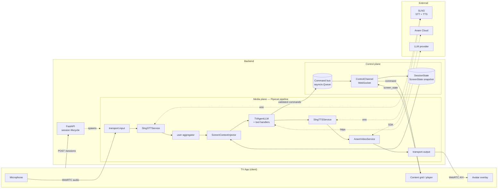
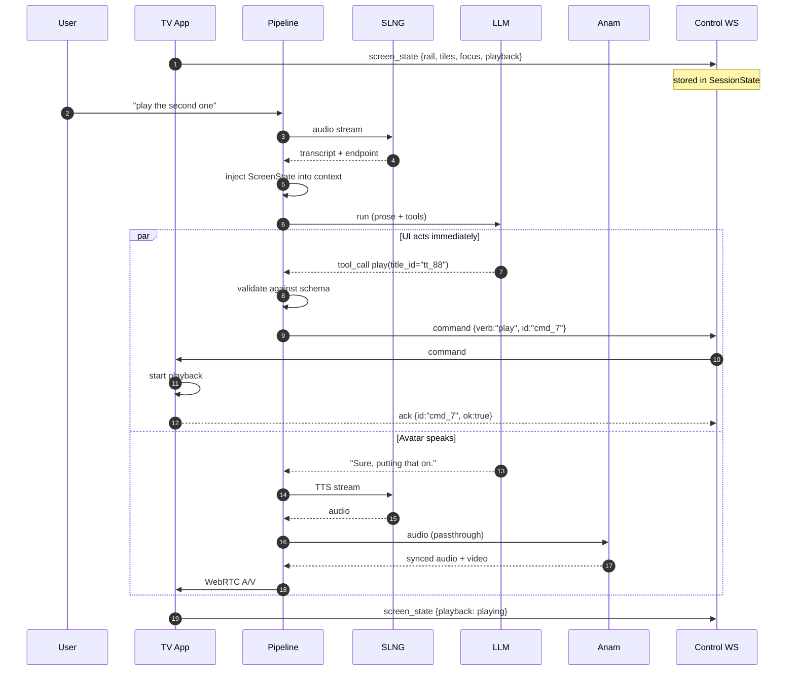
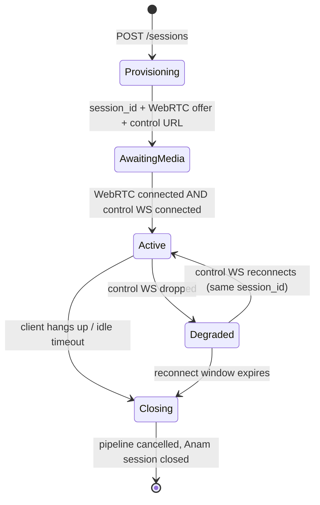

# TV Avatar Backend — Design Spec

**Date:** 2026-09-19
**Status:** Draft for review
**Scope:** Backend only. The TV frontend is out of scope except for the wire protocol it must speak and the mock client bundled for development.

---

## 1. Goal

A conversational avatar that sits on a transparent overlay above a live TV UI. As the user talks to it, it moves the content grid, plays a title on "yes", controls playback, and surfaces shoppable products tied to what is on screen.

The avatar must feel seamless: interruptible mid-sentence, and fast enough that navigation reads as reflex rather than as a request being processed.

### Non-goals

- The TV frontend itself (a mock client is provided for development and demo).
- The content catalog and product data sources. The backend consumes them through a single `search_catalog` tool and through screen state pushed by the client.
- User accounts, billing, and multi-tenant concerns.

---

## 2. Locked decisions

These were settled during design and everything below follows from them.

| # | Decision | Rationale |
|---|---|---|
| D1 | **Two planes: WebRTC for media, a separate WebSocket for control** | Cleanest separation. The UI command contract is independent of the call lifecycle, so a teammate can build the TV app against a stable protocol, and a control-socket reconnect does not drop the call. |
| D2 | **Client pushes screen state** | The TV app stays the source of truth about its own UI. Deixis ("that one", "the second") resolves with zero latency at turn time, because the snapshot is already in memory when the user speaks. The alternative — the backend owning the navigation model — means two state machines that drift. |
| D3 | **Prose streams to TTS; UI actions ride typed tool calls** | A single JSON envelope per turn forces the avatar to wait for full generation before saying a word. Tool calls give native Pipecat streaming *and* let commands fire mid-sentence. Structure is preserved: every command is a validated Pydantic schema. |
| D4 | **LLM provider is pluggable** | The agent boundary is defined in terms of Pipecat's LLM service interface, so any provider drops in without touching the tool layer or the prompt assembly. |
| D5 | **`SmallWebRTCTransport`, not Daily** | No third-party account or room provisioning for a hackathon-speed build. Daily remains a drop-in swap later if TURN reliability on real TV hardware demands it. |

### Rejected alternatives

- **Single JSON envelope (`{"speech": ..., "commands": [...]}`)** — adds full generation latency as dead air before the first word. Rejected on D3.
- **Speech-first streaming JSON with a partial parser** — solves the latency but requires writing and debugging incremental JSON parsing under time pressure, with ugly recovery when output is malformed mid-stream. Rejected on D3.
- **Backend owns UI state, client is a dumb renderer** — perfect agent knowledge, but duplicates the TV app's state machine on the server. Rejected on D2.
- **Tool-call-on-demand for screen state (`get_screen_state()`)** — cleaner prompt, but adds an LLM round-trip mid-turn, which is directly felt on a voice interface. Rejected on D2; retained only for `search_catalog`, where the data genuinely is not on screen.
- **`AnamTransport` direct Daily egress** — documented as experimental and cara-4 only, with signalling that may break between Anam alpha releases. Rejected on D5.

---

## 3. Architecture

Two planes, deliberately independent. They meet only at the session store and the command bus.



**Why `ScreenContextInjector` sits between the aggregator and the LLM:** screen state must be as fresh as the moment the user stopped speaking, not as fresh as session start. Injecting it as a frame processor gives every LLM run the latest snapshot without polluting conversation history with stale screens.

---

## 4. The pipeline

```python
Pipeline([
    transport.input(),          # SmallWebRTC — mic in, A/V out
    stt,                        # SlngSTTService, partials on
    user_agg,                   # LLMContextAggregatorPair.user()
    screen_injector,            # custom: stamps current ScreenState
    llm,                        # custom: pluggable service + tool handlers
    tts,                        # SlngTTSService
    anam,                       # AnamVideoService (audio passthrough)
    transport.output(),
    assistant_agg,
])
```

Only two boxes are ours: `screen_injector` and the tool layer around `llm`. Everything else is library code wired from config.

### Service configuration

| Service | Key settings |
|---|---|
| `SlngSTTService` | `model="slng/deepgram/nova:3-en"`, `enable_partials=True`, `enable_vad=True`, `base_url` set to the nearest regional hub (`eu.api.slng.ai`) |
| `SlngTTSService` | `model="slng/deepgram/aura:2-en"`, `voice` pinned in config, same regional `base_url` |
| `AnamVideoService` | `persona_config` with `enable_audio_passthrough=True` (our TTS drives the avatar, not Anam's voice), `enable_session_replay=False`, `avatar_model="cara-4"`, `video_width=768`, `video_height=1152` |

Voice, speed, and language are **pinned for the session**: changing any of them mid-session forces a WebSocket reconnect to redo SLNG's init handshake, which would be heard as a gap.

### VAD placement

Run `SileroVADAnalyzer` **locally in the transport** rather than relying solely on SLNG's server-side VAD. Barge-in detection is the one thing that must not pay a network round-trip — the avatar has to stop the instant the user starts. SLNG's server VAD stays enabled for transcript segmentation, where an extra ~100 ms is invisible.

---

## 5. Turn flow



The parallel block is the payoff from D3: the grid moves while the sentence is still being spoken.

### Latency budget (target, first avatar word)

| Stage | Target |
|---|---|
| Mic → STT partial | 100–200 ms |
| Endpointing (VAD silence) | 300–500 ms |
| LLM time-to-first-token | 300–600 ms |
| TTS time-to-first-byte | 100–200 ms |
| Anam render + network | 200–400 ms |
| **Total to first word** | **~1.0–1.7 s** |
| **Total to first UI command** | **~0.5–0.8 s** (fires at tool-call time, ahead of speech) |

---

## 6. Session lifecycle



`Degraded` is a real state, not an error: media keeps flowing and the avatar can still converse, but commands queue rather than dispatch. This is the direct benefit of D1 — a control-socket blip does not kill the call.

---

## 7. Control protocol

Both directions use discriminated unions on a `type` field, modelled with Pydantic so validation is symmetric.

### Client → server

| Type | Payload | Notes |
|---|---|---|
| `screen_state` | `rail_id`, `tiles[] {title_id, name, position}`, `focus_index`, `playback {state, title_id, position_s}`, `view` | Sent on every UI change. Latest wins; no history kept. |
| `ack` | `command_id`, `ok`, `error?` | Confirms a dispatched command. Used for logging and `search_catalog` correlation. |
| `result` | `command_id`, `data` | Response payload for request-response commands. |
| `user_event` | `event`, `detail` | The user acted via the physical remote. Keeps the agent aware of changes it did not cause. |

### Server → client

| Type | Payload | Notes |
|---|---|---|
| `command` | `id`, `verb`, `args`, `turn_id`, `ts` | A validated UI action. |
| `agent_status` | `state` ∈ `idle`/`listening`/`thinking`/`speaking` | Drives overlay affordances (e.g. a listening indicator). |
| `transcript` | `role`, `text`, `final` | Optional captions. |
| `error` | `code`, `message` | Protocol or upstream failures. |

### Command envelope

```json
{
  "type": "command",
  "id": "cmd_7",
  "turn_id": "turn_3",
  "verb": "play",
  "args": { "title_id": "tt_88" },
  "ts": 1758278400.123
}
```

`turn_id` is what makes turn-scoped cancellation possible (§9).

---

## 8. The agent

### Structured output — command vocabulary

A closed verb set, each one a Pydantic model. Unknown verbs are rejected by the validation layer before reaching the bus.

| Verb | Args | Kind |
|---|---|---|
| `play` | `title_id`, `resume_from?` | fire-and-forget |
| `pause` | — | fire-and-forget |
| `resume` | — | fire-and-forget |
| `seek` | exactly one of `to_seconds` or `delta_seconds` | fire-and-forget |
| `navigate` | `direction` ∈ `up`/`down`/`left`/`right`, `count` | fire-and-forget |
| `focus` | `title_id` | fire-and-forget |
| `open_details` | `title_id` | fire-and-forget |
| `close` | — | fire-and-forget |
| `back` | — | fire-and-forget |
| `home` | — | fire-and-forget |
| `show_products` | `title_id`, `scene_at?` | fire-and-forget |
| `search_catalog` | `query`, `limit` | **request-response** |

**Dispatch semantics.** Fire-and-forget handlers enqueue and return `{"status": "dispatched"}` immediately, without awaiting the client's ack — a slow TV must never stall the LLM turn, because stalling the turn stalls speech. `search_catalog` is the sole exception: it awaits a correlation-id future with a hard **400 ms** timeout, degrading to a spoken "I couldn't reach the catalog just now" rather than hanging the conversation.

### Structured prompt

Assembled per turn from five fixed sections:

1. **Role and persona** — who the avatar is, tone, brevity rules.
2. **Capability manifest** — the available verbs and their arguments.
3. **Current screen state** — a compact rendering of the latest snapshot.
4. **Interaction rules** — act first then narrate; keep replies to one or two sentences; never invent a `title_id` that is not in screen state or a search result; ask before destructive actions.
5. **Output contract** — speak in plain prose, express every UI action as a tool call.

**The capability manifest is generated from the same Pydantic models that define the tools.** Prompt and schema therefore cannot drift — which removes the most common failure mode in this class of system, a prompt advertising a verb the validator rejects.

Sections 1, 2, 4, and 5 are static across a session and go first; section 3 is volatile and goes last, so a stable prefix can be cached if the chosen provider supports it.

---

## 9. Interruption semantics

Barge-in is not merely "stop the audio". Four rules, one of them deliberately a non-action:

1. **Stop speech.** Pipecat's `StartInterruptionFrame` cancels TTS and LLM downstream.
2. **Flush the avatar.** `AnamVideoService` buffers early TTS audio by design so nothing is dropped during startup. That buffer must be dropped on interruption, or the avatar keeps talking after the user has cut in. **This is the highest-risk unknown in the design** and is verified in M1, before anything is built on top of it.
3. **Cancel unsent commands.** The command bus is turn-scoped: queued-but-unsent commands carrying the interrupted `turn_id` are dropped.
4. **Do not roll back dispatched commands.** If `play` already reached the TV, it stays played. Silently undoing a visible action is worse than surprising the user, who can simply say "no, go back".

---

## 10. Repository structure

```
src/tv_avatar/
  config.py               # pydantic-settings: keys, models, voices, regions
  app.py                  # FastAPI: POST /sessions, WS /sessions/{id}/control
  session/
    manager.py            # lifecycle, per-session task supervision
    state.py              # ScreenState, SessionState
  control/
    protocol.py           # wire models — discriminated unions both directions
    channel.py            # WS read/write loops, correlation futures
  agent/
    commands.py           # Pydantic command schemas  <- single source of truth
    tools.py              # schemas -> tool defs + handlers
    prompt.py             # structured prompt assembly
    injector.py           # ScreenContextInjector (FrameProcessor)
    llm.py                # pluggable LLM service construction
  pipeline/
    builder.py            # build_pipeline(transport, session) -> PipelineTask
    services.py           # SLNG + Anam construction from config
    observers.py          # latency metrics, agent_status emission
tests/
tools/mock_tv_client/     # browser page: video + fake grid, speaks the protocol
```

Each unit has one purpose and a defined interface: `commands.py` owns the schemas and nothing else imports Pipecat; `channel.py` knows the wire format but not the agent; `builder.py` knows Pipecat but not the protocol. `tools/mock_tv_client/` is not optional scaffolding — it is how the protocol gets exercised before the real TV frontend exists, and how the system is demoed if the frontend slips.

---

## 11. Build order

| # | Milestone | Proves |
|---|---|---|
| M0 | Voice loop, no avatar: WebRTC → SLNG STT → LLM → SLNG TTS → out | The SLNG plugin works on the pinned Pipecat version |
| M1 | Add `AnamVideoService` + **interruption test** | The riskiest unknown, early |
| M2 | Control WS + protocol + mock TV client | A teammate can build against a real contract |
| M3 | Screen state injection + tools + structured prompt | The agent understands "that one" |
| M4 | Turn-scoped cancellation + latency instrumentation | It feels seamless, measurably |
| M5 | Shoppable products, persona / director notes, polish | Demo quality |

---

## 12. Testing strategy

| Layer | Approach |
|---|---|
| Command schemas | Pure unit tests — valid args accepted, unknown verbs and out-of-range args rejected |
| Prompt assembly | Snapshot tests over a fixed `ScreenState`; a test asserts the manifest matches the schema registry, catching drift |
| Control protocol | Round-trip serialization tests both directions |
| Command bus | Async tests for turn-scoped cancellation and for the `search_catalog` timeout path |
| Pipeline | Integration test with fake STT/LLM/TTS services, asserting frame ordering and interruption behavior |
| End-to-end | Manual via the mock TV client; the interruption case is a scripted manual check |

---

## 13. Risks

| Risk | Severity | Mitigation |
|---|---|---|
| **Version skew.** `pipecat-anam` requires Pipecat ≥ 1.8.0; `pipecat-slng` declares `pipecat-ai>=1.3.0` but is documented as *tested against 1.3.0*. Compatible on paper — the SLNG example already uses the newer `LLMContext` / `LLMContextAggregatorPair` API — but unproven together. | High | M0 exists to prove it on real versions before anything depends on it. Pin exact versions in `pyproject.toml` from day one. |
| **Anam interruption / buffer behavior** on barge-in is undocumented. | High | Verified in M1 as an explicit test, not as a side effect. |
| **Sample-rate alignment** between SLNG TTS output and what Anam expects. | Medium | Set the pipeline sample rate explicitly and pass it to both services rather than relying on defaults. |
| **Overlay transparency.** WebRTC carries no alpha channel; Anam sends opaque RGB. | Medium | The "transparent overlay" is a client-side masked composite of an opaque portrait feed (cara-4, 768×1152). Documented as a frontend requirement, not a backend one. |
| **Tool-call chatter** — a weaker model narrating without calling a tool, or inventing `title_id`s. | Medium | Explicit interaction rules in the prompt; validation layer rejects ids absent from screen state or recent search results. |
| **Aspect-ratio mismatch** between the Anam feed and the overlay slot. | Low | `pipecat-anam` ships a `CenterAspectCropFilter` example that operates on `OutputImageRawFrame`; adopt it if needed. |

---

## 14. Open questions

None blocking. Two to settle during implementation:

- **LLM provider and model.** Deliberately deferred (D4). The agent boundary is provider-agnostic; the choice is a config value and a latency measurement in M0.
- **Product data source** for `show_products` — whether products arrive in the client's screen state or are fetched server-side. Deferred to M5; it does not affect any interface defined above.
